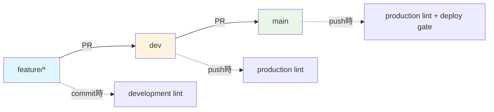

# 📋 .eslint ディレクトリ構成 - BoxLog ESLint システム

> **BoxLogプロジェクトのESLint設定システムの完全ガイド**

---

## 🗂️ ディレクトリ構造

```
.eslint/
├── 📄 index.js                     # メインエントリーポイント（環境判定）
├── 📁 configs/                     # 環境別ESLint設定
│   ├── base.js                     # 全環境共通の基本設定
│   ├── development.js              # 開発環境用（緩い設定）
│   ├── production.js               # 本番環境用（厳格設定）
│   └── theme-safe.js               # テーマ安全設定
├── 📁 rules/                       # カスタムESLintルール
│   ├── 🎨 theme/                   # テーマシステム強制ルール
│   │   ├── index.js                # テーマプラグインメイン
│   │   ├── enforce-theme-usage.js  # テーマ使用強制
│   │   ├── no-direct-tailwind.js   # 直接Tailwind禁止
│   │   ├── performance-rules.js    # パフォーマンス最適化
│   │   └── bundle-optimization-rules.js # バンドル最適化
│   ├── 🔒 compliance/              # コンプライアンスルール
│   │   ├── index.js                # コンプライアンスメイン
│   │   ├── gdpr-compliance.js      # GDPR準拠チェック
│   │   ├── security-audit.js       # セキュリティ監査
│   │   ├── data-retention.js       # データ保持ポリシー
│   │   └── performance-rules.js    # パフォーマンス監査
│   └── 📝 todo/                    # TODO管理ルール
│       └── index.js                # 構造化TODO強制
├── 📁 overrides/                   # 特別な場合のオーバーライド
│   ├── generated.js                # 自動生成ファイル用
│   ├── legacy.js                   # レガシーコード用
│   └── theme-migration.js          # テーマ移行中ファイル用
├── 📁 scripts/                     # セットアップ・メンテナンススクリプト
│   └── setup.js                    # ESLint環境セットアップ
├── 📁 tests/                       # テスト関連
│   ├── README.md                   # テスト実行ガイド
│   ├── compliance-test.tsx         # コンプライアンステスト
│   ├── performance-test.tsx        # パフォーマンステスト
│   └── theme-test.tsx              # テーマルールテスト
├── 📁 fixtures/                    # テスト用サンプルファイル
│   ├── valid/                      # 正しい例
│   └── invalid/                    # 間違った例
├── 📁 cache/                       # キャッシュファイル
│   └── .eslintcache               # ESLintキャッシュ
├── 📁 reports/                     # 生成レポート
│   └── lint-report.html           # HTMLレポート
├── 📁 docs/                        # 詳細ドキュメント
│   └── README.md                   # 詳細ガイド
├── 📄 STATUS_SUMMARY.md            # 📊 現在の設定状況サマリー
├── 📄 QUICK_REFERENCE.md           # ⚡ 緊急時対応ガイド
├── 📄 CONFIG_EXAMPLES.md           # 🎛️ 設定例集
└── 📄 TIMING_SETUP.md              # ⏰ タイミング設定ガイド
```

---

## 🎯 主要ファイルの役割

### 📄 **index.js** - メインエントリーポイント

```javascript
// 環境に応じて自動的に設定を切り替え
const isDev = process.env.NODE_ENV !== 'production'

module.exports = {
  extends: [
    './configs/base.js', // 共通設定
    isDev ? './configs/development.js' : './configs/production.js',
  ],
}
```

**🔄 動作**:

- `NODE_ENV`を監視して自動的に環境判定
- 開発時は緩い設定、本番時は厳格設定を適用

### 📁 **configs/** - 環境別設定

#### 📄 **base.js** - 共通基本設定

```javascript
// 全環境で共有する設定
module.exports = {
  extends: ['next/core-web-vitals'],
  plugins: ['@typescript-eslint', 'import', 'unused-imports'],
  rules: {
    'import/order': [
      'error',
      {
        /* 詳細設定 */
      },
    ],
    'unused-imports/no-unused-imports': 'error',
  },
}
```

#### 📄 **development.js** - 開発環境設定

```javascript
// 開発効率を重視した緩い設定
module.exports = {
  rules: {
    'no-console': 'off', // console.log許可
    'no-debugger': 'warn', // debugger警告のみ
    'unused-imports/no-unused-vars': 'warn', // 未使用変数は警告
  },
}
```

#### 📄 **production.js** - 本番環境設定

```javascript
// 品質重視の厳格設定
module.exports = {
  rules: {
    'no-console': 'error', // console.log禁止
    'no-debugger': 'error', // debugger禁止
    'unused-imports/no-unused-vars': 'error', // 未使用変数エラー
  },
}
```

---

## 🎨 カスタムルール詳細

### **theme/** - テーマシステム強制

BoxLogの統一デザインシステムを強制するカスタムルール群：

| ルール                | 目的                 | 例                                                                     |
| --------------------- | -------------------- | ---------------------------------------------------------------------- |
| `enforce-theme-usage` | テーマインポート強制 | `import { colors } from '@/config/theme'`                              |
| `no-direct-tailwind`  | 直接Tailwind禁止     | ❌ `className="bg-blue-500"` → ✅ `className={colors.primary.DEFAULT}` |
| `performance-rules`   | パフォーマンス最適化 | memo化強制、inline style禁止                                           |
| `bundle-optimization` | バンドル最適化       | 重いライブラリ警告、dynamic import推奨                                 |

**実際の適用例**:

```typescript
// ❌ 直接Tailwind（エラー）
<div className="bg-blue-500 text-white p-4 rounded-lg">

// ✅ テーマシステム使用（正しい）
import { colors, spacing, rounded } from '@/config/theme'
<div className={`${colors.primary.DEFAULT} ${colors.text.white} ${spacing.padding.md} ${rounded.component.card.md}`}>
```

### **compliance/** - コンプライアンス

GDPR、セキュリティ、アクセシビリティ要件を自動チェック：

| ルール            | チェック内容                                 |
| ----------------- | -------------------------------------------- |
| `gdpr-compliance` | 個人データ収集時の同意確認、適切なCookie設定 |
| `security-audit`  | XSS脆弱性、unsafe操作の検出                  |
| `data-retention`  | データ保持期間の妥当性チェック               |

### **todo/** - TODO管理

構造化TODOフォーマットを強制：

```typescript
// ❌ 非構造化TODO（エラー）
// TODO: これを後で修正する

// ✅ 構造化TODO（正しい）
// TODO [TASK-123] (2024-12-31) @takayasu: ユーザー認証機能の実装完了
```

---

## ⏰ 実行タイミング別設定

### 1️⃣ **保存時（VS Code）**

- **設定**: `.vscode/settings.json`
- **目的**: 即座のフィードバック
- **モード**: development（緩い設定）
- **自動修正**: ✅ 有効

### 2️⃣ **コミット時（Husky）**

- **設定**: `.husky/pre-commit` + `lint-staged`
- **目的**: 品質ゲート
- **モード**: development（警告許可）
- **対象**: 変更ファイルのみ

### 3️⃣ **PR時（GitHub Actions）**

- **設定**: `.github/workflows/code-quality.yml`
- **目的**: 包括的チェック
- **モード**: production（厳格設定）
- **対象**: 全ファイル

### 4️⃣ **ビルド時（CI/CD）**

- **設定**: `npm run build`
- **目的**: 本番品質保証
- **モード**: production（最厳格）
- **ブロッキング**: デプロイ阻止

---

## 🚀 使用方法

### **日常的な開発**

```bash
npm run lint:cache          # 高速チェック（推奨）
npm run lint:fix            # 自動修正付き
npm run lint:dev            # 開発モード
```

### **コミット前チェック**

```bash
npm run lint:prod           # 本番モード（厳格）
npm run lint:report         # HTMLレポート生成
```

### **特定問題のチェック**

```bash
npm run lint:theme          # テーマ違反のみ
npm run lint:imports        # Import順序のみ
npm run lint:compliance     # コンプライアンスのみ
```

### **トラブル時**

```bash
npm run eslint:setup        # 環境再セットアップ
npm run lint -- --no-cache  # キャッシュクリア実行
```

---

## 📊 品質メトリクス

現在の品質状況は[📊 STATUS_SUMMARY.md](./STATUS_SUMMARY.md)で確認できます。

| カテゴリ         | 現在スコア | 目標    |
| ---------------- | ---------- | ------- |
| ESLint準拠       | 92/100     | 98/100  |
| テーマ準拠       | 85/100     | 100/100 |
| コンプライアンス | 98/100     | 98/100  |
| TODO管理         | 100/100    | 100/100 |

---

## 🔄 Lint実行タイミング全体像

### 📋 **Lint実行フロー比較表**

| タイミング                   | 対象ブランチ | 環境判定      | 実行コマンド           | 対象ファイル     | ESLint設定                       | 自動修正 | ブロッキング | 速度    | 目的               |
| ---------------------------- | ------------ | ------------- | ---------------------- | ---------------- | -------------------------------- | -------- | ------------ | ------- | ------------------ |
| **💾 保存時（VS Code）**     | 全ブランチ   | `development` | `eslint --fix`         | 編集中ファイル   | `.eslint/configs/development.js` | ✅ 有効  | ❌ 無効      | ⚡ 即座 | 即座フィードバック |
| **🔒 コミット時（Husky）**   | 全ブランチ   | `development` | `lint-staged`          | ステージング済み | `.eslint/configs/development.js` | ✅ 有効  | ✅ 有効      | 🚀 高速 | 品質ゲート         |
| **🔍 PR→dev時（GitHub）**    | `dev`        | `development` | `npm run lint:cache`   | 全ファイル       | `.eslint/configs/development.js` | ❌ 無効  | ✅ 有効      | 🐌 中速 | 開発統合チェック   |
| **🔍 PR→main時（GitHub）**   | `main`       | `development` | `npm run lint:cache`   | 全ファイル       | `.eslint/configs/development.js` | ❌ 無効  | ✅ 有効      | 🐌 中速 | 本番準備チェック   |
| **🏗️ Push→dev時（GitHub）**  | `dev`        | `production`  | `npm run lint:cache`   | 全ファイル       | `.eslint/configs/production.js`  | ❌ 無効  | ✅ 有効      | 🐌 中速 | 開発品質保証       |
| **🚀 Push→main時（GitHub）** | `main`       | `production`  | `npm run lint:cache`   | 全ファイル       | `.eslint/configs/production.js`  | ❌ 無効  | ✅ 有効      | 🐌 中速 | 本番品質保証       |
| **⏰ 定期実行（Tech Debt）** | `main`       | `production`  | `npm run debt:analyze` | 全プロジェクト   | `.eslint/configs/production.js`  | ❌ 無効  | ❌ 無効      | 🐢 低速 | 継続監視           |

### 🌲 **ブランチ戦略と品質レベル**

| ブランチ        | 役割               | 品質レベル | lint環境                 | 想定フロー                  |
| --------------- | ------------------ | ---------- | ------------------------ | --------------------------- |
| **`dev`**       | 開発・統合ブランチ | 中程度     | development → production | feature → dev （日常開発）  |
| **`main`**      | 本番環境ブランチ   | 最高       | development → production | dev → main （リリース準備） |
| **`feature/*`** | 機能開発ブランチ   | 基本       | development のみ         | 個人開発 → dev（PR）        |

#### **ブランチ別品質チェックフロー**



### 🎯 **環境別設定詳細**

| 項目                    | development環境 | production環境 | 理由・根拠           |
| ----------------------- | --------------- | -------------- | -------------------- |
| **🎨 Theme使用強制**    | warn → error    | error          | テーマ統一の厳格化   |
| **🎨 直接Tailwind禁止** | warn → error    | error          | デザインシステム遵守 |
| **♿ アクセシビリティ** | warn            | error          | 段階的品質向上       |
| **🔧 console.log**      | off (許可)      | error (禁止)   | 開発効率 vs 本番品質 |
| **🔧 debugger**         | warn            | error          | デバッグ vs 本番環境 |
| **📏 未使用変数**       | warn            | warn           | 開発継続性           |
| **🔒 外部リンク**       | warn            | error          | セキュリティ強化     |

### ⚙️ **実行メカニズム詳細**

#### **1. 💾 保存時（エディタ）**

```json
// .vscode/settings.json
{
  "editor.codeActionsOnSave": {
    "source.fixAll.eslint": true
  },
  "eslint.workingDirectories": ["."],
  "eslint.options": {
    "configFile": ".eslint/index.js"
  }
}
```

#### **2. 🔒 コミット時（Git Hook）**

```bash
# .husky/pre-commit
npx lint-staged

# package.json lint-staged設定
"lint-staged": {
  "*.{ts,tsx}": [
    "eslint -c .eslint/index.js --fix",
    "prettier --write"
  ]
}
```

#### **3. 🔍 PR時（GitHub Actions）**

```yaml
# .github/workflows/code-quality.yml
on:
  pull_request:
    branches: [main, dev]  # PRターゲット: main・dev両方

- name: Run ESLint (Development mode)
  if: github.event_name == 'pull_request'
  run: NODE_ENV=development npm run lint:cache
```

#### **4. 🏗️ Push時（GitHub Actions）**

```yaml
# .github/workflows/code-quality.yml
on:
  push:
    branches: [main, dev]  # Push対象: main・dev両方

- name: Run ESLint (Production mode)
  if: github.event_name == 'push'
  run: NODE_ENV=production npm run lint:cache
```

### 📊 **利用可能なLintコマンド一覧**

| コマンド                   | 環境        | 用途             | 特徴                     |
| -------------------------- | ----------- | ---------------- | ------------------------ |
| `npm run lint`             | 自動判定    | 標準チェック     | 環境に応じて自動切り替え |
| `npm run lint:fix`         | 自動判定    | 自動修正付き     | エラー自動修正           |
| `npm run lint:cache`       | 自動判定    | 高速チェック     | キャッシュ活用で高速化   |
| `npm run lint:dev`         | development | 開発モード       | 緩い設定で開発効率重視   |
| `npm run lint:prod`        | production  | 本番モード       | 厳格設定で品質重視       |
| `npm run lint:report`      | 自動判定    | HTMLレポート     | 視覚的レポート生成       |
| `npm run lint:theme`       | 自動判定    | テーマチェック   | デザインシステム専用     |
| `npm run lint:compliance`  | 自動判定    | コンプライアンス | GDPR・セキュリティ専用   |
| `npm run lint:performance` | 自動判定    | パフォーマンス   | 複雑度・最適化専用       |
| `npm run lint:imports`     | 自動判定    | Import順序       | Import整理専用           |

### 🎛️ **品質ゲート設定**

#### **ブロッキング基準（ブランチ別）**

| タイミング      | 対象ブランチ | ブロック条件                   | 対応アクション          |
| --------------- | ------------ | ------------------------------ | ----------------------- |
| **コミット時**  | 全ブランチ   | ESLintエラー存在               | コミット阻止 → 修正必須 |
| **PR→dev時**    | `dev`        | ESLint/TypeScript/テストエラー | マージ阻止 → 修正必須   |
| **PR→main時**   | `main`       | ESLint/TypeScript/テストエラー | マージ阻止 → 修正必須   |
| **Push→dev時**  | `dev`        | production環境設定違反         | 統合阻止 → 修正必須     |
| **Push→main時** | `main`       | production環境設定違反         | デプロイ阻止 → 修正必須 |

#### **Quality Gate判定**

```bash
# 3つすべて成功でPass
✅ ESLint & Prettier
✅ TypeScript Check
✅ Unit Tests
= 🎉 Quality Gate PASS
```

---

## 📊 設定比較テーブル

### 🎯 **現状の設定**

| カテゴリ                | dev環境    | 本番環境   | 参考企業・根拠  |
| ----------------------- | ---------- | ---------- | --------------- |
| **🎨 デザインシステム** |            |            |                 |
| ✅ Theme使用強制        | error 必須 | error 必須 | Airbnb, Uber    |
| ✅ 直接Tailwindクラス   | error 禁止 | error 禁止 | Google Material |
| **♿ アクセシビリティ** |            |            |                 |
| alt属性                 | warn 警告  | error 必須 | Microsoft, W3C  |
| ARIAラベル              | warn 警告  | error 必須 | Apple           |
| キーボード操作          | warn 警告  | error 必須 | Google          |
| 見出し構造              | warn 警告  | error 必須 | W3C             |
| **🔧 開発効率**         |            |            |                 |
| ✅ console.log          | off 許可   | error 禁止 | Netflix         |
| debugger                | warn 警告  | error 禁止 | Amazon          |
| TODO/FIXME              | なし       | なし       | Google          |
| **⚡ パフォーマンス**   |            |            |                 |
| Bundle size             | なし       | なし       | Twitter         |
| useMemo/useCallback     | なし       | なし       | Meta            |
| 画像最適化              | なし       | なし       | Netflix         |
| Array index key         | warn 警告  | warn 警告  | React Team      |
| **🔒 セキュリティ**     |            |            |                 |
| eval使用                | なし       | なし       | すべて          |
| dangerouslySetHTML      | なし       | なし       | Meta            |
| 外部リンク              | warn 警告  | error 必須 | Google          |
| **📏 コード品質**       |            |            |                 |
| ✅ 未使用変数           | warn 警告  | warn 警告  | Airbnb          |
| any型                   | なし       | なし       | Microsoft       |
| 複雑度                  | なし       | なし       | Google          |
| **🧪 テスト**           |            |            |                 |
| テストカバレッジ        | なし       | なし       | Google          |
| E2Eテスト               | なし       | なし       | Amazon          |

### 🌟 **理想の設定**

| カテゴリ                | dev環境         | 本番環境      | 参考企業・根拠  |
| ----------------------- | --------------- | ------------- | --------------- |
| **🎨 デザインシステム** |                 |               |                 |
| ✅ Theme使用強制        | error 必須      | error 必須    | Airbnb, Uber    |
| ✅ 直接Tailwindクラス   | error 禁止      | error 禁止    | Google Material |
| **♿ アクセシビリティ** |                 |               |                 |
| alt属性                 | error 必須      | error 必須    | Microsoft, W3C  |
| ARIAラベル              | warn 推奨       | error 必須    | Apple           |
| キーボード操作          | warn 推奨       | error 必須    | Google          |
| 見出し構造              | error 必須      | error 必須    | W3C             |
| **🔧 開発効率**         |                 |               |                 |
| ✅ console.log          | off 許可        | error 禁止    | Netflix         |
| debugger                | warn 警告       | error 禁止    | Amazon          |
| TODO/FIXME              | warn 構造化推奨 | error 禁止    | Google          |
| **⚡ パフォーマンス**   |                 |               |                 |
| Bundle size             | warn 警告       | error 制限    | Twitter         |
| useMemo/useCallback     | warn 推奨       | error 必須    | Meta            |
| 画像最適化              | off スキップ    | error 必須    | Netflix         |
| Array index key         | warn 警告       | error 禁止    | React Team      |
| **🔒 セキュリティ**     |                 |               |                 |
| eval使用                | error 禁止      | error 禁止    | すべて          |
| dangerouslySetHTML      | warn 警告       | error 禁止    | Meta            |
| 外部リンク              | warn 警告       | error rel必須 | Google          |
| **📏 コード品質**       |                 |               |                 |
| 未使用変数              | warn 警告       | error 禁止    | Airbnb          |
| any型                   | warn 警告       | error 禁止    | Microsoft       |
| 複雑度                  | warn (15)       | error (10)    | Google          |
| **🧪 テスト**           |                 |               |                 |
| テストカバレッジ        | なし            | 80%必須       | Google          |
| E2Eテスト               | なし            | 必須          | Amazon          |

### 📈 **改善優先度**

| 優先度        | カテゴリ         | 改善項目                     | 期待効果           | 状態         |
| ------------- | ---------------- | ---------------------------- | ------------------ | ------------ |
| ✅ **完了**   | デザインシステム | Theme使用強制をerror化       | UI統一性向上       | **実装済み** |
| 🔥 **High**   | セキュリティ     | eval, dangerouslySetHTML禁止 | 脆弱性削減         | 未実装       |
| 🔥 **High**   | コード品質       | any型禁止                    | 型安全性向上       | 未実装       |
| 🟡 **Medium** | パフォーマンス   | useMemo/useCallback推奨      | 再レンダリング削減 | 未実装       |
| 🟡 **Medium** | テスト           | カバレッジ80%設定            | 品質保証           | 未実装       |
| 🟢 **Low**    | 開発効率         | 構造化TODO強制               | 技術的負債管理     | 未実装       |

---

## 🔗 関連ドキュメント

- [📊 **現在の設定状況**](./STATUS_SUMMARY.md) - 包括的な状況レポート
- [⚡ **緊急時対応**](./QUICK_REFERENCE.md) - よくある問題の即座解決
- [🎛️ **設定例集**](./CONFIG_EXAMPLES.md) - 具体的な設定パターン
- [⏰ **タイミング設定**](./TIMING_SETUP.md) - 各タイミングでの詳細設定
- [📖 **詳細ガイド**](./docs/README.md) - 技術的詳細説明

---

## 🎯 成功指標

- ✅ **ESLintエラー**: 5件/日 → 0件/日（目標: 2週間）
- ✅ **PR品質通過率**: 85% → 95%（目標: 1ヶ月）
- ✅ **テーマ準拠率**: 85% → 100%（目標: 1ヶ月）
- ✅ **開発者満足度**: 4.2/5 → 4.5/5（目標: 3ヶ月）

---

**🎉 BoxLog ESLint品質管理システム運用中！**

このシステムにより、コード品質が自動的に保たれ、開発効率と保守性が大幅に向上します。
