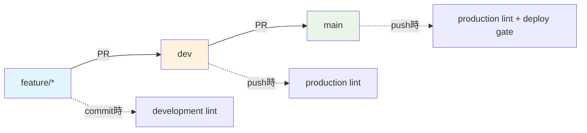

# BoxLog ESLint Configuration

BoxLogプロジェクトのESLint設定について説明します。

## 📁 ディレクトリ構造

```
.eslint/
├── index.js               # メインエントリーポイント
├── configs/               # 設定ファイル群
│   ├── base.js           # 基本設定
│   ├── development.js    # 開発環境用設定
│   ├── production.js     # 本番環境用設定
│   └── theme-simple.js   # テーマ強制設定
├── overrides/            # 例外処理設定
│   ├── generated.js      # 自動生成ファイル用
│   └── legacy.js         # レガシーコード用
├── rules/                # カスタムルール
│   ├── theme/           # テーマシステム関連
│   ├── todo/            # TODO管理関連
│   └── compliance/      # コンプライアンス関連
├── scripts/             # セットアップ・ユーティリティ
│   └── setup.js         # 初期設定スクリプト
├── cache/               # ESLintキャッシュ（.gitignore対象）
├── reports/             # レポート出力先
├── fixtures/            # テスト用サンプルコード
└── docs/                # ドキュメント
```

## 🚀 使い方

### 基本コマンド

```bash
# 標準リント実行
npm run lint

# 自動修正付きリント
npm run lint:fix

# キャッシュ付き高速実行
npm run lint:cache

# HTMLレポート生成
npm run lint:report
```

### 環境別実行

```bash
# 開発環境設定でリント（緩い設定）
npm run lint:dev

# 本番環境設定でリント（厳格な設定）
npm run lint:prod
```

### 特定用途のリント

```bash
# テーマシステム違反チェック
npm run lint:theme

# コンプライアンス問題チェック
npm run lint:compliance

# パフォーマンス問題チェック
npm run lint:performance

# Import順序チェック
npm run lint:imports
```

## ⚙️ 設定の詳細

### 環境による設定切り替え

- **開発環境** (`NODE_ENV=development`): 警告レベル、デバッグログ許可
- **本番環境** (`NODE_ENV=production`): エラーレベル、厳格なチェック

### オーバーライド設定

#### 自動生成ファイル (generated.js)

以下のファイルには緩いルールが適用されます：

- `*.generated.*`
- `src/types/supabase.ts`
- `src/__generated__/**`
- `.next/**`
- ビルドアーティファクト

#### レガシーコード (legacy.js)

段階的移行対象のファイルには緩いルールが適用されます：

- `src/legacy/**`
- `src/old-components/**`
- 特定の移行対象ファイル

---

## 🎨 カスタムルール詳細

## 🔧 セットアップ

### 初回セットアップ

```bash
npm run eslint:setup
```

このコマンドは以下を実行します：

1. カスタムプラグインをnode_modulesにコピー
2. キャッシュディレクトリの初期化
3. レポートディレクトリの初期化
4. .gitignoreの更新
5. 設定の検証

### カスタムルールの更新

カスタムルールを更新した場合：

```bash
npm run eslint:setup  # セットアップを再実行
npm run lint:cache    # キャッシュクリア付きでテスト
```

## 📊 レポート

### HTMLレポート

```bash
npm run lint:report
```

生成されたレポートは `.eslint/reports/lint-report.html` で確認できます。

### 技術的負債レポート

```bash
npm run debt:analyze
```

ESLint結果を含む包括的な技術的負債レポートが生成されます。

## 🛠️ トラブルシューティング

### カスタムルールが認識されない

```bash
# セットアップを再実行
npm run eslint:setup

# node_modulesを確認
ls node_modules/eslint-plugin-boxlog-*
```

### キャッシュをクリアしたい

```bash
# キャッシュディレクトリを削除
rm -rf .eslint/cache/*

# またはキャッシュなしで実行
npm run lint -- --no-cache
```

### 設定ファイルのエラー

```bash
# 設定の検証
node .eslint/scripts/setup.js

# 基本設定のテスト
eslint --print-config src/app/page.tsx -c .eslint/index.js
```

## 📝 設定のカスタマイズ

### 新しいルールの追加

1. `.eslint/configs/base.js` にルールを追加
2. 必要に応じて環境別設定 (development.js, production.js) を調整
3. `npm run lint:cache` でテスト

### 新しいオーバーライドの追加

1. `.eslint/overrides/` に新しい設定ファイルを作成
2. `.eslint/index.js` の `overrides` 配列に追加
3. `npm run eslint:setup` でセットアップを再実行

## 🎯 ベストプラクティス

1. **開発中は `npm run lint:dev`** を使用（緩い設定）
2. **コミット前は `npm run lint:prod`** を実行（厳格な設定）
3. **大きな変更後は `npm run lint:report`** でHTMLレポートを確認
4. **定期的に `npm run debt:analyze`** で技術的負債をチェック
5. **カスタムルール更新後は `npm run eslint:setup`** を実行

## 🔗 関連ドキュメント

### 📚 内部ドキュメント

- **[📖 詳細ガイド](../README_DETAILED.md)** - 設定の動作原理と詳細解説
- **[⚡ クイックリファレンス](../QUICK_REFERENCE.md)** - 緊急時対応・よく使うコマンド
- **[🎛️ 設定例集](../CONFIG_EXAMPLES.md)** - 様々なシーンでの設定例

### 🔧 関連システム

- [技術的負債監視システム](../../reports/tech-debt.html)
- [TODOマネージャー](../../scripts/todo-manager.js)
- [Bundle分析システム](../../scripts/bundle-check.js)

### 🌐 外部リソース

- [ESLint公式ドキュメント](https://eslint.org/docs/)
- [TypeScript ESLint](https://typescript-eslint.io/)
- [Next.js ESLint設定](https://nextjs.org/docs/basic-features/eslint)

---

**📝 このドキュメントについて**

- **最終更新**: 2025-09-11
- **バージョン**: v2.0.0 - 完全統合ESLint構造
- **対象**: 基本的な使用方法・コマンド一覧

**💡 読む順序の推奨**

1. **このファイル** - 基本的な使い方
2. **[QUICK_REFERENCE.md](../QUICK_REFERENCE.md)** - 困った時の緊急対応
3. **[README_DETAILED.md](../README_DETAILED.md)** - 詳細な仕組み理解
4. **[CONFIG_EXAMPLES.md](../CONFIG_EXAMPLES.md)** - カスタマイズ時

- **目的**: 即座のフィードバック
- **モード**: development（緩い設定）
- **自動修正**: ✅ 有効

### 2️⃣ **コミット時（Husky）**

- **設定**: `.husky/pre-commit` + `lint-staged`
- **目的**: 品質ゲート
- **モード**: development（警告許可）
- **対象**: 変更ファイルのみ

### 3️⃣ **PR時（GitHub Actions）**

- **設定**: `.github/workflows/code-quality.yml`
- **目的**: 包括的チェック
- **モード**: production（厳格設定）
- **対象**: 全ファイル

### 4️⃣ **ビルド時（CI/CD）**

- **設定**: `npm run build`
- **目的**: 本番品質保証
- **モード**: production（最厳格）
- **ブロッキング**: デプロイ阻止

---

## 🚀 使用方法

### **日常的な開発**

```bash
npm run lint:cache          # 高速チェック（推奨）
npm run lint:fix            # 自動修正付き
npm run lint:dev            # 開発モード
```

### **コミット前チェック**

```bash
npm run lint:prod           # 本番モード（厳格）
npm run lint:report         # HTMLレポート生成
```

### **特定問題のチェック**

```bash
npm run lint:theme          # テーマ違反のみ
npm run lint:imports        # Import順序のみ
npm run lint:compliance     # コンプライアンスのみ
```

### **トラブル時**

```bash
npm run eslint:setup        # 環境再セットアップ
npm run lint -- --no-cache  # キャッシュクリア実行
```

---

## 📊 品質メトリクス

現在の品質状況は[📊 STATUS_SUMMARY.md](./STATUS_SUMMARY.md)で確認できます。

| カテゴリ         | 現在スコア | 目標    |
| ---------------- | ---------- | ------- |
| ESLint準拠       | 92/100     | 98/100  |
| テーマ準拠       | 85/100     | 100/100 |
| コンプライアンス | 98/100     | 98/100  |
| TODO管理         | 100/100    | 100/100 |

---

## 🔄 Lint実行タイミング全体像

### 📋 **Lint実行フロー比較表**

| タイミング                   | 対象ブランチ | 環境判定      | 実行コマンド           | 対象ファイル     | ESLint設定                       | 自動修正 | ブロッキング | 速度    | 目的               |
| ---------------------------- | ------------ | ------------- | ---------------------- | ---------------- | -------------------------------- | -------- | ------------ | ------- | ------------------ |
| **💾 保存時（VS Code）**     | 全ブランチ   | `development` | `eslint --fix`         | 編集中ファイル   | `.eslint/configs/development.js` | ✅ 有効  | ❌ 無効      | ⚡ 即座 | 即座フィードバック |
| **🔒 コミット時（Husky）**   | 全ブランチ   | `development` | `lint-staged`          | ステージング済み | `.eslint/configs/development.js` | ✅ 有効  | ✅ 有効      | 🚀 高速 | 品質ゲート         |
| **🔍 PR→dev時（GitHub）**    | `dev`        | `development` | `npm run lint:cache`   | 全ファイル       | `.eslint/configs/development.js` | ❌ 無効  | ✅ 有効      | 🐌 中速 | 開発統合チェック   |
| **🔍 PR→main時（GitHub）**   | `main`       | `development` | `npm run lint:cache`   | 全ファイル       | `.eslint/configs/development.js` | ❌ 無効  | ✅ 有効      | 🐌 中速 | 本番準備チェック   |
| **🏗️ Push→dev時（GitHub）**  | `dev`        | `production`  | `npm run lint:cache`   | 全ファイル       | `.eslint/configs/production.js`  | ❌ 無効  | ✅ 有効      | 🐌 中速 | 開発品質保証       |
| **🚀 Push→main時（GitHub）** | `main`       | `production`  | `npm run lint:cache`   | 全ファイル       | `.eslint/configs/production.js`  | ❌ 無効  | ✅ 有効      | 🐌 中速 | 本番品質保証       |
| **⏰ 定期実行（Tech Debt）** | `main`       | `production`  | `npm run debt:analyze` | 全プロジェクト   | `.eslint/configs/production.js`  | ❌ 無効  | ❌ 無効      | 🐢 低速 | 継続監視           |

### 🌲 **ブランチ戦略と品質レベル**

| ブランチ        | 役割               | 品質レベル | lint環境                 | 想定フロー                  |
| --------------- | ------------------ | ---------- | ------------------------ | --------------------------- |
| **`dev`**       | 開発・統合ブランチ | 中程度     | development → production | feature → dev （日常開発）  |
| **`main`**      | 本番環境ブランチ   | 最高       | development → production | dev → main （リリース準備） |
| **`feature/*`** | 機能開発ブランチ   | 基本       | development のみ         | 個人開発 → dev（PR）        |

#### **ブランチ別品質チェックフロー**



### 🎯 **環境別設定詳細**

| 項目                    | development環境 | production環境 | 理由・根拠           |
| ----------------------- | --------------- | -------------- | -------------------- |
| **🎨 Theme使用強制**    | warn → error    | error          | テーマ統一の厳格化   |
| **🎨 直接Tailwind禁止** | warn → error    | error          | デザインシステム遵守 |
| **♿ アクセシビリティ** | warn            | error          | 段階的品質向上       |
| **🔧 console.log**      | off (許可)      | error (禁止)   | 開発効率 vs 本番品質 |
| **🔧 debugger**         | warn            | error          | デバッグ vs 本番環境 |
| **📏 未使用変数**       | warn            | warn           | 開発継続性           |
| **🔒 外部リンク**       | warn            | error          | セキュリティ強化     |

### ⚙️ **実行メカニズム詳細**

#### **1. 💾 保存時（エディタ）**

```json
// .vscode/settings.json
{
  "editor.codeActionsOnSave": {
    "source.fixAll.eslint": true
  },
  "eslint.workingDirectories": ["."],
  "eslint.options": {
    "configFile": ".eslint/index.js"
  }
}
```

#### **2. 🔒 コミット時（Git Hook）**

```bash
# .husky/pre-commit
npx lint-staged

# package.json lint-staged設定
"lint-staged": {
  "*.{ts,tsx}": [
    "eslint -c .eslint/index.js --fix",
    "prettier --write"
  ]
}
```

#### **3. 🔍 PR時（GitHub Actions）**

```yaml
# .github/workflows/code-quality.yml
on:
  pull_request:
    branches: [main, dev]  # PRターゲット: main・dev両方

- name: Run ESLint (Development mode)
  if: github.event_name == 'pull_request'
  run: NODE_ENV=development npm run lint:cache
```

#### **4. 🏗️ Push時（GitHub Actions）**

```yaml
# .github/workflows/code-quality.yml
on:
  push:
    branches: [main, dev]  # Push対象: main・dev両方

- name: Run ESLint (Production mode)
  if: github.event_name == 'push'
  run: NODE_ENV=production npm run lint:cache
```

### 📊 **利用可能なLintコマンド一覧**

| コマンド                   | 環境        | 用途             | 特徴                     |
| -------------------------- | ----------- | ---------------- | ------------------------ |
| `npm run lint`             | 自動判定    | 標準チェック     | 環境に応じて自動切り替え |
| `npm run lint:fix`         | 自動判定    | 自動修正付き     | エラー自動修正           |
| `npm run lint:cache`       | 自動判定    | 高速チェック     | キャッシュ活用で高速化   |
| `npm run lint:dev`         | development | 開発モード       | 緩い設定で開発効率重視   |
| `npm run lint:prod`        | production  | 本番モード       | 厳格設定で品質重視       |
| `npm run lint:report`      | 自動判定    | HTMLレポート     | 視覚的レポート生成       |
| `npm run lint:theme`       | 自動判定    | テーマチェック   | デザインシステム専用     |
| `npm run lint:compliance`  | 自動判定    | コンプライアンス | GDPR・セキュリティ専用   |
| `npm run lint:performance` | 自動判定    | パフォーマンス   | 複雑度・最適化専用       |
| `npm run lint:imports`     | 自動判定    | Import順序       | Import整理専用           |

### 🎛️ **品質ゲート設定**

#### **ブロッキング基準（ブランチ別）**

| タイミング      | 対象ブランチ | ブロック条件                   | 対応アクション          |
| --------------- | ------------ | ------------------------------ | ----------------------- |
| **コミット時**  | 全ブランチ   | ESLintエラー存在               | コミット阻止 → 修正必須 |
| **PR→dev時**    | `dev`        | ESLint/TypeScript/テストエラー | マージ阻止 → 修正必須   |
| **PR→main時**   | `main`       | ESLint/TypeScript/テストエラー | マージ阻止 → 修正必須   |
| **Push→dev時**  | `dev`        | production環境設定違反         | 統合阻止 → 修正必須     |
| **Push→main時** | `main`       | production環境設定違反         | デプロイ阻止 → 修正必須 |

#### **Quality Gate判定**

```bash
# 3つすべて成功でPass
✅ ESLint & Prettier
✅ TypeScript Check
✅ Unit Tests
= 🎉 Quality Gate PASS
```

---

## 📊 設定比較テーブル

### 🎯 **現状の設定**

| カテゴリ                | dev環境    | 本番環境   | 参考企業・根拠  |
| ----------------------- | ---------- | ---------- | --------------- |
| **🎨 デザインシステム** |            |            |                 |
| ✅ Theme使用強制        | error 必須 | error 必須 | Airbnb, Uber    |
| ✅ 直接Tailwindクラス   | error 禁止 | error 禁止 | Google Material |
| **♿ アクセシビリティ** |            |            |                 |
| alt属性                 | warn 警告  | error 必須 | Microsoft, W3C  |
| ARIAラベル              | warn 警告  | error 必須 | Apple           |
| キーボード操作          | warn 警告  | error 必須 | Google          |
| 見出し構造              | warn 警告  | error 必須 | W3C             |
| **🔧 開発効率**         |            |            |                 |
| ✅ console.log          | off 許可   | error 禁止 | Netflix         |
| debugger                | warn 警告  | error 禁止 | Amazon          |
| TODO/FIXME              | なし       | なし       | Google          |
| **⚡ パフォーマンス**   |            |            |                 |
| Bundle size             | なし       | なし       | Twitter         |
| useMemo/useCallback     | なし       | なし       | Meta            |
| 画像最適化              | なし       | なし       | Netflix         |
| Array index key         | warn 警告  | warn 警告  | React Team      |
| **🔒 セキュリティ**     |            |            |                 |
| eval使用                | なし       | なし       | すべて          |
| dangerouslySetHTML      | なし       | なし       | Meta            |
| 外部リンク              | warn 警告  | error 必須 | Google          |
| **📏 コード品質**       |            |            |                 |
| ✅ 未使用変数           | warn 警告  | warn 警告  | Airbnb          |
| any型                   | なし       | なし       | Microsoft       |
| 複雑度                  | なし       | なし       | Google          |
| **🧪 テスト**           |            |            |                 |
| テストカバレッジ        | なし       | なし       | Google          |
| E2Eテスト               | なし       | なし       | Amazon          |

### 🌟 **理想の設定**

| カテゴリ                | dev環境         | 本番環境      | 参考企業・根拠  |
| ----------------------- | --------------- | ------------- | --------------- |
| **🎨 デザインシステム** |                 |               |                 |
| ✅ Theme使用強制        | error 必須      | error 必須    | Airbnb, Uber    |
| ✅ 直接Tailwindクラス   | error 禁止      | error 禁止    | Google Material |
| **♿ アクセシビリティ** |                 |               |                 |
| alt属性                 | error 必須      | error 必須    | Microsoft, W3C  |
| ARIAラベル              | warn 推奨       | error 必須    | Apple           |
| キーボード操作          | warn 推奨       | error 必須    | Google          |
| 見出し構造              | error 必須      | error 必須    | W3C             |
| **🔧 開発効率**         |                 |               |                 |
| ✅ console.log          | off 許可        | error 禁止    | Netflix         |
| debugger                | warn 警告       | error 禁止    | Amazon          |
| TODO/FIXME              | warn 構造化推奨 | error 禁止    | Google          |
| **⚡ パフォーマンス**   |                 |               |                 |
| Bundle size             | warn 警告       | error 制限    | Twitter         |
| useMemo/useCallback     | warn 推奨       | error 必須    | Meta            |
| 画像最適化              | off スキップ    | error 必須    | Netflix         |
| Array index key         | warn 警告       | error 禁止    | React Team      |
| **🔒 セキュリティ**     |                 |               |                 |
| eval使用                | error 禁止      | error 禁止    | すべて          |
| dangerouslySetHTML      | warn 警告       | error 禁止    | Meta            |
| 外部リンク              | warn 警告       | error rel必須 | Google          |
| **📏 コード品質**       |                 |               |                 |
| 未使用変数              | warn 警告       | error 禁止    | Airbnb          |
| any型                   | warn 警告       | error 禁止    | Microsoft       |
| 複雑度                  | warn (15)       | error (10)    | Google          |
| **🧪 テスト**           |                 |               |                 |
| テストカバレッジ        | なし            | 80%必須       | Google          |
| E2Eテスト               | なし            | 必須          | Amazon          |

### 📈 **改善優先度**

| 優先度        | カテゴリ         | 改善項目                     | 期待効果           | 状態         |
| ------------- | ---------------- | ---------------------------- | ------------------ | ------------ |
| ✅ **完了**   | デザインシステム | Theme使用強制をerror化       | UI統一性向上       | **実装済み** |
| 🔥 **High**   | セキュリティ     | eval, dangerouslySetHTML禁止 | 脆弱性削減         | 未実装       |
| 🔥 **High**   | コード品質       | any型禁止                    | 型安全性向上       | 未実装       |
| 🟡 **Medium** | パフォーマンス   | useMemo/useCallback推奨      | 再レンダリング削減 | 未実装       |
| 🟡 **Medium** | テスト           | カバレッジ80%設定            | 品質保証           | 未実装       |
| 🟢 **Low**    | 開発効率         | 構造化TODO強制               | 技術的負債管理     | 未実装       |

---

## 🔗 関連ドキュメント

- [📊 **現在の設定状況**](./STATUS_SUMMARY.md) - 包括的な状況レポート
- [⚡ **緊急時対応**](./QUICK_REFERENCE.md) - よくある問題の即座解決
- [🎛️ **設定例集**](./CONFIG_EXAMPLES.md) - 具体的な設定パターン
- [⏰ **タイミング設定**](./TIMING_SETUP.md) - 各タイミングでの詳細設定
- [📖 **詳細ガイド**](./docs/README.md) - 技術的詳細説明

---

## 🎯 成功指標

- ✅ **ESLintエラー**: 5件/日 → 0件/日（目標: 2週間）
- ✅ **PR品質通過率**: 85% → 95%（目標: 1ヶ月）
- ✅ **テーマ準拠率**: 85% → 100%（目標: 1ヶ月）
- ✅ **開発者満足度**: 4.2/5 → 4.5/5（目標: 3ヶ月）

---

**🎉 BoxLog ESLint品質管理システム運用中！**

このシステムにより、コード品質が自動的に保たれ、開発効率と保守性が大幅に向上します。
