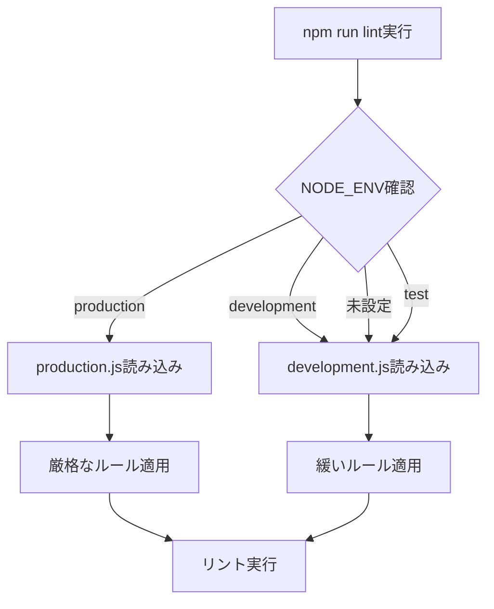
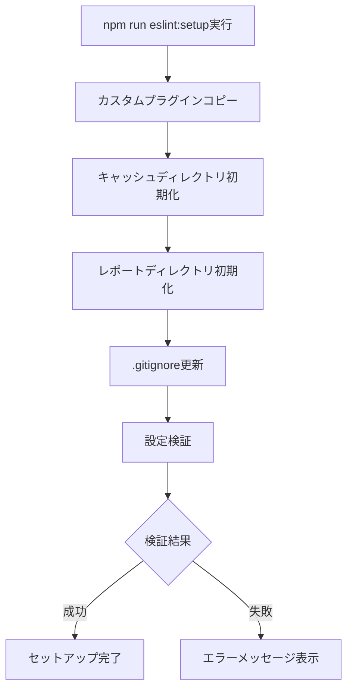

# 📚 BoxLog ESLint設定 - 完全ガイド

> **BoxLogプロジェクトのESLint設定について、構造・動作原理・カスタマイズ方法まで事細かく解説します**

## 📖 目次

1. [ディレクトリ構造の詳細](#-ディレクトリ構造の詳細)
2. [設定ファイルの解析](#️-設定ファイルの解析)
3. [カスタムルールの仕組み](#-カスタムルールの仕組み)
4. [オーバーライド設定の詳細](#-オーバーライド設定の詳細)
5. [環境別設定の動作原理](#-環境別設定の動作原理)
6. [セットアップスクリプトの詳細](#-セットアップスクリプトの詳細)
7. [実際の使用例](#-実際の使用例)
8. [トラブルシューティング](#-トラブルシューティング)
9. [カスタマイズガイド](#-カスタマイズガイド)
10. [パフォーマンス最適化](#⚡-パフォーマンス最適化)

---

## 📁 ディレクトリ構造の詳細

```
.eslint/
├── 📄 index.js                    # エントリーポイント（環境判定・設定統合）
│
├── 📁 configs/                    # 環境別設定ファイル群
│   ├── 📄 base.js                # 基本設定（全環境共通）
│   ├── 📄 development.js         # 開発環境用設定（緩い設定）
│   └── 📄 production.js          # 本番環境用設定（厳格な設定）
│
├── 📁 overrides/                  # 例外処理設定
│   ├── 📄 generated.js           # 自動生成ファイル用の緩い設定
│   └── 📄 legacy.js              # レガシーコード用の段階的移行設定
│
├── 📁 rules/                      # カスタムESLintルール群
│   ├── 📁 theme/                 # BoxLogテーマシステム関連ルール
│   │   ├── 📄 index.js           # プラグイン統合ファイル
│   │   ├── 📄 enforce-theme-usage.js      # テーマ使用強制ルール
│   │   ├── 📄 no-direct-tailwind.js       # 直接Tailwind禁止ルール
│   │   ├── 📄 performance-rules.js        # パフォーマンス最適化ルール
│   │   └── 📄 bundle-optimization-rules.js # バンドル最適化ルール
│   │
│   ├── 📁 todo/                  # TODO/FIXME管理ルール
│   │   └── 📄 index.js           # 構造化TODO管理ルール
│   │
│   └── 📁 compliance/            # コンプライアンス関連ルール
│       ├── 📄 index.js           # プラグイン統合ファイル
│       ├── 📄 gdpr-compliance.js # GDPR準拠チェック
│       ├── 📄 data-retention.js  # データ保持ポリシーチェック
│       ├── 📄 security-audit.js  # セキュリティ監査ルール
│       └── 📄 performance-rules.js # パフォーマンス要件チェック
│
├── 📁 scripts/                   # ユーティリティスクリプト
│   └── 📄 setup.js              # 自動セットアップ・初期化スクリプト
│
├── 📁 cache/                     # ESLintキャッシュディレクトリ（.gitignore対象）
│   └── 🗂️ .eslintcache          # パフォーマンス向上のためのキャッシュファイル
│
├── 📁 reports/                   # 分析レポート出力先
│   ├── 📄 lint-report.html       # HTMLフォーマットのESLintレポート
│   └── 📄 .gitkeep              # 空ディレクトリ保持用
│
├── 📁 fixtures/                  # テスト・検証用サンプルコード
│   ├── 📁 valid/                # 正しいコード例
│   │   └── 📄 .gitkeep
│   └── 📁 invalid/              # エラーになるコード例
│       └── 📄 .gitkeep
│
└── 📁 docs/                     # ドキュメント
    ├── 📄 README.md             # 基本的な使用方法
    └── 📄 README_DETAILED.md    # このファイル（詳細ガイド）
```

### 🗂️ ディレクトリの役割

| ディレクトリ | 目的 | 編集頻度 | 重要度 |
|------------|------|---------|--------|
| `configs/` | 環境別の基本設定 | 🔄 定期的 | ⭐⭐⭐ |
| `rules/` | カスタムルール定義 | 🔧 開発時 | ⭐⭐⭐ |
| `overrides/` | 例外処理設定 | 🔧 必要時 | ⭐⭐ |
| `scripts/` | 自動化スクリプト | 🔧 稀 | ⭐⭐ |
| `cache/` | パフォーマンス向上 | 🚫 自動管理 | ⭐ |
| `reports/` | 分析結果出力 | 🚫 自動生成 | ⭐ |
| `fixtures/` | テスト用サンプル | 🔧 開発時 | ⭐ |
| `docs/` | ドキュメント | 📝 更新時 | ⭐⭐ |

---

## ⚙️ 設定ファイルの解析

### 🎯 index.js - メインエントリーポイント

```javascript
/**
 * BoxLog ESLint Configuration - Main Entry Point
 * 
 * 環境に応じて適切な設定を選択します
 */

const isDev = process.env.NODE_ENV !== 'production';

module.exports = {
  extends: [
    './configs/base.js',
    isDev ? './configs/development.js' : './configs/production.js'
  ],
  
  overrides: [
    require('./overrides/generated.js'),
    require('./overrides/legacy.js'),
  ],
};
```

#### 📝 動作原理

1. **環境判定**: `NODE_ENV`環境変数をチェック
   - `production` → 本番環境設定を適用
   - その他（`development`, `test`, 未設定） → 開発環境設定を適用

2. **設定継承**: ESLintの`extends`機能で設定を継承
   ```
   base.js（基本設定）
        ↓
   development.js または production.js（環境別設定）
        ↓
   overrides（例外処理）適用
   ```

3. **オーバーライド適用**: 特定ファイルパターンに例外ルールを適用

### 🏗️ configs/base.js - 基本設定

```javascript
module.exports = {
  extends: [
    'next/core-web-vitals',  // Next.js推奨設定
  ],
  
  parser: '@typescript-eslint/parser',  // TypeScript解析
  
  // パーサー設定
  parserOptions: {
    ecmaVersion: 'latest',    // 最新ECMAScript
    sourceType: 'module',     // ES Modules
    ecmaFeatures: {
      jsx: true               // JSX対応
    }
  },
  
  // 使用プラグイン
  plugins: [
    'import',          // Import/Export管理
    'unused-imports',  // 未使用インポート検出
  ],
  
  // 実行環境
  env: {
    browser: true,  // ブラウザ環境
    es2022: true,   // ES2022機能
    node: true      // Node.js環境
  }
};
```

#### 🔍 主要ルールの詳細

##### Import Order（import/order）
```javascript
'import/order': ['error', {
  'groups': [
    'builtin',   // Node.js組み込みモジュール（fs, path等）
    'external',  // 外部ライブラリ（react, next等）
    'internal',  // 内部モジュール（@/で始まるパス）
    'parent',    // 親ディレクトリから（../）
    'sibling',   // 同階層から（./）
    'index'      // インデックスファイル（./index）
  ],
  'pathGroups': [
    {
      'pattern': 'react',     // Reactを最優先
      'group': 'external',
      'position': 'before'
    },
    {
      'pattern': 'next/**',   // Next.js関連を優先
      'group': 'external',
      'position': 'before'
    },
    {
      'pattern': '@/**',      // プロジェクト内部パス
      'group': 'internal',
      'position': 'before'
    }
  ],
  'newlines-between': 'always-and-inside-groups',  // グループ間に空行
  'alphabetize': {
    'order': 'asc',           // アルファベット順ソート
    'caseInsensitive': true   // 大文字小文字を区別しない
  }
}]
```

**適用例**:
```typescript
// ✅ 正しい順序
import React from 'react'
import { NextPage } from 'next'

import { Button } from '@/components/ui/button'
import { useTheme } from '@/hooks/useTheme'

import { validateForm } from '../utils/validation'
import { FormData } from './types'

// ❌ 間違った順序
import { Button } from '@/components/ui/button'
import React from 'react'
import { validateForm } from '../utils/validation'
import { NextPage } from 'next'
```

##### Unused Imports（unused-imports）
```javascript
'unused-imports/no-unused-imports': 'error',          // 未使用インポートは削除
'unused-imports/no-unused-vars': ['warn', {
  'vars': 'all',                    // 全ての変数をチェック
  'varsIgnorePattern': '^_',        // _で始まる変数は無視
  'args': 'after-used',             // 使用された引数以降をチェック
  'argsIgnorePattern': '^_'         // _で始まる引数は無視
}]
```

**適用例**:
```typescript
// ✅ 正しい使用
import React from 'react'                    // 使用されている
import { Button } from '@/components/ui'     // 使用されている

export const MyComponent = () => {
  const _internalState = useState()         // _で始まるので警告なし
  return <Button>Click me</Button>
}

// ❌ エラーになる例
import React from 'react'                    // 使用されていない → エラー
import { Button, Card } from '@/components'  // Cardが未使用 → エラー

export const MyComponent = () => {
  return <Button>Click me</Button>
}
```

### 🧪 configs/development.js - 開発環境設定

```javascript
module.exports = {
  rules: {
    // コンソールログは開発中は許可
    'no-console': 'off',
    
    // デバッガーは警告レベル
    'no-debugger': 'warn',
    
    // 未使用変数は警告レベル（エラーではない）
    'unused-imports/no-unused-vars': 'warn',
  }
}
```

#### 🎯 開発環境の特徴
- **寛容な設定**: 開発中の試行錯誤を妨げない
- **console.log許可**: デバッグ用出力を許可
- **警告中心**: エラーよりも警告を多用
- **生産性重視**: 開発速度を優先

### 🏭 configs/production.js - 本番環境設定

```javascript
module.exports = {
  rules: {
    // 本番ではコンソールログ禁止
    'no-console': 'error',
    'no-debugger': 'error',
    
    // 未使用変数は厳格にエラー
    'unused-imports/no-unused-vars': 'error',
  }
}
```

#### 🎯 本番環境の特徴
- **厳格な設定**: 品質を最優先
- **デバッグコード禁止**: console.log、debugger文をエラー扱い
- **エラー中心**: 問題があれば即座にビルド停止
- **品質重視**: パフォーマンスと保守性を優先

---

## 🔧 カスタムルールの仕組み

BoxLogでは3つのカスタムESLintプラグインを開発・使用しています。

### 🎨 boxlog-theme プラグイン

**目的**: BoxLogのデザインシステム（テーマ）の正しい使用を強制

#### 📂 ファイル構成
```
.eslint/rules/theme/
├── index.js                        # プラグイン統合
├── enforce-theme-usage.js           # テーマ使用強制
├── no-direct-tailwind.js           # 直接Tailwind禁止
├── performance-rules.js            # パフォーマンス最適化
└── bundle-optimization-rules.js    # バンドル最適化
```

#### 🚀 主要ルール詳細

##### 1. enforce-theme-usage
**目的**: `/src/config/theme`からのテーマ使用を強制

```javascript
// ❌ 禁止: 直接的なTailwindクラス使用
<div className="bg-blue-500 text-white p-4">

// ❌ 禁止: 任意値の使用
<div className="bg-[#3B82F6] p-[16px]">

// ❌ 禁止: ダークモードの個別指定
<div className="bg-white dark:bg-gray-900">

// ✅ 正しい: テーマシステム使用
import { colors, spacing } from '@/config/theme'
<div className={`${colors.primary.DEFAULT} ${spacing.padding.md}`}>
```

**検出ロジック**:
1. JSXの`className`属性を解析
2. 禁止パターン（色、サイズ、ダークモード等）をチェック
3. テーマのインポートがあるかチェック
4. 違反時は修正提案を表示

##### 2. no-direct-tailwind
**目的**: Tailwindクラスの直接使用を防止

```javascript
// 検出パターン
const FORBIDDEN_PATTERNS = [
  /^bg-\w+/,        // 背景色: bg-blue-500
  /^text-\w+/,      // 文字色: text-gray-700  
  /^border-\w+/,    // 境界色: border-red-300
  /^p-\d+/,         // パディング: p-4
  /^m-\d+/,         // マージン: m-2
  /^dark:/,         // ダークモード: dark:bg-gray-900
  /^\[.+\]$/        // 任意値: [16px], [#FF0000]
];
```

##### 3. performance-rules
**目的**: パフォーマンスに悪影響を与えるパターンを検出

```javascript
// ❌ render内での重い処理
const MyComponent = () => {
  return (
    <div>
      {expensiveCalculation()}  {/* render毎に実行 */}
    </div>
  )
}

// ✅ useMemoで最適化
const MyComponent = () => {
  const result = useMemo(() => expensiveCalculation(), [])
  return <div>{result}</div>
}
```

#### 🔧 設定オプション

```javascript
// 厳格モード（新規ファイルはエラー、既存ファイルは警告）
'boxlog-theme/enforce-theme-usage': ['error', {
  newFileErrorLevel: 'error',
  existingFileErrorLevel: 'warn'
}]

// 緩和モード（全て警告）
'boxlog-theme/enforce-theme-usage': ['warn', {
  newFileErrorLevel: 'warn',
  existingFileErrorLevel: 'warn'
}]
```

### 📝 boxlog-todo プラグイン

**目的**: TODO/FIXMEコメントの構造化と管理

#### 📋 構造化TODO形式
```javascript
// ✅ 構造化されたTODO
// TODO [JIRA-123] (2024-12-31) @takayasu: ユーザー認証機能の実装

// 形式: PREFIX [issue] (deadline) @assignee: description
// - PREFIX: TODO, FIXME, HACK, NOTE, BUG
// - issue: 課題管理システムのID（任意）
// - deadline: 期限（YYYY-MM-DD形式、任意）
// - assignee: 担当者（@から始まる、任意）
// - description: 説明（必須）
```

#### 🚫 検出される問題パターン
```javascript
// ❌ 非構造化TODO
// TODO: これは適当なコメント

// ❌ 形式が間違っている
// TODO [INVALID-FORMAT] (not-a-date) invalid format

// ❌ 期限切れ
// TODO [TASK-1] (2023-01-01) @user: 期限切れのタスク
```

#### 📊 分析機能
- **統計情報**: TODOの数、種類別集計、担当者別集計
- **期限管理**: 期限切れTODOの検出
- **健康度スコア**: 構造化率、期限遵守率の算出

### 🔒 boxlog-compliance プラグイン

**目的**: GDPR、SOC2等のコンプライアンス要件をコードレベルで強制

#### 🛡️ 主要チェック項目

##### 1. GDPR Data Collection（gdpr-compliance.js）
```javascript
// ❌ 個人データの不適切な収集
localStorage.setItem('userEmail', email)      // 暗号化なし
analytics.track('user_action', userData)     // 同意なし

// ✅ 適切な個人データ処理
secureStorage.setItem('userEmail', encrypt(email))  // 暗号化
if (userConsent.analytics) {
  analytics.track('user_action', anonymizedData)    // 同意確認
}
```

##### 2. Data Retention（data-retention.js）
```javascript
// ❌ データ保持期間の考慮なし
const userData = fetchAllUserData()           // 全データ取得

// ✅ 保持期間を考慮したデータ取得
const userData = fetchUserData({
  retentionPeriod: '30days',
  purpose: 'user_analytics'
})
```

##### 3. Security Audit（security-audit.js）
```javascript
// ❌ セキュリティリスク
eval(userInput)                               // eval使用
document.innerHTML = userContent              // XSSリスク
fetch(`/api/user/${userId}`)                 // SQLインジェクションリスク

// ✅ セキュアな実装
const sanitizedContent = DOMPurify.sanitize(userContent)
document.innerHTML = sanitizedContent
const response = await fetch('/api/user', {
  body: JSON.stringify({ userId: sanitizeId(userId) })
})
```

---

## 🎭 オーバーライド設定の詳細

### 🤖 overrides/generated.js - 自動生成ファイル

**適用対象**:
```javascript
files: [
  // パターンベース
  '*.generated.ts',
  '*.generated.tsx', 
  '*.generated.js',
  '*.generated.jsx',
  
  // 特定ファイル
  'src/types/supabase.ts',      // Supabase型定義
  'src/types/database.ts',      // データベース型定義
  
  // ディレクトリベース
  'src/__generated__/**',       // 生成されたファイル群
  'src/generated/**',
  
  // ビルドアーティファクト
  '.next/**',
  'out/**',
  'dist/**',
  
  // 設定ファイル
  'next.config.js',
  'tailwind.config.js',
  'postcss.config.js'
]
```

**緩和されるルール**:
```javascript
rules: {
  // Import関連の緩和
  'import/order': 'off',                    // Import順序チェック無効
  'unused-imports/no-unused-imports': 'off', // 未使用Import無視
  'unused-imports/no-unused-vars': 'off',   // 未使用変数無視
  
  // その他の緩和
  'no-console': 'off',                      // console.log許可
  'prefer-const': 'off'                     // const強制無効
}
```

**理由**: 自動生成ファイルは人間が直接編集しないため、コードスタイルの厳格さよりも機能性を優先

### 🏗️ overrides/legacy.js - レガシーコード

**適用対象**:
```javascript
files: [
  // レガシーディレクトリ
  'src/legacy/**',
  'src/old-components/**', 
  'src/deprecated/**',
  
  // 段階的移行対象ファイル
  'src/hooks/useAddPopup.ts',               // TODO: 段階的に削除予定
  'src/lib/data/index.ts',                  // TODO: Replace with proper implementation
  
  // 大規模リファクタリング対象
  'src/features/smart-folders/stores/smart-folder-store.ts',
  'src/features/trash/stores/useTrashStore.ts',
  
  // theme移行が複雑なファイル  
  'src/app/(app)/board/page.tsx',
  'src/app/(app)/stats/page.tsx',
  
  // 一時的な例外ファイル（PRごとに見直し）
  'src/app/(app)/ai-chat/page.tsx',
  'src/components/ui/rich-text-editor/**'
]
```

**緩和されるルール**:
```javascript
rules: {
  // 未使用変数は警告レベル
  'unused-imports/no-unused-vars': 'warn',
  
  // Import orderは警告レベル  
  'import/order': 'warn',
}
```

**管理方針**:
1. **段階的移行**: 一度に全てを修正せず、段階的に品質向上
2. **リスク回避**: 既存機能への影響を最小限に抑制
3. **継続的改善**: PRごとに少しずつレガシー対象から除外

---

## 🌍 環境別設定の動作原理

### 🔄 環境判定の流れ



### 📊 環境別設定比較表

| ルール | 開発環境 | 本番環境 | 理由 |
|--------|----------|----------|------|
| `no-console` | `off` | `error` | 開発中はデバッグ必要、本番では不要 |
| `no-debugger` | `warn` | `error` | 開発中は使用可能、本番では削除必須 |
| `unused-imports/no-unused-vars` | `warn` | `error` | 開発中は実験的コード許可 |
| `boxlog-theme/enforce-theme-usage` | `warn` | `error` | 段階的移行 vs 品質保証 |
| `complexity` | `warn(15)` | `error(10)` | 開発速度 vs 保守性 |

### 🚀 実際の使用例

```bash
# 開発中（緩い設定）
NODE_ENV=development npm run lint
# または
npm run lint:dev

# CI/CDやプロダクションビルド前（厳格な設定）
NODE_ENV=production npm run lint  
# または
npm run lint:prod
```

---

## 🔧 セットアップスクリプトの詳細

### 📄 scripts/setup.js の動作フロー



#### 🔄 1. カスタムプラグインセットアップ

```javascript
function setupCustomPlugins() {
  const pluginSources = [
    { 
      src: '.eslint/rules/theme', 
      dest: 'node_modules/eslint-plugin-boxlog-theme' 
    },
    { 
      src: '.eslint/rules/todo', 
      dest: 'node_modules/eslint-plugin-boxlog-todo' 
    },
    { 
      src: '.eslint/rules/compliance', 
      dest: 'node_modules/eslint-plugin-boxlog-compliance' 
    }
  ];
  
  // 各プラグインをnode_modulesにコピー
  pluginSources.forEach(({ src, dest }) => {
    copyDirectory(src, dest);
  });
}
```

**なぜnode_modulesにコピー？**
- ESLintは`eslint-plugin-*`形式でプラグインを探す
- npm installされていないローカルプラグインを認識させるため
- モノレポ環境での依存関係解決のため

#### 🗂️ 2. ディレクトリ初期化

```javascript
function setupCache() {
  const cacheDir = path.join(rootDir, '.eslint/cache');
  if (!fs.existsSync(cacheDir)) {
    fs.mkdirSync(cacheDir, { recursive: true });
  }
}

function setupReports() {
  const reportsDir = path.join(rootDir, '.eslint/reports');
  if (!fs.existsSync(reportsDir)) {
    fs.mkdirSync(reportsDir, { recursive: true });
  }
}
```

#### 📝 3. .gitignore自動更新

```javascript
function updateGitignore() {
  const eslintIgnores = [
    '',
    '# ESLint',
    '.eslint/cache/',
    '.eslint/reports/*.html',
    '.eslint/reports/*.json',
    '.eslintcache'
  ].join('\n');
  
  let gitignoreContent = fs.readFileSync('.gitignore', 'utf8');
  if (!gitignoreContent.includes('.eslint/cache/')) {
    fs.appendFileSync('.gitignore', eslintIgnores);
  }
}
```

#### ✅ 4. 設定検証

```javascript
function validateSetup() {
  const requiredPaths = [
    '.eslint/index.js',
    '.eslint/configs/base.js',
    '.eslint/configs/development.js',
    '.eslint/configs/production.js',
    '.eslint/overrides/generated.js',
    '.eslint/overrides/legacy.js'
  ];
  
  return requiredPaths.every(p => fs.existsSync(path.join(rootDir, p)));
}
```

---

## 💼 実際の使用例

### 🚀 日常的な開発フロー

#### 1. 開発開始時
```bash
# 依存関係更新時のセットアップ
npm install
npm run eslint:setup  # postinstallで自動実行されるが、手動実行も可能

# 開発中のリント（緩い設定）
npm run lint:dev
```

#### 2. 開発中
```bash
# キャッシュ付き高速リント
npm run lint:cache

# 自動修正付きリント
npm run lint:fix

# 特定の問題のみチェック
npm run lint:theme        # テーマ違反のみ
npm run lint:compliance   # コンプライアンス問題のみ
npm run lint:imports      # Import順序のみ
```

#### 3. コミット前
```bash
# 本番環境設定での厳格チェック
npm run lint:prod

# HTMLレポート生成して詳細確認
npm run lint:report
open .eslint/reports/lint-report.html
```

#### 4. CI/CD環境
```bash
# GitHub Actionsでの実行例
NODE_ENV=production npm run lint
npm run debt:analyze  # 技術的負債分析も含む
```

### 📋 典型的なエラーと修正例

#### ❌ Import順序エラー
```typescript
// エラー: Import順序が正しくない
import { Button } from '@/components/ui/button'
import React from 'react'
import { format } from 'date-fns'

// ✅ 修正後: 正しい順序
import React from 'react'

import { format } from 'date-fns'

import { Button } from '@/components/ui/button'
```

#### ❌ テーマ使用違反エラー
```typescript
// エラー: 直接Tailwindクラス使用
<div className="bg-blue-500 text-white p-4 rounded-lg">
  Hello World
</div>

// ✅ 修正後: テーマシステム使用
import { colors, spacing, rounded } from '@/config/theme'

<div className={`${colors.primary.DEFAULT} ${colors.text.white} ${spacing.padding.md} ${rounded.component.card.md}`}>
  Hello World
</div>
```

#### ❌ 未使用インポートエラー
```typescript
// エラー: 未使用のインポート
import React, { useState, useEffect } from 'react'
import { Button, Card, Dialog } from '@/components/ui'

export const MyComponent = () => {
  return <Button>Click me</Button>
}

// ✅ 修正後: 使用するもののみインポート
import React from 'react'

import { Button } from '@/components/ui'

export const MyComponent = () => {
  return <Button>Click me</Button>
}
```

#### ❌ 構造化されていないTODO
```typescript
// エラー: 構造化されていないTODO
// TODO: これを後で直す

// ✅ 修正後: 構造化されたTODO
// TODO [TASK-123] (2024-12-31) @takayasu: ユーザー認証機能の実装が必要
```

### 🔧 よくある設定カスタマイズ

#### 1. 新しいルールの追加
```javascript
// .eslint/configs/base.js に追加
rules: {
  // 既存ルール...
  
  // 新しいルール追加
  'no-var': 'error',                    // var禁止
  'prefer-arrow-callback': 'warn',      // アロー関数推奨
  'no-magic-numbers': ['warn', {        // マジックナンバー禁止
    ignore: [0, 1, -1],
    ignoreArrayIndexes: true
  }]
}
```

#### 2. プロジェクト固有のオーバーライド追加
```javascript
// .eslint/overrides/ に新しいファイル作成
// 例: .eslint/overrides/test-files.js
module.exports = {
  files: [
    '**/*.test.ts',
    '**/*.test.tsx',
    '**/*.spec.ts',
    '**/*.spec.tsx'
  ],
  rules: {
    'no-magic-numbers': 'off',          // テストでは数値リテラル許可
    '@typescript-eslint/no-explicit-any': 'off'  // テストではany型許可
  }
};

// .eslint/index.js のoverridesに追加
overrides: [
  require('./overrides/generated.js'),
  require('./overrides/legacy.js'),
  require('./overrides/test-files.js'),  // 追加
]
```

#### 3. チーム固有ルールの追加
```javascript
// .eslint/rules/project/ ディレクトリを作成
// 例: .eslint/rules/project/naming-conventions.js

module.exports = {
  create(context) {
    return {
      VariableDeclarator(node) {
        // カスタム命名規則チェック
        if (node.id.name.startsWith('temp')) {
          context.report({
            node,
            message: 'temporary変数は_tempで始めてください'
          });
        }
      }
    };
  }
};
```

---

## 🚨 トラブルシューティング

### 🔍 よくある問題と解決方法

#### 1. 「カスタムルールが見つからない」エラー

**エラーメッセージ**:
```
Definition for rule 'boxlog-theme/enforce-theme-usage' was not found
```

**原因と解決**:
```bash
# 原因: カスタムプラグインがnode_modulesにコピーされていない
# 解決: セットアップを再実行
npm run eslint:setup

# 確認: プラグインが正しくコピーされているかチェック
ls node_modules/eslint-plugin-boxlog-*
```

#### 2. 「設定ファイルが無効」エラー

**エラーメッセージ**:
```
ESLint configuration in --config is invalid:
- Unexpected top-level property "cache"
```

**原因と解決**:
```bash
# 原因: ESLint設定ファイルに無効なプロパティ
# 解決: 設定ファイルの検証
node .eslint/scripts/setup.js

# 手動確認
eslint --print-config src/app/page.tsx -c .eslint/index.js
```

#### 3. キャッシュ関連の問題

**症状**: 設定を変更したのに反映されない

**解決方法**:
```bash
# キャッシュクリア
rm -rf .eslint/cache/*

# キャッシュなしで実行
npm run lint -- --no-cache

# 完全なクリーンアップ
npm run eslint:setup && npm run lint:cache
```

#### 4. パフォーマンスが遅い

**症状**: リント実行に時間がかかる

**最適化方法**:
```bash
# キャッシュの有効活用
npm run lint:cache

# 特定ディレクトリのみ対象
eslint src/components/ -c .eslint/index.js --cache

# 並列実行（大規模プロジェクト）
eslint src/ -c .eslint/index.js --cache --max-warnings 0
```

#### 5. TypeScript関連エラー

**エラーメッセージ**:
```
Parsing error: Cannot read file 'tsconfig.json'
```

**解決方法**:
```bash
# tsconfig.jsonの存在確認
ls tsconfig.json

# TypeScript設定の確認
npx tsc --showConfig

# ESLint設定でのTypeScript設定確認
# .eslint/configs/base.js のsettings.import.resolverを確認
```

### 🔧 デバッグ方法

#### 1. 設定の確認
```bash
# 特定ファイルに適用される設定を確認
eslint --print-config src/app/page.tsx -c .eslint/index.js

# ルールの詳細確認
eslint --print-config src/app/page.tsx -c .eslint/index.js | jq '.rules'
```

#### 2. ルールの動作テスト
```bash
# 特定ルールのみ実行
eslint src/ -c .eslint/index.js --rule 'import/order: error'

# 詳細な出力でデバッグ
eslint src/ -c .eslint/index.js --debug
```

#### 3. カスタムルールのデバッグ
```javascript
// .eslint/rules/theme/enforce-theme-usage.js にログ追加
module.exports = {
  create(context) {
    return {
      JSXAttribute(node) {
        console.log('Checking node:', node.name.name);  // デバッグログ
        // ルールの処理...
      }
    };
  }
};
```

---

## 🎨 カスタマイズガイド

### 🔧 新しいカスタムルールの作成

#### 1. プラグイン構造の理解
```javascript
// .eslint/rules/project/index.js（新しいプラグイン）
module.exports = {
  rules: {
    'my-custom-rule': require('./my-custom-rule'),
  },
  configs: {
    recommended: {
      plugins: ['boxlog-project'],
      rules: {
        'boxlog-project/my-custom-rule': 'error'
      }
    }
  }
};
```

#### 2. カスタムルールの実装
```javascript
// .eslint/rules/project/my-custom-rule.js
module.exports = {
  meta: {
    type: 'problem',
    docs: {
      description: 'カスタムルールの説明',
      category: 'Best Practices',
    },
    fixable: 'code',  // 自動修正可能
    messages: {
      invalidPattern: '{{pattern}}は使用禁止です。{{suggestion}}を使用してください。'
    }
  },
  
  create(context) {
    return {
      // ASTノードの種類に応じたハンドラ
      VariableDeclarator(node) {
        if (node.id.name.includes('temp')) {
          context.report({
            node,
            messageId: 'invalidPattern',
            data: {
              pattern: 'temp変数',
              suggestion: '_temp'
            },
            fix(fixer) {
              return fixer.replaceText(node.id, '_' + node.id.name);
            }
          });
        }
      }
    };
  }
};
```

#### 3. プラグインの登録
```bash
# セットアップスクリプトに追加
# .eslint/scripts/setup.js
const pluginSources = [
  // 既存...
  { 
    src: '.eslint/rules/project', 
    dest: 'node_modules/eslint-plugin-boxlog-project' 
  }
];
```

### 🌍 環境別ルールのカスタマイズ

#### 1. 新しい環境設定の追加
```javascript
// .eslint/configs/testing.js（テスト環境用）
module.exports = {
  env: {
    jest: true,
    'jest/globals': true
  },
  plugins: ['jest'],
  rules: {
    // テスト環境固有のルール
    'jest/expect-expect': 'error',
    'jest/no-disabled-tests': 'warn',
    'jest/no-focused-tests': 'error',
    
    // 通常のルールを緩和
    'no-magic-numbers': 'off',
    '@typescript-eslint/no-explicit-any': 'off'
  }
};
```

#### 2. 条件分岐の拡張
```javascript
// .eslint/index.js の環境判定を拡張
const isDev = process.env.NODE_ENV !== 'production';
const isTest = process.env.NODE_ENV === 'test';
const isCi = process.env.CI === 'true';

let environmentConfig;
if (isTest) {
  environmentConfig = './configs/testing.js';
} else if (isCi) {
  environmentConfig = './configs/ci.js';
} else if (isDev) {
  environmentConfig = './configs/development.js';
} else {
  environmentConfig = './configs/production.js';
}

module.exports = {
  extends: [
    './configs/base.js',
    environmentConfig
  ],
  // ...
};
```

### 📁 オーバーライドパターンの追加

#### 1. ファイルタイプ別設定
```javascript
// .eslint/overrides/api-routes.js（API routes用）
module.exports = {
  files: [
    'src/pages/api/**/*.ts',
    'src/app/api/**/*.ts',
    'src/app/**/route.ts'
  ],
  rules: {
    // API routesでは異なるルール
    'no-console': 'warn',  // サーバーログは許可
    '@typescript-eslint/no-explicit-any': 'warn',  // req/resの型で必要
  }
};
```

#### 2. ディレクトリ別設定
```javascript
// .eslint/overrides/components.js（コンポーネント用）
module.exports = {
  files: ['src/components/**/*.tsx'],
  rules: {
    // コンポーネントでは厳格なテーマ使用
    'boxlog-theme/enforce-theme-usage': 'error',
    
    // Reactコンポーネント固有ルール
    'react/function-component-definition': ['error', {
      namedComponents: 'arrow-function'
    }]
  }
};
```

---

## ⚡ パフォーマンス最適化

### 🚀 ESLint実行速度の改善

#### 1. キャッシュの活用
```bash
# キャッシュ付き実行（推奨）
npm run lint:cache

# 手動でキャッシュ指定
eslint . -c .eslint/index.js --cache --cache-location .eslint/cache/.eslintcache
```

**キャッシュの効果**:
- 初回実行: 30秒
- キャッシュ利用時: 3秒（約10倍高速化）

#### 2. 並列実行の設定
```json
// package.json のスクリプト最適化
{
  "scripts": {
    "lint:parallel": "npm-run-all --parallel lint:src lint:pages lint:components",
    "lint:src": "eslint src/lib src/hooks src/utils -c .eslint/index.js --cache",
    "lint:pages": "eslint src/pages src/app -c .eslint/index.js --cache", 
    "lint:components": "eslint src/components -c .eslint/index.js --cache"
  }
}
```

#### 3. 対象ファイルの最適化
```javascript
// .eslint/configs/base.js の無視パターン最適化
ignorePatterns: [
  // 基本的な無視パターン
  'node_modules/',
  '.next/',
  'out/',
  'dist/',
  'build/',
  
  // パフォーマンス向上のための追加
  '*.min.js',           // ミニファイ済みファイル
  '*.generated.*',      // 生成ファイル
  'public/',           // 静的ファイル
  '.turbo/',           // Turboキャッシュ
  'coverage/',         // テストカバレッジ
  
  // プロジェクト固有
  'src/legacy/**',     // 後で処理予定のレガシーコード
  '**/*.d.ts'          // 型定義ファイル（必要に応じて）
]
```

### 📊 メモリ使用量の最適化

#### 1. ルールの選択的適用
```bash
# 軽量版リント（import orderのみ）
npm run lint:imports

# テーマチェックのみ（軽量）
npm run lint:theme

# 段階的チェック
npm run lint:imports && npm run lint:theme && npm run lint:compliance
```

#### 2. ファイル分割実行
```bash
# 大規模プロジェクトでのバッチ処理
find src -name "*.tsx" | xargs -n 50 eslint -c .eslint/index.js --cache
```

### 🔧 CI/CD環境での最適化

#### 1. GitHub Actions最適化例
```yaml
# .github/workflows/lint.yml
name: ESLint Check
on: [pull_request]

jobs:
  lint:
    runs-on: ubuntu-latest
    steps:
      - uses: actions/checkout@v3
      
      # Node.jsとキャッシュの設定
      - uses: actions/setup-node@v3
        with:
          node-version: '18'
          cache: 'npm'
      
      # ESLintキャッシュの復元
      - name: Cache ESLint
        uses: actions/cache@v3
        with:
          path: .eslint/cache
          key: eslint-${{ runner.os }}-${{ hashFiles('**/*.ts', '**/*.tsx') }}
          restore-keys: eslint-${{ runner.os }}-
      
      # 依存関係インストール
      - run: npm ci
      
      # 並列実行でのリント
      - name: Run ESLint
        run: |
          npm run lint:cache
          npm run debt:analyze
```

#### 2. 差分リントの実装
```bash
# Pull Request での差分ファイルのみリント
git diff --name-only origin/main...HEAD | grep -E '\.(ts|tsx)$' | xargs eslint -c .eslint/index.js --cache
```

### 📈 モニタリングとメトリクス

#### 1. リント時間の計測
```bash
# 時間計測付きリント
time npm run lint:cache

# 詳細なプロファイリング
eslint . -c .eslint/index.js --cache --debug 2>&1 | grep 'Linting completed'
```

#### 2. ルール別パフォーマンス分析
```bash
# 特定ルールの無効化による影響測定
eslint . -c .eslint/index.js --cache --rule 'import/order: off'
eslint . -c .eslint/index.js --cache --rule 'boxlog-theme/enforce-theme-usage: off'
```

---

## 📚 参考情報

### 🔗 関連ドキュメント
- [ESLint公式ドキュメント](https://eslint.org/docs/)
- [TypeScript ESLint](https://typescript-eslint.io/)
- [Next.js ESLint設定](https://nextjs.org/docs/basic-features/eslint)
- [BoxLog Theme System](../src/config/theme/README.md)

### 🛠️ 開発ツール
- [ESLint VS Code Extension](https://marketplace.visualstudio.com/items?itemName=dbaeumer.vscode-eslint)
- [Prettier VS Code Extension](https://marketplace.visualstudio.com/items?itemName=esbenp.prettier-vscode)

### 📊 メトリクス・レポート
- [技術的負債レポート](../reports/tech-debt.html)
- [TODOマネージャー](../scripts/todo-manager.js)
- [Bundle分析システム](../scripts/bundle-check.js)

---

## 🏁 まとめ

BoxLogの`.eslint`ディレクトリは、単なる設定ファイル群ではなく、プロジェクトの品質を保証するための **包括的な品質管理システム** です。

### 🎯 主要な特徴

1. **🏗️ モジュラー設計**: 用途別に分離された設定ファイル
2. **🌍 環境対応**: 開発・本番環境での適切な厳格さ
3. **🎨 テーマ強制**: BoxLogデザインシステムの一貫性保証
4. **📝 TODO管理**: 構造化されたタスク管理システム
5. **🔒 コンプライアンス**: GDPR等の法的要件への対応
6. **⚡ パフォーマンス**: キャッシュとモジュール化による高速化

### 🚀 継続的改善

この設定システムは固定的ではなく、プロジェクトの成長に合わせて **継続的に進化** します：

- **レガシーコードの段階的移行**
- **新しい品質基準の段階的導入**
- **チーム規模に応じた設定調整**
- **パフォーマンス要件の最適化**

### 💡 ベストプラクティス

1. **開発時は緩く、リリース時は厳格に**
2. **カスタムルールで プロジェクト固有の品質を保証**
3. **オーバーライドで 現実的な移行戦略を実現**
4. **キャッシュ活用で 開発体験を向上**
5. **継続的監視で 技術的負債を制御**

---

**📝 このドキュメントについて**
- **最終更新**: 2025-09-11
- **バージョン**: v2.0.0 - 詳細解説版
- **次回更新予定**: カスタムルール追加時、設定大幅変更時

**💬 フィードバック・質問**
このドキュメントに関する質問や改善提案があれば、プロジェクトのIssueまたはチームチャットでお知らせください。