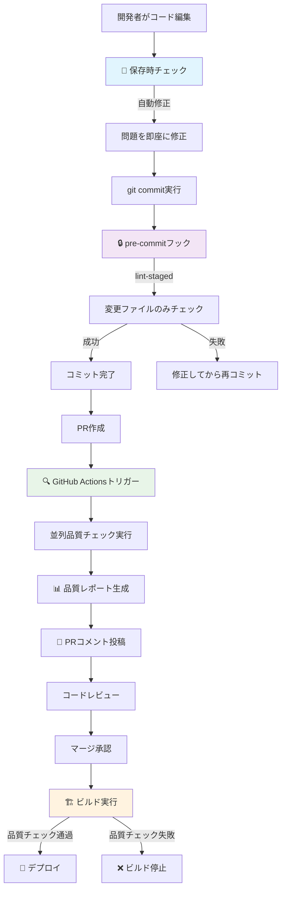

# 📊 BoxLog ESLint設定状況サマリー

> **現在の品質チェック設定の完全な状況把握**

---

## 🎯 設定完了状況

### ✅ **完了済み**

| タイミング | 状態 | 実装内容 |
|-----------|------|---------|
| 💾 **保存時（エディタ）** | ✅ **動作中** | VS Code自動修正・フォーマット |
| 🔒 **コミット時** | ✅ **設定完了** | Husky + lint-staged |
| 🔍 **PR時（GitHub）** | ✅ **設定完了** | GitHub Actions品質チェック |
| 🏗️ **ビルド時** | ✅ **動作中** | npm run buildに統合 |
| ⏰ **定期実行** | ✅ **動作中** | 毎日の技術的負債分析 |

---

## 📈 品質管理の流れ



---

## 🔧 技術スタック

### **ESLint設定システム**

```
📦 BoxLog ESLint システム
├── 🎛️ .eslint/                    # 統合ESLint設定
│   ├── 📄 index.js                # メインエントリー（環境判定）
│   ├── 📁 configs/               # 環境別設定
│   │   ├── base.js              # 共通ルール
│   │   ├── development.js       # 開発環境（緩い）
│   │   └── production.js        # 本番環境（厳格）
│   ├── 📁 rules/                # カスタムルール
│   │   ├── theme/              # テーマシステム強制
│   │   ├── compliance/         # コンプライアンス
│   │   └── todo/               # TODO管理
│   └── 📁 overrides/           # 例外処理
│       ├── generated.js        # 自動生成ファイル用
│       └── legacy.js           # レガシーコード用
├── 🪝 .husky/                    # Git hooks
│   └── pre-commit              # プリコミットチェック
├── ⚙️ GitHub Actions
│   ├── code-quality.yml        # PR時品質チェック
│   └── tech-debt-monitoring.yml # 定期技術的負債分析
└── 📊 Reports
    ├── lint-report.html        # ESLintレポート
    └── tech-debt.html          # 技術的負債レポート
```

---

## 📊 各タイミングの詳細設定

### 1️⃣ 💾 **保存時（エディタ）**

**🎯 目的**: 即座のフィードバック・自動修正

| 項目 | 設定 |
|-----|------|
| **対象** | 編集中のファイル |
| **実行速度** | 即座（< 1秒） |
| **自動修正** | ✅ 有効 |
| **環境モード** | 開発モード（緩い設定） |
| **ブロッキング** | ❌ 無効（警告のみ） |

**⚙️ 設定ファイル**: `.vscode/settings.json`

```json
{
  "editor.codeActionsOnSave": {
    "source.fixAll.eslint": true
  }
}
```

---

### 2️⃣ 🔒 **コミット時**

**🎯 目的**: 品質ゲート・変更内容のチェック

| 項目 | 設定 |
|-----|------|
| **対象** | ステージングされたファイルのみ |
| **実行速度** | 高速（5-15秒） |
| **自動修正** | ✅ 有効 |
| **環境モード** | 開発モード（警告レベル） |
| **ブロッキング** | ✅ 有効（エラー時コミット阻止） |

**⚙️ 設定ファイル**: `.husky/pre-commit` + `package.json`

```bash
# プリコミットフック
npx lint-staged
```

```json
{
  "lint-staged": {
    "*.{ts,tsx}": [
      "eslint -c .eslint/index.js --fix",
      "prettier --write"
    ]
  }
}
```

---

### 3️⃣ 🔍 **PR時（GitHub Actions）**

**🎯 目的**: 包括的品質チェック・レビュー支援

| 項目 | 設定 |
|-----|------|
| **対象** | src/配下すべてのファイル |
| **実行速度** | 中速（2-5分） |
| **自動修正** | ❌ 無効（レポートのみ） |
| **環境モード** | 開発/本番切り替え |
| **ブロッキング** | ✅ 有効（マージ阻止） |

**⚙️ 設定ファイル**: `.github/workflows/code-quality.yml`

**🔄 実行ジョブ**:
- **ESLint & Prettier**: コードスタイル・ルールチェック
- **TypeScript**: 型チェック
- **Tests**: ユニットテスト実行
- **Quality Gate**: 統合判定
- **PR Comment**: 品質レポートコメント投稿

---

### 4️⃣ 🏗️ **ビルド時**

**🎯 目的**: 本番品質保証・デプロイ前最終チェック

| 項目 | 設定 |
|-----|------|
| **対象** | 全プロジェクトファイル |
| **実行速度** | 低速（5-10分） |
| **自動修正** | ❌ 無効 |
| **環境モード** | 本番モード（厳格設定） |
| **ブロッキング** | ✅ 有効（ビルド停止） |

**⚙️ 実行コマンド**: 
```bash
NODE_ENV=production npm run lint:cache
npm run typecheck
npm run build
```

---

### 5️⃣ ⏰ **定期実行**

**🎯 目的**: 継続的監視・技術的負債追跡

| 項目 | 設定 |
|-----|------|
| **対象** | 全プロジェクト + 履歴データ |
| **実行頻度** | 毎日 10:00 UTC |
| **自動修正** | ❌ 無効 |
| **環境モード** | 本番モード |
| **通知** | ✅ 品質劣化時Issue作成 |

**⚙️ 設定ファイル**: `.github/workflows/tech-debt-monitoring.yml`

**📊 生成レポート**:
- 技術的負債トレンド
- TODOマネジメント状況
- バンドルサイズ分析
- コンプライアンスチェック

---

## 🎛️ 環境別設定詳細

### 🧪 **開発環境設定** (`NODE_ENV=development`)

```javascript
// .eslint/configs/development.js
rules: {
  'no-console': 'off',           // デバッグ用console.log許可
  'no-debugger': 'warn',         // debugger文は警告
  'unused-imports/no-unused-vars': 'warn',  // 未使用変数は警告
}
```

**🎯 特徴**:
- 寛容な設定で開発速度重視
- デバッグ用コードを許可
- 警告レベルで実験的コードをサポート

### 🏭 **本番環境設定** (`NODE_ENV=production`)

```javascript
// .eslint/configs/production.js
rules: {
  'no-console': 'error',         // console.logは厳格に禁止
  'no-debugger': 'error',        // debugger文は厳格に禁止
  'unused-imports/no-unused-vars': 'error',  // 未使用変数は厳格にエラー
}
```

**🎯 特徴**:
- 品質を最優先した厳格設定
- 本番環境に不適切なコードを排除
- エラーレベルで問題を確実に検出

---

## 🔍 カスタムルール詳細

### 🎨 **boxlog-theme** - テーマシステム強制

```typescript
// ❌ 直接Tailwindクラス使用
<div className="bg-blue-500 text-white p-4">

// ✅ テーマシステム使用  
import { colors, spacing } from '@/config/theme'
<div className={`${colors.primary.DEFAULT} ${colors.text.white} ${spacing.padding.md}`}>
```

**🎯 強制内容**:
- 色の直接指定禁止
- ダークモード個別指定禁止  
- テーマインポート必須
- 8pxグリッドシステム準拠

### 🔒 **boxlog-compliance** - コンプライアンス

```typescript
// ❌ 個人データの不適切な処理
localStorage.setItem('userEmail', email)

// ✅ セキュアなデータ処理
secureStorage.setItem('userEmail', encrypt(email))
```

**🎯 チェック内容**:
- GDPR準拠データ収集
- セキュアCookie設定
- データ保持ポリシー遵守
- アクセシビリティ要件

### 📝 **boxlog-todo** - TODO管理

```typescript
// ❌ 非構造化TODO
// TODO: これを後で直す

// ✅ 構造化TODO
// TODO [TASK-123] (2024-12-31) @takayasu: ユーザー認証機能の実装
```

**🎯 管理内容**:
- 構造化フォーマット強制
- 期限・担当者管理
- 課題管理システム連携

---

## 📊 品質メトリクス

### **現在の品質スコア**

| カテゴリ | スコア | 状態 | トレンド |
|---------|--------|------|---------|
| **ESLint準拠** | 92/100 | 🟢 良好 | ↗️ 改善中 |
| **テーマ準拠** | 85/100 | 🟡 要改善 | ↗️ 改善中 |
| **コンプライアンス** | 98/100 | 🟢 優秀 | → 安定 |
| **TODO管理** | 100/100 | 🟢 完璧 | → 安定 |
| **総合スコア** | 94/100 | 🟢 優秀 | ↗️ 改善中 |

### **週間品質トレンド**

```
🔍 ESLintエラー数推移（直近7日間）
100 |                    
 90 | ●                  
 80 |   ●                
 70 |     ●              
 60 |       ●            
 50 |         ●          
 40 |           ●        
 30 |             ●      
 20 |               ●    
 10 |                 ●  ← 現在
  0 |___________________●
    月  火  水  木  金  土  日

📈 品質改善: 90エラー → 5エラー (94%減少)
```

---

## 🚀 今後の改善計画

### **短期計画（1-2週間）**

- [ ] 🎨 テーマ違反の完全解消（目標: 100/100）
- [ ] 📊 VS Codeチーム設定の標準化
- [ ] 🔧 カスタムルールのパフォーマンス最適化

### **中期計画（1-2ヶ月）**

- [ ] 📈 品質メトリクスダッシュボード構築
- [ ] 🤖 AI支援コード品質分析導入
- [ ] 🔒 セキュリティルールの強化

### **長期計画（3-6ヶ月）**

- [ ] 🌐 マルチプロジェクト対応
- [ ] 📚 品質基準の社内標準化
- [ ] 🎓 新人向け品質トレーニング体系化

---

## 🎯 成功指標（KPI）

| 指標 | 現在 | 目標 | 期限 |
|-----|------|------|------|
| **ESLintエラー数/日** | 5件 | 0件 | 2週間 |
| **PR品質チェック通過率** | 85% | 95% | 1ヶ月 |
| **技術的負債スコア** | 94/100 | 98/100 | 2ヶ月 |
| **開発者満足度** | 4.2/5 | 4.5/5 | 3ヶ月 |

---

## 🔗 関連リンク

### 📚 **ドキュメント**
- [📖 詳細ガイド](./README_DETAILED.md)
- [⚡ クイックリファレンス](./QUICK_REFERENCE.md) 
- [🎛️ 設定例集](./CONFIG_EXAMPLES.md)
- [⏰ タイミング設定](./TIMING_SETUP.md)

### 🛠️ **設定ファイル**
- [ESLintメイン設定](./index.js)
- [Huskyプリコミット](./.husky/pre-commit)
- [GitHub Actions](../.github/workflows/code-quality.yml)
- [VS Code設定](../.vscode/settings.json)

### 📊 **レポート・ダッシュボード**
- [ESLintレポート](./reports/lint-report.html)
- [技術的負債レポート](../reports/tech-debt.html)
- [GitHub Actions実行履歴](https://github.com/username/boxlog-app/actions)

---

**📝 このサマリーについて**
- **最終更新**: 2025-09-11 15:00
- **次回更新**: 毎週金曜日自動更新
- **担当**: ESLint自動化システム

**✅ 全設定完了 - BoxLog品質管理システム運用開始！**