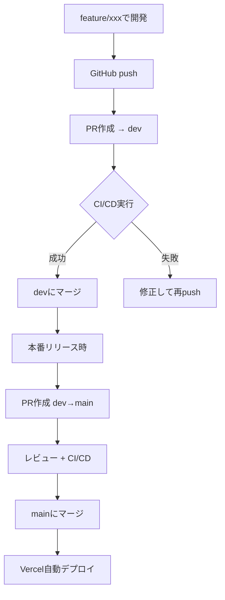

# CI/CD環境 現在の状態

**最終更新**: 2025-01-18

## 📊 設定完了状況

### ✅ 完了した設定

#### 1. Vitest環境
- テストフレームワーク導入完了
- React Testing Library設定済み
- 基本的なコンポーネントテスト作成済み

#### 2. GitHub Actions
- CI/CDワークフロー設定完了
- dev/mainブランチで自動実行
- PR作成時も自動実行

#### 3. GitHub Repository設定
- **Actions**: 有効化済み ✅
- **Secrets**: Vercel認証情報設定済み ✅
- **Branch Protection**: 設定完了 ✅

#### 4. Branch Protection Rules詳細

**devブランチ** 🔒
- 直接push: **可能**
- レビュー承認: **不要**
- CI/CD成功: **必須**
- 用途: 開発速度重視

**mainブランチ** 🔒
- 直接push: **不可**
- PR必須: **Yes**
- レビュー承認: **必須（1人）**
- CI/CD成功: **必須**
- 管理者例外: **なし**
- 用途: 本番環境保護

## 🔄 現在の開発フロー



## 📝 利用可能なコマンド

```bash
# テスト実行
npm run test         # 単発実行
npm run test:watch   # ウォッチモード
npm run test:ui      # UIモード
npm run test:coverage # カバレッジ

# 品質チェック
npm run lint         # Lintチェック
npm run typecheck    # 型チェック
npm run build        # ビルド確認

# 開発前の推奨チェック
npm run lint && npm run test && npm run build
```

## ⚠️ 既知の問題

### 1. 型エラー（対応保留中）
- `tests/api/tags.test.ts` - supertest型の不一致
- 現在はskipで回避中
- CI/CDは継続実行される設定

### 2. 警告
- Vite CJS deprecation警告
- 動作に影響なし

## 🚀 今後の活用方法

### 新機能開発時
1. `feature/機能名` ブランチ作成
2. 開発・テスト作成
3. PR → dev（CI自動実行）
4. 成功後マージ

### バグ修正時
1. `fix/バグ名` ブランチ作成
2. 修正・テスト追加
3. PR → dev（CI自動実行）
4. 成功後マージ

### 本番リリース時
1. dev → main PR作成
2. レビュー依頼
3. 承認 + CI成功でマージ
4. Vercel自動デプロイ実行

## 📞 トラブルシューティング

### CI/CDが失敗した場合
1. PR/ActionsページでエラーログCHECK_SYMBOL
2. ローカルで `npm run test` 実行
3. エラー修正後、再push

### Vercelデプロイが失敗した場合
1. GitHub Secrets確認
2. Vercelダッシュボードでログ確認
3. 環境変数の設定確認

---

CI/CD環境の構築により、**品質保証**と**自動化**が実現しました。
安全で効率的な開発をお楽しみください！ 🎉