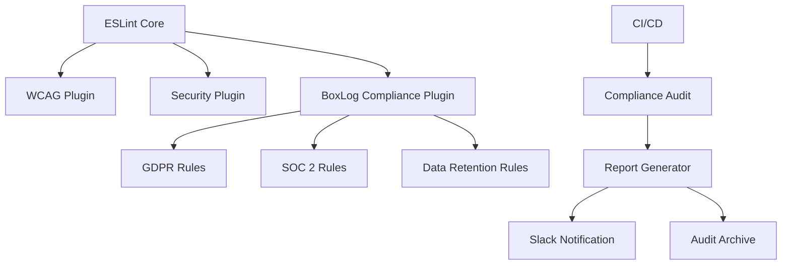
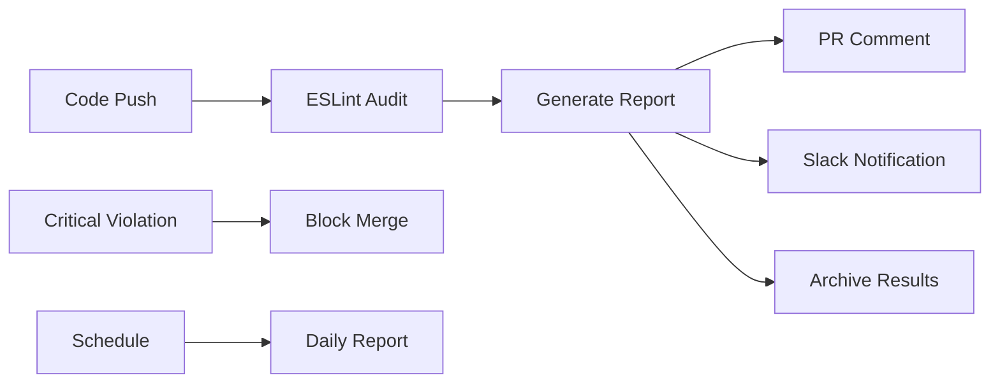

# 🛡️ BoxLog International Compliance ESLint Rules

BoxLogプロジェクトにおける国際規格準拠のためのESLintルール体系について説明します。

## 📋 目次

- [概要](#概要)
- [対応規格](#対応規格)
- [ESLintルール一覧](#eslintルール一覧)
- [段階的導入計画](#段階的導入計画)
- [監視とレポート](#監視とレポート)
- [CI/CD統合](#cicd統合)
- [トラブルシューティング](#トラブルシューティング)

## 概要

### 🎯 目的

BoxLogは以下の国際規格に準拠する必要があります：

1. **🔴 必須（法的要件）**
   - GDPR（EU一般データ保護規則）
   - CCPA（カリフォルニア州消費者プライバシー法）

2. **🟡 重要（セキュリティ要件）**
   - SOC 2 Type II
   - ISO 27001

3. **🟢 推奨（アクセシビリティ）**
   - WCAG 2.1 Level AA
   - Section 508

### 🏗️ アーキテクチャ



## 対応規格

### 1. 🇪🇺 GDPR (General Data Protection Regulation)

**根拠法令**: EU 2016/679  
**適用範囲**: EU居住者の個人データ処理  
**最大制裁金**: 年間売上高の4%または2,000万ユーロ

#### 実装要件

| Article         | 要件           | ESLintルール                 |
| --------------- | -------------- | ---------------------------- |
| Article 5(1)(e) | データ保存制限 | `data-retention-policy`      |
| Article 6       | 処理の適法性   | `require-consent-tracking`   |
| Article 17      | 削除権         | `require-deletion-mechanism` |
| Article 25      | 設計による保護 | `no-personal-data-logging`   |
| Article 32      | セキュリティ   | `secure-data-transmission`   |

### 2. 🛡️ SOC 2 Type II

**規格**: AICPA Trust Services Criteria  
**対象**: クラウドサービス組織  
**監査頻度**: 年次

#### Trust Services Criteria

| Criteria | 内容         | ESLintルール               |
| -------- | ------------ | -------------------------- |
| CC6.1    | アクセス制御 | `no-hardcoded-secrets`     |
| CC6.2    | システム廃棄 | `automated-data-cleanup`   |
| CC6.3    | データ処理   | `require-input-validation` |
| CC7.1    | システム監視 | `require-audit-logging`    |

### 3. ♿ WCAG 2.1 Level AA

**規格**: W3C Web Content Accessibility Guidelines  
**レベル**: AA（中程度の適合）  
**対象**: Webアクセシビリティ

#### 実装要件

| Principle      | Guideline               | ESLintルール                            |
| -------------- | ----------------------- | --------------------------------------- |
| Perceivable    | 1.1 Text Alternatives   | `jsx-a11y/alt-text`                     |
| Operable       | 2.1 Keyboard Accessible | `jsx-a11y/click-events-have-key-events` |
| Understandable | 3.1 Readable            | `jsx-a11y/lang`                         |
| Robust         | 4.1 Compatible          | `jsx-a11y/aria-props`                   |

## ESLintルール一覧

### 🔴 GDPR準拠ルール（必須）

#### `no-personal-data-logging`

```typescript
// ❌ 違反
console.log('User email:', user.email)

// ✅ 正しい
console.log('User logged in:', user.id)
```

**根拠**: GDPR Article 25 - データ保護設計原則  
**違反時の影響**: データ漏洩リスク、制裁金対象

#### `require-consent-tracking`

```typescript
// ❌ 違反
analytics.track('page_view', userdata)

// ✅ 正しい
if (hasConsent('analytics')) {
  analytics.track('page_view', anonymizedData)
}
```

**根拠**: GDPR Article 7 - 同意の条件  
**違反時の影響**: 違法なデータ処理

#### `secure-data-transmission`

```typescript
// ❌ 違反
fetch('http://api.example.com/users', {
  body: JSON.stringify(personalData),
})

// ✅ 正しい
fetch('https://api.example.com/users', {
  headers: {
    Authorization: `Bearer ${token}`,
    'Content-Type': 'application/json',
  },
  body: JSON.stringify(encryptedData),
})
```

**根拠**: GDPR Article 32 - 処理のセキュリティ  
**違反時の影響**: データ漏洩、通信傍受

### 🟡 SOC 2準拠ルール（重要）

#### `no-hardcoded-secrets`

```typescript
// ❌ 違反
const API_KEY = 'sk-1234567890abcdef'

// ✅ 正しい
const API_KEY = process.env.API_KEY
```

**根拠**: SOC 2 CC6.1 - 論理・物理アクセス制御  
**違反時の影響**: 認証情報漏洩、不正アクセス

#### `require-audit-logging`

```typescript
// ❌ 違反
function deleteUser(userId) {
  database.users.delete(userId)
}

// ✅ 正しい
function deleteUser(userId) {
  auditLog('user_deletion', { userId, timestamp: Date.now() })
  database.users.delete(userId)
}
```

**根拠**: SOC 2 CC7.1 - システム監視  
**違反時の影響**: 監査証跡不足、インシデント対応困難

### 🟢 アクセシビリティルール（推奨）

#### `jsx-a11y/alt-text`

```tsx
{
  /* ❌ 違反 */
}
;

{
  /* ✅ 正しい */
}
;
```

**根拠**: WCAG 2.1 Success Criterion 1.1.1  
**違反時の影響**: スクリーンリーダー利用者の情報アクセス阻害

## 段階的導入計画

### Phase 1: 緊急対応（Week 1）

**対象**: 法的リスクが最も高いルール  
**レベル**: ERROR

```json
{
  "rules": {
    "boxlog-compliance/no-personal-data-logging": "error",
    "boxlog-compliance/no-hardcoded-secrets": "error",
    "boxlog-compliance/secure-data-transmission": "error"
  }
}
```

**実行**:

```bash
npm run lint:compliance:phase1
```

### Phase 2: セキュリティ強化（Week 2-3）

**対象**: セキュリティ統制関連  
**レベル**: WARN → ERROR

```json
{
  "rules": {
    "boxlog-compliance/require-consent-tracking": "warn",
    "boxlog-compliance/require-input-validation": "warn",
    "boxlog-compliance/require-audit-logging": "warn"
  }
}
```

### Phase 3: 完全準拠（Week 4）

**対象**: 全ルール  
**レベル**: ERROR

```bash
npm run lint:compliance:strict
```

### Phase 4: 継続監視

**頻度**: 日次自動実行  
**アクション**: CI/CD統合、Slack通知

## 監視とレポート

### 📊 コンプライアンスダッシュボード

```bash
npm run compliance:report
```

**出力形式**:

- JSON（機械読み取り用）
- HTML（人間読み取り用）
- CSV（スプレッドシート分析用）

**レポート内容**:

```json
{
  "summary": {
    "overallScore": 85,
    "status": "PARTIAL_COMPLIANCE",
    "criticalIssues": 3
  },
  "regulations": {
    "gdpr": {
      "score": 78,
      "compliant": false,
      "errorCount": 5,
      "warningCount": 12
    }
  }
}
```

### 📈 KPI指標

| 指標                       | 目標値 | 現在値 | トレンド |
| -------------------------- | ------ | ------ | -------- |
| 総合コンプライアンススコア | 95%    | 85%    | ↗️       |
| GDPR準拠率                 | 100%   | 78%    | ↗️       |
| SOC 2準拠率                | 100%   | 92%    | ↗️       |
| 重大違反数                 | 0      | 3      | ↘️       |

### 🚨 アラート設定

```yaml
alerts:
  critical:
    - rule: 'no-personal-data-logging'
      threshold: 1
      action: 'immediate_slack_notification'

  high:
    - rule: 'no-hardcoded-secrets'
      threshold: 5
      action: 'daily_summary'
```

## CI/CD統合

### GitHub Actions設定

**トリガー**:

- Push to main/dev branches
- Pull Request
- Daily schedule (9 AM JST)
- Manual dispatch

**実行フロー**:



### PR自動コメント

```markdown
## 🛡️ GDPR Compliance Report

**Status:** ❌ NON-COMPLIANT (65/100)

| Metric           | Count |
| ---------------- | ----- |
| Errors           | 8     |
| Warnings         | 15    |
| Total Violations | 23    |

### 🔧 Action Required

GDPR compliance issues detected. Please review and fix violations before merging.

**Top Issues:**

1. Personal data in log statements (5 occurrences)
2. Missing consent tracking (3 occurrences)
```

### Slack通知

```json
{
  "text": "🚨 BoxLog Compliance Alert",
  "blocks": [
    {
      "type": "header",
      "text": {
        "type": "plain_text",
        "text": "🛡️ Critical Compliance Violation Detected"
      }
    },
    {
      "type": "section",
      "fields": [
        {
          "type": "mrkdwn",
          "text": "*Rule:* no-personal-data-logging"
        },
        {
          "type": "mrkdwn",
          "text": "*Severity:* CRITICAL"
        }
      ]
    }
  ]
}
```

## package.json統合

**新規コマンド**:

```json
{
  "scripts": {
    "lint:compliance": "eslint --config .eslintrc.compliance.json src/**/*.{ts,tsx}",
    "lint:compliance:gdpr": "eslint --config .eslintrc.compliance.json --rule 'boxlog-compliance/gdpr-*: error' src/",
    "lint:compliance:soc2": "eslint --config .eslintrc.compliance.json --rule 'boxlog-compliance/soc2-*: error' src/",
    "lint:compliance:strict": "eslint --config .eslintrc.compliance.json --rule 'boxlog-compliance/*: error' src/",
    "compliance:report": "node scripts/compliance-report.js",
    "compliance:fix": "eslint --config .eslintrc.compliance.json --fix src/",
    "compliance:watch": "nodemon --exec 'npm run compliance:report' --watch src/"
  }
}
```

## トラブルシューティング

### よくある問題

#### 1. **プラグインが見つからない**

```bash
Error: Cannot resolve plugin 'boxlog-compliance'
```

**解決方法**:

```bash
# プラグインのセットアップ
mkdir -p node_modules/eslint-plugin-boxlog-compliance
cp -r config/eslint/compliance-rules/* node_modules/eslint-plugin-boxlog-compliance/
```

#### 2. **過剰な警告**

```bash
Warning: 1,247 compliance violations found
```

**解決方法**:

```bash
# 段階的導入モードを使用
npm run lint:compliance:migration
```

#### 3. **パフォーマンス問題**

```bash
ESLint execution time: 45 seconds
```

**解決方法**:

```json
{
  "eslintConfig": {
    "cache": true,
    "cacheLocation": ".eslintcache"
  }
}
```

### エラー解決ガイド

#### GDPR違反の修正

```typescript
// 修正前
console.log('Processing user:', user.email, user.phone)

// 修正後
import { sanitizeForLogging } from '@/utils/privacy'

console.log('Processing user:', sanitizeForLogging(user.id))
```

#### SOC 2違反の修正

```typescript
// 修正前
const dbPassword = 'admin123'

// 修正後
const dbPassword = process.env.DB_PASSWORD
```

#### アクセシビリティ違反の修正

```tsx
{
  /* 修正前 */
}
;<button onClick={handleSubmit}>Submit</button>

{
  /* 修正後 */
}
;<button onClick={handleSubmit} aria-label="フォームを送信" type="submit">
  Submit
</button>
```

## 関連ドキュメント

- [ESLintハイブリッドアプローチ](../development/ESLINT_HYBRID_APPROACH.md)

---

**📞 サポート**: compliance-team@boxlog.com  
**🔄 更新頻度**: 月次  
**📅 次回監査**: 2025年1月15日

---

**最終更新**: 2025-09-18
