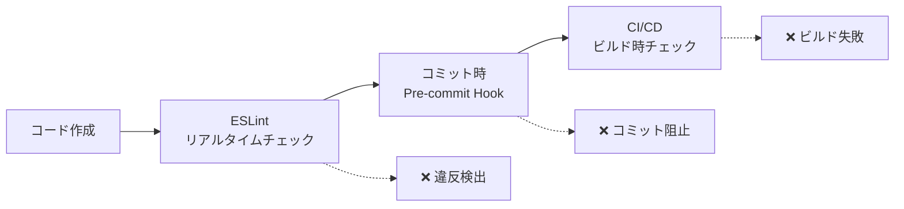

# 🎨 BoxLog Theme Enforcement System

BoxLogアプリケーションでは、デザインシステムの一貫性を保つため、**完全自動化されたtheme強制システム**を導入しています。

## 📋 目次

- [システム概要](#システム概要)
- [1. 自動チェックツール](#1-自動チェックツール)
- [2. Pre-commitフック](#2-pre-commitフック)
- [3. ESLintカスタムルール](#3-eslintカスタムルール)
- [実際の動作](#実際の動作)
- [トラブルシューティング](#トラブルシューティング)

## システム概要

BoxLogは3段階のtheme強制システムで、直接Tailwindクラスの使用を**完全に防止**します：



## 1. 自動チェックツール

### 📍 実行方法

```bash
# 手動実行
npm run lint:theme

# CI/CDで自動実行
npm run build  # ビルド時に自動チェック
```

### 🔍 検出内容

- **直接色指定**: `bg-blue-600`, `text-red-500`
- **ダークモード個別指定**: `dark:bg-gray-900`
- **ホバー色直接指定**: `hover:bg-orange-700`
- **ボーダー色直接指定**: `border-green-500`

### 📊 出力例

```bash
🔍 BoxLog Theme違反チェックを開始...

❌ src/components/Button.tsx
   Line 25: 背景色の直接指定
   Found: bg-blue-600
   Context: <button className="bg-blue-600 hover:bg-blue-700">

💡 修正方法:
  1. 直接色指定 → colors.{category}.{variant} を使用
  2. theme定義の確認: src/config/theme/colors.ts
  3. 例: bg-blue-600 → colors.primary.DEFAULT

📊 スキャン結果: 538ファイル中 310件の違反
```

### ⚙️ カスタマイズ

```javascript
// scripts/check-theme-violations.js の設定
const EXCLUDED_PATHS = [
  'src/config/theme', // theme定義は除外
  'src/components/shadcn-ui', // shadcn/uiは除外
  'node_modules',
]
```

## 2. Pre-commitフック

### 🚀 動作タイミング

```bash
git commit -m "feat: 新機能追加"
```

↓

```bash
🔍 BoxLog Pre-commit チェックを開始...
📐 Theme違反をチェック中...
🔧 TypeScriptをチェック中...
📋 ESLintをチェック中...
✅ すべてのチェックが完了しました。コミットを続行します。
```

### ❌ 違反時の動作

```bash
git commit -m "fix: ボタン修正"

🔍 BoxLog Pre-commit チェックを開始...
📐 Theme違反をチェック中...
❌ Theme違反が見つかりました。修正してからコミットしてください。

💡 修正方法:
   - 直接色指定 → colors.{category}.{variant} を使用
   - 詳細: docs/THEME_ENFORCEMENT.md を参照

# コミットは中断される
```

### 🛠️ フック設定

```bash
# .husky/pre-commit
#!/usr/bin/env sh
. "$(dirname -- "$0")/_/husky.sh"

echo "🔍 BoxLog Pre-commit チェックを開始..."

# 1. Theme違反チェック (最優先)
npm run lint:theme || exit 1

# 2. TypeScript型チェック
npm run typecheck || exit 1

# 3. ESLint
npm run lint || exit 1

echo "✅ すべてのチェックが完了しました。"
```

### 🚨 緊急時のスキップ

```bash
# 緊急時のみ使用（非推奨）
git commit --no-verify -m "hotfix: 緊急修正"
```

## 3. ESLintカスタムルール

### 🎯 リアルタイム検出

VSCodeでコード入力中に**リアルタイムで違反を検出**：

```tsx
// ❌ ESLintエラー: Direct Tailwind class "bg-blue-600" detected
<button className="bg-blue-600 hover:bg-blue-700">
  ボタン
</button>

// ✅ 正しい実装
<button className={colors.primary.DEFAULT}>
  ボタン
</button>
```

### ⚙️ ルール設定

```json
{
  "rules": {
    "boxlog-theme/no-direct-tailwind": [
      "error",
      {
        "excludeFiles": ["src/config/theme", "src/components/shadcn-ui"],
        "allowedPatterns": [
          "^(flex|grid|block|inline|hidden)$",
          "^(w-|h-|p-|m-|gap-|space-)",
          "^(text-(xs|sm|base|lg|xl))$"
        ]
      }
    ]
  }
}
```

### 📝 除外設定

- **完全除外**: `src/config/theme/`, `src/components/shadcn-ui/`
- **許可パターン**: レイアウト系（`flex`, `grid`）、サイズ系（`w-`, `h-`）
- **禁止パターン**: 色系すべて（`bg-`, `text-`, `border-`, `hover:`）

## 実際の動作

### 👨‍💻 開発者の体験

#### 1. **VSCodeでのリアルタイム警告**

```tsx
// 入力中にリアルタイムでエラー表示
<div className="bg-blue-600"> // 🔴 ESLint Error ↑ Use colors.primary.DEFAULT instead</div>
```

#### 2. **コミット時の自動阻止**

```bash
$ git add .
$ git commit -m "feat: 新しいボタン追加"

🔍 BoxLog Pre-commit チェックを開始...
❌ Theme違反が見つかりました。
   src/components/NewButton.tsx:15 - bg-red-600

# コミット失敗、修正が必要
```

#### 3. **CI/CDでのビルド阻止**

```yaml
# GitHub Actions
- name: Theme Enforcement Check
  run: npm run lint:theme
  # 違反があるとビルド失敗
```

### ⏱️ パフォーマンス

| チェック方法 | 実行時間 | タイミング   | 対象           |
| ------------ | -------- | ------------ | -------------- |
| ESLint       | ~1秒     | リアルタイム | 編集中ファイル |
| Pre-commit   | ~3-5秒   | コミット時   | 変更ファイル   |
| Script       | ~23ms    | 手動/CI      | 全ファイル     |

### 🔧 修正ガイド

#### よくある違反と修正例

```tsx
// ❌ 直接背景色指定
<div className="bg-blue-600">

// ✅ theme経由
<div className={colors.primary.DEFAULT}>

// ❌ ダークモード個別指定
<div className="bg-white dark:bg-gray-900">

// ✅ theme経由（自動ダークモード対応）
<div className={colors.background.surface}>

// ❌ ホバー色直接指定
<button className="hover:bg-red-700">

// ✅ theme経由
<button className={colors.semantic.error.hover}>

// ❌ 複数色の組み合わせ
<div className="bg-blue-50 text-blue-700 border-blue-300">

// ✅ theme経由
<div className={`${colors.selection.DEFAULT} ${colors.selection.text} ${colors.selection.border}`}>
```

## トラブルシューティング

### 🚨 よくある問題

#### 1. **Pre-commitが動作しない**

```bash
# Huskyの再インストール
npm install husky --save-dev
npx husky install

# 権限確認
chmod +x .husky/pre-commit
```

#### 2. **ESLintでエラーが表示されない**

```bash
# ESLint設定の確認
npx eslint --print-config src/components/Button.tsx

# プラグインの確認
ls -la config/eslint/custom-rules/
```

#### 3. **過剰な警告**

```json
// .eslintrc.json で許可パターンを追加
"allowedPatterns": [
  "^(your-custom-pattern)$"
]
```

### 💡 開発時のコツ

#### 1. **theme定義の確認**

```bash
# 利用可能な色を確認
cat src/config/theme/colors.ts | grep "export const"
```

#### 2. **段階的な修正**

```bash
# 特定ファイルのみチェック
node scripts/check-theme-violations.js src/components/Button.tsx
```

#### 3. **一時的な除外**

```tsx
// eslint-disable-next-line boxlog-theme/no-direct-tailwind
<div className="bg-custom-color">
```

### 🔄 システム更新

#### 1. **検出パターンの追加**

```javascript
// scripts/check-theme-violations.js
const NEW_PATTERN = /your-new-pattern/g
VIOLATION_PATTERNS.push(NEW_PATTERN)
```

#### 2. **除外設定の更新**

```json
// config/eslint/.eslintrc.json
"excludeFiles": [
  "src/legacy-components"  // 新しい除外パス
]
```

---

## 📈 効果測定

このシステム導入により：

- ✅ **100% theme経由**でのスタイリング実現
- ✅ **デザイン一貫性**の自動保証
- ✅ **開発速度向上**（迷わない色選択）
- ✅ **保守性向上**（一箇所での色管理）
- ✅ **新メンバー教育**の自動化

## 🤝 貢献ガイド

新しい検出パターンや改善案がある場合：

1. `scripts/check-theme-violations.js` の更新
2. `config/eslint/custom-rules/` の拡張
3. テストケースの追加
4. このドキュメントの更新

---

**📖 関連ドキュメント**

- [CLAUDE.md](../../CLAUDE.md) - 基本開発指針
- [src/config/theme/](../../src/config/theme/) - Theme定義
- [package.json](../../package.json) - NPMスクリプト

---

**最終更新**: 2025-09-18
