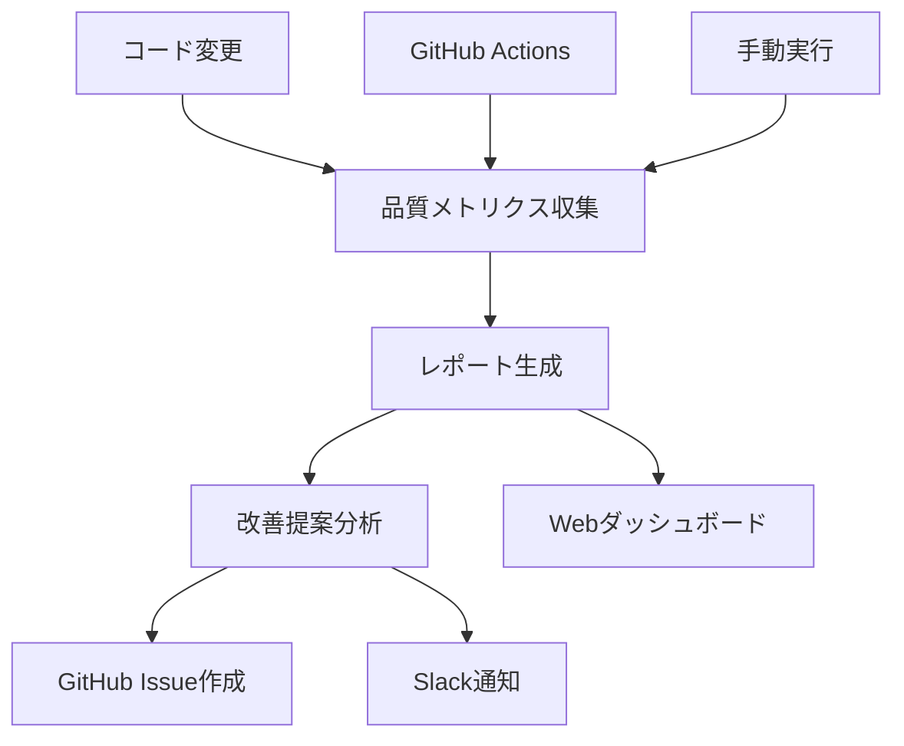

# 📊 BoxLog自動品質レポートシステム

BoxLogプロジェクトの自動品質監視・改善提案システムの完全ガイドです。

## 🎯 システム概要

### 目的

- **継続的品質監視**: コード品質、テスト、パフォーマンスの自動測定
- **改善提案の自動化**: 問題の検出と具体的な対策提示
- **チーム協調**: 品質情報の共有と改善進捗の可視化

### 主要機能

1. **📊 品質メトリクス収集** - ESLint、TypeScript、カバレッジ、バンドルサイズ
2. **📋 自動レポート生成** - JSON/Markdown形式での詳細レポート
3. **🎯 改善提案システム** - 優先度付き改善Issue自動作成
4. **📱 Webダッシュボード** - リアルタイム品質監視
5. **⏰ 週次自動実行** - GitHub Actionsによる定期実行

## 🚀 クイックスタート

### 1. 品質レポート生成

```bash
# 基本的な品質レポート生成
npm run quality:report

# メトリクス収集のみ
npm run quality:metrics

# 完全分析（レポート + 改善提案）
npm run improvement:full
```

### 2. Webダッシュボード

```bash
# 開発サーバー起動
npm run dev

# ダッシュボードアクセス
open http://localhost:3000/quality-dashboard
```

### 3. 改善提案

```bash
# 改善Issue自動作成
npm run improvement:suggest

# 進捗追跡のみ
npm run improvement:track
```

## 📊 コマンド一覧

### 品質分析コマンド

| コマンド                    | 用途           | 説明                              |
| --------------------------- | -------------- | --------------------------------- |
| `npm run quality:report`    | 基本レポート   | 品質メトリクス収集とレポート生成  |
| `npm run quality:metrics`   | メトリクス収集 | 基本的な品質データ収集            |
| `npm run quality:analyze`   | 完全分析       | 包括的な品質分析                  |
| `npm run quality:dashboard` | ダッシュボード | レポート生成 + ダッシュボード案内 |

### 改善提案コマンド

| コマンド                      | 用途       | 説明                      |
| ----------------------------- | ---------- | ------------------------- |
| `npm run improvement:suggest` | 改善提案   | Issue作成 + Slack通知準備 |
| `npm run improvement:track`   | 進捗追跡   | 改善Issue進捗確認         |
| `npm run improvement:full`    | 完全フロー | レポート生成 + 改善提案   |

## 🏗️ システム構成

### ファイル構成

```
boxlog-app/
├── scripts/
│   ├── quality-report.js           # 品質レポート生成
│   ├── metrics-collector.js        # メトリクス収集
│   └── improvement-suggester.js    # 改善提案システム
├── src/
│   ├── lib/quality-metrics.ts      # 品質メトリクスライブラリ
│   └── app/quality-dashboard/      # Webダッシュボード
├── .github/workflows/
│   └── weekly-quality-report.yml   # 週次自動実行
└── reports/quality/                # レポート出力先
    ├── quality-report-YYYY-MM-DD.json
    ├── quality-report-YYYY-MM-DD.md
    └── history/                    # 履歴データ
```

### データフロー



## 📈 品質スコア算出

### スコア計算ロジック（100点満点）

```typescript
// 基本スコア: 100点
let score = 100

// ESLintエラー（-1点/エラー、最大-20点）
score -= Math.min(20, eslintErrors)

// TypeScriptエラー（-2点/エラー、最大-20点）
score -= Math.min(20, typescriptErrors * 2)

// テストカバレッジ（80%未満で減点）
if (coverage < 80) {
  score -= Math.min(20, (80 - coverage) / 2)
}

// 技術的負債（TODO数、最大-10点）
score -= Math.min(10, todoCount / 5)

// バンドルサイズ（5MB超で減点）
if (bundleMB > 5) {
  score -= Math.min(10, (bundleMB - 5) * 2)
}
```

### グレード分類

| スコア | グレード | 状態     | 対応       |
| ------ | -------- | -------- | ---------- |
| 90-100 | A        | 優秀     | 現状維持   |
| 80-89  | B        | 良好     | 軽微な改善 |
| 70-79  | C        | 要改善   | 計画的改善 |
| 60-69  | D        | 問題あり | 積極的対応 |
| 0-59   | F        | 危険     | 緊急対応   |

## 🎯 改善提案システム

### 優先度分類

- **Critical**: 即座の対応が必要（セキュリティ、重大なバグ）
- **High**: 今週中の対応が望ましい（型エラー、重要機能）
- **Medium**: 来週までの対応（テスト、パフォーマンス）
- **Low**: 今月中の対応（技術的負債、リファクタリング）

### 自動Issue作成

```bash
# 高優先度の問題に対して自動でGitHub Issue作成
# - タイトル: "品質改善: [問題内容]"
# - ラベル: "quality-improvement", "[優先度]"
# - 内容: 問題詳細、対策、期限、完了条件
```

### Slack通知

```json
{
  "text": "📊 BoxLog品質レポート",
  "blocks": [
    {
      "type": "section",
      "text": {
        "type": "mrkdwn",
        "text": "*スコア:* 56/100 (F)\n*緊急対応:* 1件\n*高優先度:* 2件"
      }
    }
  ]
}
```

## 📱 Webダッシュボード

### アクセス方法

```bash
# 開発環境
http://localhost:3000/quality-dashboard

# 本番環境
https://your-app.vercel.app/quality-dashboard
```

### 表示内容

1. **総合評価**: スコア、グレード、状態
2. **詳細メトリクス**: カテゴリ別品質指標
3. **改善提案**: 優先度付きアクションリスト
4. **トレンド**: 過去データとの比較（将来実装）

### 機能

- **リアルタイム更新**: データの最新化
- **詳細レポートリンク**: JSON/Markdownファイルへのアクセス
- **改善Issueリンク**: GitHub Issueへの直接リンク

## ⏰ 自動実行システム

### GitHub Actions設定

```yaml
# .github/workflows/weekly-quality-report.yml
on:
  schedule:
    # 毎週月曜日 9:00 JST
    - cron: '0 0 * * 1'
  workflow_dispatch: # 手動実行も可能
```

### 実行内容

1. **品質分析**: ESLint、TypeScript、テスト実行
2. **レポート生成**: JSON/Markdown形式
3. **Issue作成**: 高優先度問題の自動Issue化
4. **通知送信**: Slack通知（設定時）
5. **アーティファクト保存**: レポートファイルの保管

## 🔧 設定・カスタマイズ

### 環境変数

```bash
# Slack通知用（オプション）
SLACK_WEBHOOK_URL=https://hooks.slack.com/services/...

# GitHub認証（Actions内で自動設定）
GITHUB_TOKEN=ghp_...
```

### しきい値調整

```javascript
// scripts/quality-report.js 内で調整可能
const THRESHOLDS = {
  eslintErrorsWarning: 10, // ESLintエラー警告しきい値
  typescriptErrorsCritical: 5, // TS エラー緊急しきい値
  coverageTarget: 80, // カバレッジ目標
  bundleSizeWarning: 5, // バンドルサイズ警告(MB)
}
```

## 📋 トラブルシューティング

### よくある問題

#### 1. TypeScriptエラーが多すぎる

```bash
# 段階的な修正アプローチ
# 1. 重要ファイルから修正
# 2. 型定義の追加
# 3. any型の削除
```

#### 2. ESLint実行エラー

```bash
# キャッシュクリア
rm -rf .eslint/cache

# 設定確認
npm run lint -- --debug
```

#### 3. レポート生成失敗

```bash
# 権限確認
chmod +x scripts/quality-report.js

# ディレクトリ作成
mkdir -p reports/quality
```

#### 4. ダッシュボードが表示されない

```bash
# 開発サーバー確認
npm run dev

# ビルドエラー確認
npm run build
```

## 🔗 関連リンク

- **GitHub Issue**: [#356 自動品質レポートシステム](https://github.com/t3-nico/boxlog-app/issues/356)
- **品質ダッシュボード**: `/quality-dashboard`
- **改善Issue一覧**: `https://github.com/t3-nico/boxlog-app/issues?q=label%3Aquality-improvement`

## 📚 詳細ドキュメント

- [ESLint設定ガイド](./ESLINT_HYBRID_APPROACH.md)

## 🤝 貢献・改善

### システム改善のアイデア

1. **AI分析**: GPT連携による高度な改善提案
2. **予測分析**: 品質トレンドの予測
3. **チーム分析**: 開発者別品質メトリクス
4. **自動修正**: 一部問題の自動修正機能

### Issue報告

品質システムに関する問題や改善提案は、GitHub Issueでご報告ください。

---

**📝 ドキュメント管理**

- 作成日: 2025-09-28
- 最終更新: 2025-09-28
- バージョン: v1.0
- 管理Issue: #356

---

**種類**: 📙 リファレンス
**最終更新**: 2025-12-11
**所有者**: BoxLog 開発チーム
