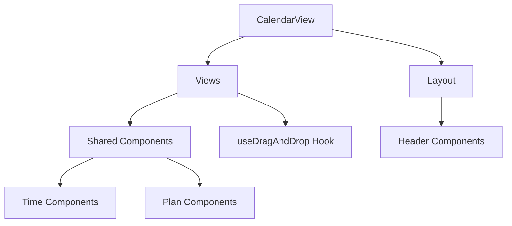

# Calendar Components

カレンダー機能のコンポーネント構成とそれぞれの役割について説明します。

## 🏗️ 全体構成

```
src/features/calendar/components/
├── CalendarView.tsx              # 📍 メインエントリーポイント
├── views/                        # 📅 ビュータイプ別実装
│   └── shared/hooks/             # 🔄 インタラクション（DnD等）
├── animations/                   # 🎬 アニメーション
├── layout/                       # 🎨 レイアウト管理
├── common/                       # 🔧 共通コンポーネント
├── event/                        # ✨ イベント関連
└── overlays/                     # 🎭 オーバーレイ表示
```

## 📍 メインコンポーネント

### CalendarView.tsx

- **役割**: カレンダー機能のメインエントリーポイント
- **責任**: ビューの切り替え、状態管理、全体の調整
- **使用場所**: `/calendar/[view]` ページから呼び出される

## 📅 ビューコンポーネント (views/)

各カレンダービューの実装を担当する専用コンポーネント群

### 主要ビューコンポーネント

- **DayView/index.tsx**: 日表示ビュー
- **WeekView/index.tsx**: 週表示ビュー
- **ThreeDayView/index.tsx**: 3日表示ビュー
- **TwoWeekView/index.tsx**: 2週間表示ビュー
- **TimelineView/index.tsx**: タイムライン表示ビュー

### 共通ビュー要素 (views/shared/)

| コンポーネント              | 説明                 | 使用場所         |
| --------------------------- | -------------------- | ---------------- |
| **ChronotypeIndicator.tsx** | 時間帯の色分け表示   | 時間軸ラベル     |
| **CurrentTimeLine.tsx**     | 現在時刻ライン       | 日/週ビュー      |
| **DateHeader.tsx**          | 日付ヘッダー         | 全ビュー         |
| **EventBlock.tsx**          | イベントブロック表示 | 全ビュー         |
| **TimeGrid.tsx**            | 時間グリッド         | 時間ベースビュー |
| **TimeAxisLabels.tsx**      | 時間軸ラベル         | 縦型ビュー       |

### レイアウト (views/shared/layouts/)

- **GoogleStyleCalendar.tsx**: Google Calendar風レイアウト
- **PureCalendarLayout.tsx**: シンプルなカレンダーレイアウト
- **FullDayCalendarLayout.tsx**: 全日表示レイアウト

### UI部品 (views/shared/components/)

- **DateNavigator.tsx**: 日付ナビゲーション
- **DateRangeDisplay.tsx**: 日付範囲表示
- **ViewSwitcher.tsx**: ビュー切り替え

## 🔄 インタラクション

ユーザーの操作に関する機能を提供

### ドラッグ&ドロップ

カレンダーのD&Dは**ハイブリッドアプローチ**を採用:

| システム                   | 用途                                 | 実装場所                               |
| -------------------------- | ------------------------------------ | -------------------------------------- |
| **カスタムマウスイベント** | カレンダー内でのプラン移動・リサイズ | `views/shared/hooks/useDragAndDrop.ts` |
| **@dnd-kit（将来実装）**   | Sidebar → Calendar のドラッグ        | 未実装                                 |

### カレンダー内DnD (useDragAndDrop)

カレンダー内でのプラン操作は、カスタムマウスイベントで実装:

- **移動**: プランをドラッグして時間・日付を変更
- **リサイズ**: プランの端をドラッグして期間を変更
- **スナップ**: 15分単位のグリッドにスナップ

### アニメーション

- **ViewTransition.tsx**: ビュー切り替えアニメーション (`animations/`)

## 🎨 レイアウト (layout/)

カレンダーの基本レイアウト構造

| コンポーネント         | 役割               |
| ---------------------- | ------------------ |
| **CalendarHeader.tsx** | ヘッダー部分の構成 |

## 🔧 共通コンポーネント (common/)

### アクセシビリティ (common/accessibility/)

- **AccessibilitySettings.tsx**: アクセシビリティ設定
- **AccessibleCalendarGrid.tsx**: アクセシブルなカレンダーグリッド
- **AccessibilityTestUtils.ts**: アクセシビリティテスト用ユーティリティ

### パフォーマンス (common/performance/)

- **LazyImage.tsx**: 遅延読み込み画像

### 仮想化 (common/virtualization/)

- **VirtualCalendarGrid.tsx**: 仮想化されたカレンダーグリッド

### サイドバー

- **Sidebar.tsx**: カレンダーサイドバー

## ✨ イベント関連 (event/)

イベントの作成・編集に関するコンポーネント

| コンポーネント               | 機能                           |
| ---------------------------- | ------------------------------ |
| **AddPopup.tsx**             | イベント追加ポップアップ       |
| **EventCreateForm.tsx**      | イベント作成フォーム           |
| **LogCreateForm.tsx**        | ログ作成フォーム               |
| **FloatingActionButton.tsx** | フローティングアクションボタン |

## 🎭 オーバーレイ (overlays/)

追加表示要素

| コンポーネント    | 役割       |
| ----------------- | ---------- |
| **TrashView.tsx** | ゴミ箱表示 |

## 🔗 インポート・エクスポート

### メインエクスポート (index.ts)

```typescript
// メインコンポーネント
export { CalendarView } from './CalendarView'

// ビューコンポーネント
export * from './views'

// 共通コンポーネント
export * from './common'
```

### コンポーネント間の依存関係



## 🎯 使用パターン

### 新しいビューコンポーネントの追加

1. `views/` に新しいディレクトリを作成
2. `index.tsx` でメインコンポーネントを実装
3. `views/index.ts` でエクスポートを追加
4. `CalendarView.tsx` でビューを登録

### 新しいインタラクション機能の追加

1. `views/shared/hooks/` に新しいフックを作成
2. 必要に応じて `views/shared/index.ts` でエクスポート
3. 関連するビューコンポーネントでインポート・使用

## 🏷️ タグ

`#components` `#calendar` `#architecture` `#react` `#typescript`
