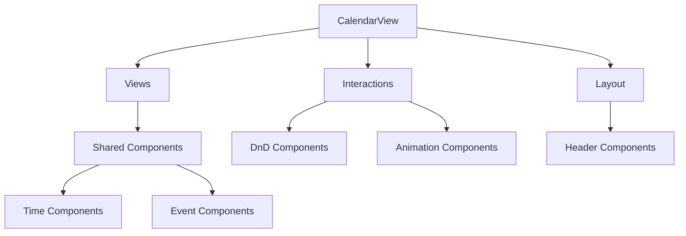

# Calendar Components

カレンダー機能のコンポーネント構成とそれぞれの役割について説明します。

## 🏗️ 全体構成

```
src/features/calendar/components/
├── CalendarView.tsx              # 📍 メインエントリーポイント
├── views/                        # 📅 ビュータイプ別実装
├── interactions/                 # 🔄 ユーザーインタラクション
├── layout/                       # 🎨 レイアウト管理
├── common/                       # 🔧 共通コンポーネント
├── event/                        # ✨ イベント関連
└── overlays/                     # 🎭 オーバーレイ表示
```

## 📍 メインコンポーネント

### CalendarView.tsx
- **役割**: カレンダー機能のメインエントリーポイント
- **責任**: ビューの切り替え、状態管理、全体の調整
- **使用場所**: `/calendar/[view]` ページから呼び出される

## 📅 ビューコンポーネント (views/)

各カレンダービューの実装を担当する専用コンポーネント群

### 主要ビューコンポーネント
- **DayView/index.tsx**: 日表示ビュー
- **WeekView/index.tsx**: 週表示ビュー
- **ThreeDayView/index.tsx**: 3日表示ビュー
- **TwoWeekView/index.tsx**: 2週間表示ビュー
- **TimelineView/index.tsx**: タイムライン表示ビュー

### 共通ビュー要素 (views/shared/)

| コンポーネント | 説明 | 使用場所 |
|---------------|------|----------|
| **ChronotypeIndicator.tsx** | 時間帯の色分け表示 | 時間軸ラベル |
| **CurrentTimeLine.tsx** | 現在時刻ライン | 日/週ビュー |
| **DateHeader.tsx** | 日付ヘッダー | 全ビュー |
| **EventBlock.tsx** | イベントブロック表示 | 全ビュー |
| **TimeGrid.tsx** | 時間グリッド | 時間ベースビュー |
| **TimeAxisLabels.tsx** | 時間軸ラベル | 縦型ビュー |

### レイアウト (views/shared/layouts/)
- **GoogleStyleCalendar.tsx**: Google Calendar風レイアウト
- **PureCalendarLayout.tsx**: シンプルなカレンダーレイアウト
- **FullDayCalendarLayout.tsx**: 全日表示レイアウト

### UI部品 (views/shared/components/)
- **DateNavigator.tsx**: 日付ナビゲーション
- **DateRangeDisplay.tsx**: 日付範囲表示
- **ViewSwitcher.tsx**: ビュー切り替え

## 🔄 インタラクション (interactions/)

ユーザーの操作に関する機能を提供

### 主要インタラクション

| コンポーネント | 機能 | 対応操作 |
|---------------|------|----------|
| **ContextMenu.tsx** | 右クリックメニュー | 右クリック |
| **EventInteractionManager.tsx** | イベント操作統合管理 | 全般 |
| **KeyboardShortcuts.tsx** | キーボードショートカット | キーボード |
| **UndoToast.tsx** | Undo/Redo機能 | Ctrl+Z/Ctrl+Y |
| **ViewTransition.tsx** | ビュー切り替えアニメーション | ビュー変更 |

### ドラッグ&ドロップ (interactions/dnd/)
- **DnDProvider.tsx**: D&Dコンテキスト提供
- **DraggableEvent.tsx**: ドラッグ可能なイベント
- **CalendarDropZone.tsx**: ドロップゾーン
- **EventResizeHandle.tsx**: リサイズハンドル
- **DragPreview.tsx**: ドラッグプレビュー

### アニメーション (interactions/animations/)
- **AnimatedEventCard.tsx**: イベントカードアニメーション
- **EventAnimations.tsx**: イベント動作アニメーション

## 🎨 レイアウト (layout/)

カレンダーの基本レイアウト構造

| コンポーネント | 役割 |
|---------------|------|
| **CalendarHeader.tsx** | ヘッダー部分の構成 |

## 🔧 共通コンポーネント (common/)

### アクセシビリティ (common/accessibility/)
- **AccessibilitySettings.tsx**: アクセシビリティ設定
- **AccessibleCalendarGrid.tsx**: アクセシブルなカレンダーグリッド
- **AccessibilityTestUtils.ts**: アクセシビリティテスト用ユーティリティ

### パフォーマンス (common/performance/)
- **LazyImage.tsx**: 遅延読み込み画像

### 仮想化 (common/virtualization/)
- **VirtualCalendarGrid.tsx**: 仮想化されたカレンダーグリッド

### サイドバー
- **Sidebar.tsx**: カレンダーサイドバー

## ✨ イベント関連 (event/)

イベントの作成・編集に関するコンポーネント

| コンポーネント | 機能 |
|---------------|------|
| **AddPopup.tsx** | イベント追加ポップアップ |
| **EventCreateForm.tsx** | イベント作成フォーム |
| **LogCreateForm.tsx** | ログ作成フォーム |
| **FloatingActionButton.tsx** | フローティングアクションボタン |

## 🎭 オーバーレイ (overlays/)

追加表示要素

| コンポーネント | 役割 |
|---------------|------|
| **TrashView.tsx** | ゴミ箱表示 |

## 🔗 インポート・エクスポート

### メインエクスポート (index.ts)
```typescript
// メインコンポーネント
export { CalendarView } from './CalendarView'

// ビューコンポーネント
export * from './views'

// インタラクション
export * from './interactions'

// 共通コンポーネント
export * from './common'
```

### コンポーネント間の依存関係



## 🎯 使用パターン

### 新しいビューコンポーネントの追加

1. `views/` に新しいディレクトリを作成
2. `index.tsx` でメインコンポーネントを実装
3. `views/index.ts` でエクスポートを追加
4. `CalendarView.tsx` でビューを登録

### 新しいインタラクション機能の追加

1. `interactions/` に新しいコンポーネントを作成
2. 必要に応じて `interactions/index.ts` でエクスポート
3. 関連するビューコンポーネントでインポート・使用

## 🏷️ タグ

`#components` `#calendar` `#architecture` `#react` `#typescript`