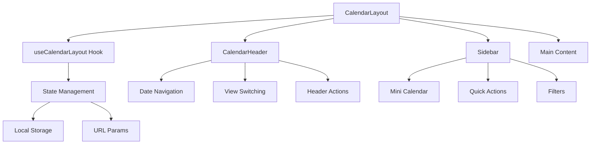

# カレンダーレイアウトシステム

BoxLogアプリケーションのカレンダー機能における包括的なレイアウトシステムの詳細ドキュメント。

## 📋 目次

- [概要](#概要)
- [アーキテクチャ](#アーキテクチャ)
- [コンポーネント詳細](#コンポーネント詳細)
- [使用方法](#使用方法)
- [カスタマイズ](#カスタマイズ)
- [トラブルシューティング](#トラブルシューティング)

---

## 概要

カレンダーレイアウトシステムは、BoxLogのカレンダー機能における統一されたUI/UXを提供するための包括的なレイアウト管理システムです。

### 🎯 主要な目的

1. **統一性**: すべてのカレンダービューで一貫したレイアウト
2. **レスポンシブ**: デスクトップ・タブレット・モバイルでの最適化
3. **拡張性**: 新しいビューや機能の容易な追加
4. **パフォーマンス**: 効率的なレンダリングと状態管理
5. **アクセシビリティ**: WCAG 2.1 AAA準拠

### 🏗️ 主要機能

- **統合レイアウト管理**: ヘッダー、サイドバー、メインコンテンツの包括的管理
- **レスポンシブデザイン**: ブレークポイントベースの適応型UI
- **状態永続化**: ユーザー設定の自動保存・復元
- **アクセシビリティ**: キーボードナビゲーション、スクリーンリーダー対応
- **パフォーマンス最適化**: 仮想化、メモ化、遅延読み込み

---

## アーキテクチャ

### 📁 ディレクトリ構造

```
src/features/calendar/components/layout/
├── CalendarLayout.tsx          # 🏛️ メインレイアウトコンポーネント
├── Header/                     # 📊 ヘッダーコンポーネント群
│   ├── index.tsx              # メインヘッダーコンポーネント
│   ├── DateNavigator.tsx      # 日付ナビゲーション
│   ├── DateRangeDisplay.tsx   # 日付範囲表示
│   ├── HeaderActions.tsx      # アクションボタン群
│   └── ViewSwitcher.tsx       # ビュー切り替え
├── Sidebar/                   # 🗂️ サイドバーコンポーネント群
│   ├── index.ts              # エクスポート管理
│   ├── Sidebar.tsx           # メインサイドバーコンポーネント
│   ├── MiniCalendar.tsx      # ミニカレンダー
│   ├── CalendarList.tsx      # カレンダーリスト
│   ├── TagFilter.tsx         # タグフィルター
│   ├── QuickActions.tsx      # クイックアクション
│   └── README.md             # サイドバー専用ドキュメント
├── MobileLayout/              # 📱 モバイル専用レイアウト
│   ├── index.ts              # エクスポート管理
│   ├── MobileDrawer.tsx      # モバイルドロワー
│   ├── MobileHeader.tsx      # モバイルヘッダー
│   └── MobileNavigation.tsx  # モバイルナビゲーション
└── index.ts                   # 全体エクスポート管理
```

### 🔄 データフロー



### 🎭 コンポーネント階層

```
CalendarLayout (最上位)
├── CalendarHeader
│   ├── DateNavigator
│   ├── DateRangeDisplay  
│   ├── ViewSwitcher
│   └── HeaderActions
├── Sidebar (条件付き表示)
│   ├── MiniCalendar
│   ├── QuickActions
│   ├── CalendarList
│   └── TagFilter
└── Main Content Area
    └── {children} (各ビューコンポーネント)
```

---

## コンポーネント詳細

### 1. 🏛️ CalendarLayout

**ファイル**: `CalendarLayout.tsx`  
**役割**: システム全体の最上位レイアウト管理

#### 📝 主要機能

- **レスポンシブレイアウト**: ブレークポイント対応
- **サイドバー管理**: 展開・折りたたみ・永続化
- **モバイル対応**: ドロワー型ナビゲーション
- **状態統合**: 全レイアウト状態の一元管理

#### 🔧 Props

```typescript
interface CalendarLayoutProps {
  children: React.ReactNode
  className?: string
  
  // Header props
  viewType: CalendarViewType
  currentDate: Date
  onNavigate: (direction: 'prev' | 'next' | 'today') => void
  onViewChange: (view: CalendarViewType) => void
  
  // Header actions
  onSettings?: () => void
  onExport?: () => void
  onImport?: () => void
  showHeaderActions?: boolean
  
  // Sidebar props
  showSidebar?: boolean
  sidebarCollapsed?: boolean
  onSidebarCollapsedChange?: (collapsed: boolean) => void
  
  // Calendar integration
  selectedDate?: Date
  onDateSelect?: (date: Date) => void
  calendars?: Calendar[]
  tags?: TagItem[]
  
  // Event handlers
  onCreateEvent?: () => void
  onCreateTask?: () => void
  onCreateLog?: () => void
  
  // Display options
  showMiniCalendar?: boolean
  showCalendarList?: boolean
  showTagFilter?: boolean
  showQuickActions?: boolean
}
```

#### 💡 使用例

```tsx
<CalendarLayout
  viewType="week"
  currentDate={new Date()}
  onNavigate={handleNavigate}
  onViewChange={handleViewChange}
  showSidebar={true}
  sidebarCollapsed={false}
  onCreateEvent={handleCreateEvent}
>
  <WeekView {...weekViewProps} />
</CalendarLayout>
```

---

### 2. 📊 Header Components

#### CalendarHeader (`Header/index.tsx`)

**役割**: カレンダーの上部ナビゲーション・コントロール

##### 主要機能
- 日付ナビゲーション
- ビュー切り替え
- アクションボタン
- モバイルメニュー対応

##### Props
```typescript
interface CalendarHeaderProps {
  viewType: CalendarViewType
  currentDate: Date
  onNavigate: (direction: 'prev' | 'next' | 'today') => void
  onViewChange: (view: CalendarViewType) => void
  leftSlot?: React.ReactNode // モバイルメニューボタン用
  showActions?: boolean
  onSettings?: () => void
  onExport?: () => void
  onImport?: () => void
}
```

#### DateNavigator (`Header/DateNavigator.tsx`)

**役割**: 日付の前後移動・今日への移動

##### 機能
- Previous/Next ボタン
- Today ボタン
- キーボードショートカット対応
- アクセシビリティラベル

#### DateRangeDisplay (`Header/DateRangeDisplay.tsx`)

**役割**: 現在選択中の日付範囲の表示

##### 機能
- ビュータイプ別の表示形式
- 週番号表示（オプション）
- 国際化対応

#### ViewSwitcher (`Header/ViewSwitcher.tsx`)

**役割**: カレンダービューの切り替え

##### サポートビュー
- `day`: 日表示
- `3day`: 3日表示  
- `week`: 週表示
- `week-no-weekend`: 平日のみ表示
- `2week`: 2週間表示
- `month`: 月表示
- `schedule`: スケジュール表示

#### HeaderActions (`Header/HeaderActions.tsx`)

**役割**: 設定・エクスポート・インポートなどのアクション

---

### 3. 🗂️ Sidebar Components

#### Sidebar (`Sidebar/Sidebar.tsx`)

**役割**: サイドバーの全体管理

##### 📋 主要機能
- **折りたたみ機能**: デスクトップ・タブレットでの表示切り替え
- **セクション管理**: 展開・折りたたみ状態の管理
- **レスポンシブ**: モバイルでは非表示、デスクトップでは折りたたみ対応

##### 🎛️ 表示モード
1. **Full (通常表示)**: 幅320px、全機能表示
2. **Collapsed (折りたたみ)**: 幅48px、アイコンのみ
3. **Hidden (非表示)**: モバイルでは完全非表示

#### MiniCalendar (`Sidebar/MiniCalendar.tsx`)

**役割**: 月表示の小さなカレンダー

##### 機能
- 日付選択
- 今日のハイライト
- イベント有無の表示
- 週の開始日設定

#### QuickActions (`Sidebar/QuickActions.tsx`)

**役割**: よく使用するアクションの素早いアクセス

##### アクション例
- イベント作成
- タスク作成
- 今日に移動
- 設定画面
- エクスポート/インポート

#### CalendarList (`Sidebar/CalendarList.tsx`)

**役割**: 複数カレンダーの管理

##### 機能
- カレンダー表示/非表示切り替え
- カラーバーでの識別
- カレンダー編集・削除
- 新規カレンダー作成

#### TagFilter (`Sidebar/TagFilter.tsx`)

**役割**: タグベースのフィルタリング

##### 機能
- タグ選択でフィルタリング
- 選択タグのカウント表示
- 全選択解除
- 新規タグ作成

---

### 4. 📱 Mobile Layout Components

#### MobileDrawer (`MobileLayout/MobileDrawer.tsx`)

**役割**: モバイル用のドロワーナビゲーション

##### 機能
- スワイプでの開閉
- オーバーレイ表示
- タッチフレンドリーな操作

#### MobileHeader (`MobileLayout/MobileHeader.tsx`)

**役割**: モバイル専用ヘッダー

##### 最適化ポイント
- タッチターゲットサイズの最適化
- 重要な機能のみ表示
- ハンバーガーメニュー統合

---

## 使用方法

### 🚀 基本的な実装

#### 1. レイアウトシステムの導入

```tsx
import { CalendarLayout } from '@/features/calendar/components/layout'
import { useCalendarLayout } from '@/features/calendar/hooks/ui'

export function MyCalendarPage() {
  const {
    viewType,
    currentDate,
    navigateRelative,
    changeView,
    sidebarOpen,
    toggleSidebar
  } = useCalendarLayout({
    initialViewType: 'week',
    initialDate: new Date(),
    persistSidebarState: true
  })

  return (
    <CalendarLayout
      viewType={viewType}
      currentDate={currentDate}
      onNavigate={navigateRelative}
      onViewChange={changeView}
      showSidebar={true}
      sidebarCollapsed={!sidebarOpen}
      onSidebarCollapsedChange={toggleSidebar}
    >
      {/* ビュー固有のコンテンツ */}
      <YourCalendarView />
    </CalendarLayout>
  )
}
```

#### 2. カスタムイベントハンドラーの追加

```tsx
<CalendarLayout
  // ... 基本Props
  onCreateEvent={() => {
    // イベント作成ロジック
    openEventModal()
  }}
  onCreateTask={() => {
    // タスク作成ロジック  
    openTaskModal()
  }}
  onDateSelect={(date) => {
    // 日付選択時のロジック
    navigateToDate(date)
  }}
/>
```

### 🎨 スタイルカスタマイズ

#### CSS変数による統一的なスタイリング

```css
.calendar-layout {
  --calendar-header-height: 64px;
  --calendar-sidebar-width-full: 320px;
  --calendar-sidebar-width-collapsed: 48px;
  --calendar-breakpoint-mobile: 768px;
  --calendar-breakpoint-tablet: 1024px;
}
```

#### Tailwindクラスでのカスタマイズ

```tsx
<CalendarLayout
  className="custom-calendar-theme"
  // カスタムクラスを適用
/>
```

---

## カスタマイズ

### 🛠️ 新しいサイドバーセクションの追加

#### 1. セクションコンポーネントの作成

```tsx
// CustomSidebarSection.tsx
export function CustomSidebarSection({ isExpanded, onToggle }) {
  return (
    <div className="space-y-2">
      <button onClick={() => onToggle('custom-section')}>
        <span>カスタムセクション</span>
      </button>
      
      {isExpanded && (
        <div className="p-4">
          {/* カスタムコンテンツ */}
        </div>
      )}
    </div>
  )
}
```

#### 2. Sidebarコンポーネントへの統合

```tsx
// Sidebar.tsxに追加
import { CustomSidebarSection } from './CustomSidebarSection'

// Sidebarコンポーネント内
{showCustomSection && (
  <CustomSidebarSection
    isExpanded={isExpanded('custom-section')}
    onToggle={toggleSection}
  />
)}
```

### 🎯 新しいビューの追加

#### 1. ビューコンポーネントの作成

```tsx
// MyCustomView.tsx
export function MyCustomView({ 
  dateRange, 
  events, 
  onEventClick 
}) {
  return (
    <div className="custom-view">
      {/* ビューのコンテンツ */}
    </div>
  )
}
```

#### 2. CalendarLayoutでの使用

```tsx
<CalendarLayout viewType="custom" {...props}>
  <MyCustomView {...viewProps} />
</CalendarLayout>
```

### 🔧 useCalendarLayoutフックの拡張

```tsx
// カスタムフック
export function useEnhancedCalendarLayout(options) {
  const baseHook = useCalendarLayout(options)
  
  // 追加機能
  const [customState, setCustomState] = useState()
  
  return {
    ...baseHook,
    customState,
    setCustomState,
    // カスタムメソッド
    customAction: () => {
      // カスタムロジック
    }
  }
}
```

---

## パフォーマンス最適化

### 🚀 最適化手法

#### 1. メモ化の活用

```tsx
// コンポーネントのメモ化
export const CalendarHeader = memo(({ 
  viewType, 
  currentDate, 
  onNavigate 
}) => {
  // レンダリング最適化
})

// 値のメモ化
const memoizedProps = useMemo(() => ({
  viewType,
  currentDate,
  events: filteredEvents
}), [viewType, currentDate, filteredEvents])
```

#### 2. 仮想化の実装

```tsx
// 大量データの仮想化
import { FixedSizeList as List } from 'react-window'

export function VirtualizedEventList({ events }) {
  return (
    <List
      height={400}
      itemCount={events.length}
      itemSize={60}
    >
      {EventItem}
    </List>
  )
}
```

#### 3. 遅延読み込み

```tsx
// 動的インポート
const HeavyComponent = lazy(() => import('./HeavyComponent'))

// 条件付き読み込み
{showHeavyFeature && (
  <Suspense fallback={<Loading />}>
    <HeavyComponent />
  </Suspense>
)}
```

---

## アクセシビリティ

### ♿ WCAG 2.1 AAA準拠

#### 1. キーボードナビゲーション

```tsx
// キーボードショートカットの実装
useEffect(() => {
  const handleKeyPress = (e: KeyboardEvent) => {
    if (e.metaKey || e.ctrlKey) {
      switch (e.key) {
        case 'ArrowLeft':
          e.preventDefault()
          navigateRelative('prev')
          break
        case 'ArrowRight':
          e.preventDefault()
          navigateRelative('next')
          break
        case 't':
          e.preventDefault()
          navigateRelative('today')
          break
      }
    }
  }
  
  window.addEventListener('keydown', handleKeyPress)
  return () => window.removeEventListener('keydown', handleKeyPress)
}, [navigateRelative])
```

#### 2. ARIA属性の適切な使用

```tsx
<nav 
  role="navigation" 
  aria-label="カレンダーナビゲーション"
>
  <button
    aria-label="前の期間に移動"
    onClick={() => onNavigate('prev')}
  >
    <ChevronLeft aria-hidden="true" />
  </button>
</nav>
```

#### 3. スクリーンリーダー対応

```tsx
// ライブリージョンでの状態通知
<div
  role="status"
  aria-live="polite"
  className="sr-only"
>
  {announcements.map(announcement => (
    <div key={announcement.id}>
      {announcement.message}
    </div>
  ))}
</div>
```

---

## トラブルシューティング

### 🐛 よくある問題と解決方法

#### 1. サイドバーが表示されない

**症状**: サイドバーが全く表示されない

**原因と解決方法**:
```tsx
// ❌ 間違い
<CalendarLayout showSidebar={false}>

// ✅ 正しい
<CalendarLayout showSidebar={true}>
```

#### 2. 状態が永続化されない

**症状**: ページリロード時に設定が失われる

**原因と解決方法**:
```tsx
// useCalendarLayoutでpersistSidebarStateを有効に
const layoutState = useCalendarLayout({
  persistSidebarState: true, // ← これが重要
  sidebarStorageKey: 'my-app-sidebar' // カスタムキー
})
```

#### 3. モバイルでサイドバーが動作しない

**症状**: モバイル端末でサイドバーの開閉ができない

**原因**: ブレークポイントの設定を確認
```tsx
// CSSでブレークポイントを確認
@media (max-width: 768px) {
  .calendar-sidebar {
    /* モバイル用スタイル */
  }
}
```

#### 4. パフォーマンスの問題

**症状**: スクロールやビュー切り替えが重い

**解決方法**:
```tsx
// 1. イベントハンドラーのメモ化
const handleViewChange = useCallback((view) => {
  changeView(view)
}, [changeView])

// 2. 不要な再レンダリングの防止
const MemoizedComponent = memo(Component)

// 3. 仮想化の使用（大量データの場合）
```

#### 5. TypeScriptエラー

**症状**: 型エラーが発生する

**解決方法**:
```tsx
// 型定義のインポート
import type { 
  CalendarViewType, 
  CalendarLayoutProps 
} from '@/features/calendar/types'

// 適切な型注釈
const viewType: CalendarViewType = 'week'
```

---

## ベストプラクティス

### 🏆 推奨事項

#### 1. コンポーネント設計

- **単一責任原則**: 各コンポーネントは1つの責任のみ
- **Props の明確化**: 必要最小限のPropsのみ受け取る
- **再利用性**: 汎用的な設計を心がける

#### 2. 状態管理

- **ローカル状態**: コンポーネント固有の状態
- **グローバル状態**: アプリ全体で共有する状態
- **永続化**: ユーザー設定の適切な保存

#### 3. パフォーマンス

- **メモ化の適切な使用**: 計算コストの高い処理
- **仮想化**: 大量データの表示
- **コード分割**: 必要な時のみ読み込み

#### 4. アクセシビリティ

- **キーボード対応**: すべての機能をキーボードで操作可能
- **スクリーンリーダー**: 適切なARIA属性
- **カラーコントラスト**: WCAG基準の遵守

---

## 🔗 関連ドキュメント

- [サイドバーコンポーネント詳細ガイド](./sidebar-components.md)
- [カレンダーコンポーネント全体ガイド](./components.md)
- [カレンダーフック使用方法](./hooks-guide.md)
- [パフォーマンス最適化ガイド](./performance-guide.md)

---

**最終更新**: 2025-01-18  
**バージョン**: v1.0.0  
**メンテナー**: BoxLog Development Team