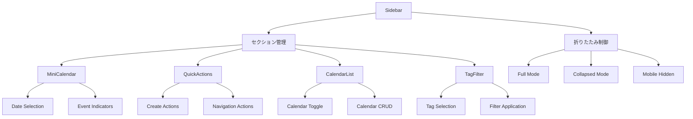

# カレンダーサイドバーコンポーネント詳細ガイド

BoxLogカレンダーのサイドバーシステムの包括的なドキュメント。各コンポーネントの詳細な使用方法、カスタマイズ方法、実装例を記載。

## 📋 目次

- [概要](#概要)
- [アーキテクチャ](#アーキテクチャ)
- [コンポーネント詳細](#コンポーネント詳細)
- [カスタマイズガイド](#カスタマイズガイド)
- [実装例](#実装例)
- [トラブルシューティング](#トラブルシューティング)

---

## 概要

カレンダーサイドバーは、ユーザーがカレンダー機能を効率的に操作するための統合されたナビゲーション・制御パネルです。

### 🎯 主要機能

1. **ミニカレンダー**: 月表示での日付選択
2. **クイックアクション**: よく使用する機能への素早いアクセス  
3. **カレンダー管理**: 複数カレンダーの表示・非表示制御
4. **タグフィルタリング**: タグベースのイベント絞り込み
5. **レスポンシブ対応**: デバイス別の最適化表示

### 🏗️ 設計原則

- **Progressive Disclosure**: 必要な情報のみを段階的に表示
- **Touch-Friendly**: モバイル端末での操作性を重視
- **Accessible**: キーボード・スクリーンリーダー完全対応
- **Performant**: 大量データでもスムーズな動作

---

## アーキテクチャ

### 📁 ファイル構成

```
src/features/calendar/components/layout/Sidebar/
├── index.ts                 # 📦 エクスポート統合
├── Sidebar.tsx             # 🏛️ メインサイドバーコンテナ
├── MiniCalendar.tsx        # 📅 ミニカレンダーコンポーネント
├── QuickActions.tsx        # ⚡ クイックアクションパネル
├── CalendarList.tsx        # 📋 カレンダーリスト管理
├── TagFilter.tsx           # 🏷️ タグフィルター機能
└── README.md              # 📚 サイドバー専用ドキュメント
```

### 🔄 コンポーネント関係図



---

## コンポーネント詳細

### 1. 🏛️ Sidebar (メインコンテナ)

**ファイル**: `Sidebar.tsx`  
**役割**: サイドバー全体の状態管理・レイアウト制御

#### 📋 主要機能

##### 表示モード管理
```typescript
enum SidebarMode {
  FULL = 'full',        // 通常表示 (320px)
  COLLAPSED = 'collapsed', // 折りたたみ (48px)  
  HIDDEN = 'hidden'     // 非表示 (モバイル)
}
```

##### セクション展開制御
```typescript
interface ExpandedSections {
  'mini-calendar': boolean
  'quick-actions': boolean  
  'calendar-list': boolean
  'tag-filter': boolean
}
```

#### 🔧 Props定義

```typescript
interface SidebarProps {
  // 基本制御
  className?: string
  collapsed?: boolean
  onCollapsedChange?: (collapsed: boolean) => void
  
  // MiniCalendar
  selectedDate?: Date
  onDateSelect?: (date: Date) => void
  highlightedDates?: Date[]
  
  // CalendarList  
  calendars?: Calendar[]
  selectedCalendarIds?: string[]
  onCalendarToggle?: (calendarId: string, visible: boolean) => void
  onCalendarCreate?: () => void
  
  // TagFilter
  tags?: TagItem[]
  selectedTagIds?: string[]
  onTagToggle?: (tagId: string, selected: boolean) => void
  
  // QuickActions
  onCreateEvent?: () => void
  onCreateTask?: () => void
  onGoToToday?: () => void
  
  // 表示制御
  showMiniCalendar?: boolean
  showCalendarList?: boolean  
  showTagFilter?: boolean
  showQuickActions?: boolean
}
```

#### 💡 基本的な使用例

```tsx
import { Sidebar } from '@/features/calendar/components/layout/Sidebar'

<Sidebar
  collapsed={false}
  onCollapsedChange={setCollapsed}
  selectedDate={currentDate}
  onDateSelect={handleDateSelect}
  calendars={userCalendars}
  onCreateEvent={handleCreateEvent}
  showMiniCalendar={true}
  showQuickActions={true}
/>
```

---

### 2. 📅 MiniCalendar

**ファイル**: `MiniCalendar.tsx`  
**役割**: コンパクトな月表示カレンダー

#### 📋 主要機能

##### 日付選択・表示
- **現在日ハイライト**: 今日の日付を視覚的に強調
- **選択日表示**: アクティブな日付の明確な表示
- **イベント インジケーター**: イベントがある日の視覚的な通知
- **週番号表示**: オプションでISO週番号を表示

##### ナビゲーション
- **月移動**: 前後の月への素早い移動
- **年移動**: 年単位でのジャンプ機能
- **今日に戻る**: ワンクリックで現在日に復帰

#### 🔧 Props定義

```typescript
interface MiniCalendarProps {
  // 日付制御
  selectedDate?: Date
  onDateSelect?: (date: Date) => void
  highlightedDates?: Date[]
  
  // 表示設定
  firstDayOfWeek?: 0 | 1 // 0: 日曜開始, 1: 月曜開始
  showWeekNumbers?: boolean
  
  // イベントデータ
  eventDates?: Date[] // イベントがある日付
  
  // スタイル
  className?: string
  size?: 'sm' | 'md' | 'lg'
}
```

#### 💡 使用例

```tsx
<MiniCalendar
  selectedDate={selectedDate}
  onDateSelect={(date) => {
    setSelectedDate(date)
    navigateToDate(date)
  }}
  highlightedDates={eventDates}
  firstDayOfWeek={1} // 月曜開始
  showWeekNumbers={true}
  eventDates={datesWithEvents}
/>
```

#### 🎨 カスタマイズ

```css
/* サイズバリエーション */
.mini-calendar--sm { width: 240px; }
.mini-calendar--md { width: 280px; } /* デフォルト */
.mini-calendar--lg { width: 320px; }

/* カラーテーマ */
.mini-calendar {
  --today-bg: theme('colors.blue.500');
  --selected-bg: theme('colors.primary.500');
  --event-indicator: theme('colors.green.400');
}
```

---

### 3. ⚡ QuickActions

**ファイル**: `QuickActions.tsx`  
**役割**: 頻繁に使用する機能への素早いアクセス

#### 📋 アクション種類

##### 作成系アクション
- **イベント作成**: 新しいイベントの追加
- **タスク作成**: TODOタスクの追加  
- **ログ作成**: 実績記録の追加

##### ナビゲーション系
- **今日に移動**: 現在日への瞬時移動
- **設定画面**: カレンダー設定の変更

##### データ操作系  
- **エクスポート**: カレンダーデータの書き出し
- **インポート**: 外部カレンダーの取り込み
- **同期**: 外部サービスとの同期

#### 🔧 Props定義

```typescript
interface QuickActionsProps {
  // 作成系
  onCreateEvent?: () => void
  onCreateTask?: () => void  
  onCreateLog?: () => void
  
  // ナビゲーション系
  onGoToToday?: () => void
  onOpenSettings?: () => void
  
  // データ操作系
  onExport?: () => void
  onImport?: () => void
  onSyncCalendars?: () => void
  
  // 表示制御
  variant?: 'expanded' | 'collapsed' | 'mobile'
  showLabels?: boolean
}
```

#### 💡 使用例

```tsx
<QuickActions
  onCreateEvent={() => openModal('event')}
  onCreateTask={() => openModal('task')}
  onGoToToday={() => navigateToToday()}
  onOpenSettings={() => router.push('/settings/calendar')}
  variant="expanded"
  showLabels={true}
/>
```

#### 🎨 表示バリエーション

##### Expanded Mode (通常表示)
```tsx
// フルサイズ、ラベル付きボタン
<div className="grid grid-cols-2 gap-2">
  <Button variant="default" size="sm">
    <Plus className="w-4 h-4 mr-2" />
    イベント作成
  </Button>
</div>
```

##### Collapsed Mode (折りたたみ)
```tsx  
// アイコンのみ、縦並び
<div className="flex flex-col gap-1">
  <Button variant="ghost" size="sm" className="p-2">
    <Plus className="w-4 h-4" />
  </Button>
</div>
```

---

### 4. 📋 CalendarList

**ファイル**: `CalendarList.tsx`  
**役割**: 複数カレンダーの管理・制御

#### 📋 主要機能

##### カレンダー表示制御
- **表示切り替え**: 個別カレンダーの表示・非表示
- **カラー管理**: カレンダー別の色分け表示
- **選択状態**: アクティブなカレンダーの管理

##### CRUD操作
- **新規作成**: 新しいカレンダーの追加
- **編集**: カレンダー名・色の変更  
- **削除**: 不要なカレンダーの削除
- **並び替え**: ドラッグ&ドロップでの順序変更

#### 🔧 Props定義

```typescript
interface CalendarListProps {
  // データ
  calendars: Calendar[]
  selectedCalendarIds: string[]
  
  // イベントハンドラー
  onCalendarToggle?: (calendarId: string, visible: boolean) => void
  onCalendarSelect?: (calendarId: string) => void
  onCalendarCreate?: () => void
  onCalendarEdit?: (calendarId: string) => void
  onCalendarDelete?: (calendarId: string) => void
  
  // 表示制御
  allowReorder?: boolean
  showCreateButton?: boolean
  maxDisplayCount?: number
}

interface Calendar {
  id: string
  name: string
  color: string
  visible: boolean
  isDefault?: boolean
  eventCount?: number
}
```

#### 💡 使用例

```tsx
<CalendarList
  calendars={[
    {
      id: '1',
      name: '個人カレンダー', 
      color: '#3B82F6',
      visible: true,
      isDefault: true,
      eventCount: 15
    },
    {
      id: '2',
      name: '仕事',
      color: '#EF4444', 
      visible: true,
      eventCount: 23
    }
  ]}
  selectedCalendarIds={['1', '2']}
  onCalendarToggle={(id, visible) => {
    updateCalendarVisibility(id, visible)
  }}
  onCalendarCreate={() => openCalendarCreationModal()}
  allowReorder={true}
/>
```

#### 🎨 リストアイテムのレンダリング

```tsx
function CalendarListItem({ calendar, onToggle, onEdit }) {
  return (
    <div className="flex items-center gap-3 p-2 hover:bg-muted/50">
      {/* カラーインジケーター */}
      <div 
        className="w-3 h-3 rounded-full"
        style={{ backgroundColor: calendar.color }}
      />
      
      {/* 表示切り替えチェックボックス */}
      <Checkbox 
        checked={calendar.visible}
        onChange={(visible) => onToggle(calendar.id, visible)}
      />
      
      {/* カレンダー名 */}
      <span className="flex-1 text-sm">
        {calendar.name}
      </span>
      
      {/* イベント数 */}
      {calendar.eventCount > 0 && (
        <Badge variant="secondary" size="sm">
          {calendar.eventCount}
        </Badge>
      )}
      
      {/* アクションメニュー */}
      <DropdownMenu>
        <DropdownMenuTrigger asChild>
          <Button variant="ghost" size="sm">
            <MoreHorizontal className="w-4 h-4" />
          </Button>
        </DropdownMenuTrigger>
        <DropdownMenuContent>
          <DropdownMenuItem onClick={() => onEdit(calendar.id)}>
            編集
          </DropdownMenuItem>
          <DropdownMenuItem 
            onClick={() => onDelete(calendar.id)}
            className="text-destructive"
          >
            削除
          </DropdownMenuItem>
        </DropdownMenuContent>
      </DropdownMenu>
    </div>
  )
}
```

---

### 5. 🏷️ TagFilter

**ファイル**: `TagFilter.tsx`  
**役割**: タグベースのイベントフィルタリング

#### 📋 主要機能

##### フィルタリング制御
- **マルチ選択**: 複数タグでのAND/OR検索
- **除外フィルター**: 特定タグを除外する逆フィルター
- **フィルター状態**: 適用中フィルターの視覚的表示

##### タグ管理
- **新規作成**: その場でのタグ作成
- **カラー設定**: タグの色分け管理
- **使用頻度**: よく使用するタグの自動的な上位表示

#### 🔧 Props定義

```typescript
interface TagFilterProps {
  // データ
  tags: TagItem[]
  selectedTagIds: string[]
  
  // イベントハンドラー
  onTagToggle?: (tagId: string, selected: boolean) => void
  onTagCreate?: (name: string, color?: string) => void
  onClearAll?: () => void
  
  // 表示制御
  showCounts?: boolean // タグ使用回数の表示
  maxVisibleTags?: number // 初期表示タグ数
  allowCreate?: boolean // 新規タグ作成の許可
}

interface TagItem {
  id: string
  name: string
  color: string
  count: number // このタグを持つイベント数
}
```

#### 💡 使用例

```tsx
<TagFilter
  tags={[
    { id: '1', name: '重要', color: '#EF4444', count: 12 },
    { id: '2', name: '会議', color: '#3B82F6', count: 8 },
    { id: '3', name: '個人', color: '#10B981', count: 15 }
  ]}
  selectedTagIds={['1']}
  onTagToggle={(tagId, selected) => {
    if (selected) {
      setSelectedTags([...selectedTags, tagId])
    } else {
      setSelectedTags(selectedTags.filter(id => id !== tagId))
    }
  }}
  onTagCreate={(name, color) => {
    createNewTag({ name, color })
  }}
  showCounts={true}
  maxVisibleTags={6}
/>
```

#### 🎨 タグアイテムのレンダリング

```tsx
function TagFilterItem({ tag, selected, onToggle }) {
  return (
    <button
      className={cn(
        "flex items-center gap-2 px-3 py-1.5 rounded-full text-sm transition-colors",
        selected 
          ? "bg-primary text-primary-foreground"
          : "bg-muted hover:bg-muted/80"
      )}
      onClick={() => onToggle(tag.id, !selected)}
    >
      {/* タグカラー */}
      <div
        className="w-2 h-2 rounded-full"
        style={{ backgroundColor: tag.color }}
      />
      
      {/* タグ名 */}
      <span>{tag.name}</span>
      
      {/* 使用回数 */}
      {tag.count > 0 && (
        <Badge variant="secondary" size="xs">
          {tag.count}
        </Badge>
      )}
    </button>
  )
}
```

---

## カスタマイズガイド

### 🎨 テーマカスタマイズ

#### CSS変数による統一的なスタイリング

```css
:root {
  /* サイドバー基本設定 */
  --sidebar-width-full: 320px;
  --sidebar-width-collapsed: 48px;
  --sidebar-padding: 16px;
  
  /* カラーテーマ */
  --sidebar-bg: hsl(var(--background));
  --sidebar-border: hsl(var(--border));
  --sidebar-text: hsl(var(--foreground));
  
  /* セクション設定 */
  --section-spacing: 24px;
  --section-header-height: 32px;
}
```

#### ダークモード対応

```css
[data-theme="dark"] {
  --sidebar-bg: hsl(220 13% 13%);
  --sidebar-border: hsl(220 13% 20%);
  --today-highlight: hsl(217 91% 60%);
}
```

### 🔧 機能拡張

#### カスタムセクションの追加

```tsx
// 1. 新しいセクションコンポーネント
function CustomSection({ isExpanded, onToggle }) {
  return (
    <div className="space-y-2">
      <button 
        onClick={() => onToggle('custom-section')}
        className="flex items-center justify-between w-full"
      >
        <span className="text-sm font-medium">カスタムセクション</span>
        {isExpanded ? <ChevronUp /> : <ChevronDown />}
      </button>
      
      {isExpanded && (
        <div className="space-y-2 p-2 bg-muted/50 rounded">
          {/* カスタムコンテンツ */}
        </div>
      )}
    </div>
  )
}

// 2. Sidebarへの統合
<Sidebar>
  {/* 既存セクション */}
  <MiniCalendar {...miniCalendarProps} />
  <QuickActions {...quickActionProps} />
  
  {/* カスタムセクション */}
  <CustomSection 
    isExpanded={expandedSections.has('custom-section')}
    onToggle={toggleSection}
  />
</Sidebar>
```

#### QuickActionsのカスタマイズ

```tsx
interface CustomQuickActionsProps extends QuickActionsProps {
  onCustomAction?: () => void
}

function CustomQuickActions(props: CustomQuickActionsProps) {
  const baseActions = [
    {
      id: 'create-event',
      label: 'イベント',
      icon: Plus,
      onClick: props.onCreateEvent
    },
    {
      id: 'custom-action',
      label: 'カスタム',
      icon: Star,
      onClick: props.onCustomAction
    }
  ]
  
  return (
    <div className="grid grid-cols-2 gap-2">
      {baseActions.map(action => (
        <Button
          key={action.id}
          variant="outline"
          size="sm"
          onClick={action.onClick}
        >
          <action.icon className="w-4 h-4 mr-2" />
          {action.label}
        </Button>
      ))}
    </div>
  )
}
```

---

## 実装例

### 🚀 基本実装

```tsx
// CalendarSidebar.tsx - 統合サイドバー
import { 
  Sidebar,
  MiniCalendar, 
  QuickActions,
  CalendarList,
  TagFilter
} from '@/features/calendar/components/layout/Sidebar'

export function CalendarSidebar() {
  const [collapsed, setCollapsed] = useState(false)
  const [selectedDate, setSelectedDate] = useState(new Date())
  const [selectedTags, setSelectedTags] = useState<string[]>([])
  
  return (
    <Sidebar
      collapsed={collapsed}
      onCollapsedChange={setCollapsed}
      selectedDate={selectedDate}
      onDateSelect={(date) => {
        setSelectedDate(date)
        // カレンダーメインビューを更新
        navigateToDate(date)
      }}
      tags={availableTags}
      selectedTagIds={selectedTags}
      onTagToggle={(tagId, selected) => {
        if (selected) {
          setSelectedTags([...selectedTags, tagId])
        } else {
          setSelectedTags(selectedTags.filter(id => id !== tagId))
        }
        // フィルター適用
        applyTagFilter(selectedTags)
      }}
      onCreateEvent={() => openCreateModal('event')}
      onCreateTask={() => openCreateModal('task')}
      showMiniCalendar={true}
      showQuickActions={true}
      showTagFilter={true}
    />
  )
}
```

### 🎯 高度な実装

```tsx
// AdvancedCalendarSidebar.tsx - 高度な機能統合
export function AdvancedCalendarSidebar() {
  // 状態管理
  const [sidebarState, setSidebarState] = useLocalStorage('sidebar-state', {
    collapsed: false,
    expandedSections: ['mini-calendar', 'quick-actions']
  })
  
  // データフェッチ
  const { data: calendars } = useCalendars()
  const { data: tags } = useTags() 
  const { data: events } = useEvents()
  
  // 計算されたプロパティ
  const eventDates = useMemo(() => 
    events.map(event => new Date(event.startDate)), 
    [events]
  )
  
  const tagCounts = useMemo(() =>
    tags.map(tag => ({
      ...tag,
      count: events.filter(event => 
        event.tags.includes(tag.id)
      ).length
    })),
    [tags, events]
  )
  
  return (
    <Sidebar
      collapsed={sidebarState.collapsed}
      onCollapsedChange={(collapsed) => 
        setSidebarState(prev => ({ ...prev, collapsed }))
      }
      
      // MiniCalendar設定
      selectedDate={currentDate}
      onDateSelect={handleDateSelect}
      highlightedDates={eventDates}
      
      // CalendarList設定  
      calendars={calendars}
      selectedCalendarIds={visibleCalendarIds}
      onCalendarToggle={handleCalendarToggle}
      onCalendarCreate={handleCalendarCreate}
      
      // TagFilter設定
      tags={tagCounts}
      selectedTagIds={activeTagFilters}
      onTagToggle={handleTagFilter}
      onTagCreate={handleTagCreate}
      
      // QuickActions設定
      onCreateEvent={() => openModal('event', { date: currentDate })}
      onCreateTask={() => openModal('task', { date: currentDate })}
      onGoToToday={() => navigateToToday()}
      
      // 表示制御
      showMiniCalendar={sidebarState.expandedSections.includes('mini-calendar')}
      showQuickActions={sidebarState.expandedSections.includes('quick-actions')}
      showCalendarList={calendars.length > 1}
      showTagFilter={tags.length > 0}
    />
  )
}
```

---

## トラブルシューティング

### 🐛 よくある問題と解決方法

#### 1. サイドバーが折りたたまれない

**症状**: 折りたたみボタンをクリックしても状態が変わらない

**原因と解決方法**:
```tsx
// ❌ 状態の更新が反映されていない
const [collapsed, setCollapsed] = useState(false)
<Sidebar collapsed={collapsed} />

// ✅ イベントハンドラーを正しく設定
<Sidebar 
  collapsed={collapsed}
  onCollapsedChange={setCollapsed} // ← これが必要
/>
```

#### 2. MiniCalendarの日付選択が効かない

**症状**: 日付をクリックしても選択状態が変わらない

**解決方法**:
```tsx
// onDateSelectハンドラーを確実に実装
<MiniCalendar
  selectedDate={currentDate}
  onDateSelect={(date) => {
    setCurrentDate(date) // 状態更新
    navigateToDate(date) // ビュー更新
  }}
/>
```

#### 3. TagFilterでフィルターが適用されない

**症状**: タグを選択してもイベントがフィルタリングされない

**解決方法**:
```tsx
// フィルター状態とイベントデータの連携を確認
const filteredEvents = useMemo(() => {
  if (selectedTagIds.length === 0) return events
  
  return events.filter(event =>
    selectedTagIds.some(tagId => 
      event.tags.includes(tagId)
    )
  )
}, [events, selectedTagIds])
```

#### 4. 折りたたみ状態が保存されない

**症状**: ページリロード時に折りたたみ状態が失われる

**解決方法**:
```tsx
// localStorage での永続化
const [collapsed, setCollapsed] = useLocalStorage('sidebar-collapsed', false)

// または、useCalendarLayoutフックを使用
const { sidebarOpen, toggleSidebar } = useCalendarLayout({
  persistSidebarState: true
})
```

#### 5. モバイルでサイドバーが表示されすぎる

**症状**: モバイル端末でサイドバーがメインコンテンツを覆い隠す

**解決方法**:
```css
/* レスポンシブ設定の確認 */
@media (max-width: 768px) {
  .calendar-sidebar {
    position: absolute;
    z-index: 40;
    transform: translateX(-100%);
    transition: transform 0.3s ease;
  }
  
  .calendar-sidebar--open {
    transform: translateX(0);
  }
}
```

### 🔧 パフォーマンス最適化

#### メモ化の活用

```tsx
// 高コストな計算のメモ化
const eventDateMap = useMemo(() => {
  const map = new Map()
  events.forEach(event => {
    const dateKey = format(event.startDate, 'yyyy-MM-dd')
    if (!map.has(dateKey)) {
      map.set(dateKey, [])
    }
    map.get(dateKey).push(event)
  })
  return map
}, [events])

// コンポーネントのメモ化
const MemoizedMiniCalendar = memo(MiniCalendar)
const MemoizedTagFilter = memo(TagFilter)
```

#### 仮想化の実装

```tsx
// 大量のタグリストの仮想化
import { FixedSizeList as List } from 'react-window'

function VirtualizedTagList({ tags, onTagToggle }) {
  return (
    <List
      height={200}
      itemCount={tags.length}
      itemSize={32}
    >
      {({ index, style }) => (
        <div style={style}>
          <TagFilterItem
            tag={tags[index]}
            onToggle={onTagToggle}
          />
        </div>
      )}
    </List>
  )
}
```

---

## 🏆 ベストプラクティス

### 1. 状態管理
- **ローカル状態**: コンポーネント固有の表示状態
- **永続化**: ユーザー設定は localStorage に保存
- **同期**: 複数タブ間での状態同期を考慮

### 2. アクセシビリティ
- **キーボード操作**: すべての機能をキーボードで操作可能
- **ARIA属性**: 適切な role, aria-label を設定
- **色依存の回避**: 色以外でも情報を伝達

### 3. パフォーマンス
- **遅延読み込み**: 重いコンポーネントの lazy loading
- **メモ化**: 計算コストの高い処理の最適化
- **仮想化**: 大量データの効率的な表示

### 4. テスト
- **単体テスト**: 各コンポーネントの独立したテスト
- **統合テスト**: サイドバー全体の協調動作テスト
- **E2E テスト**: ユーザーシナリオベースのテスト

---

## 🔗 関連リソース

- [カレンダーレイアウトシステム全体ガイド](./layout-system.md)
- [useCalendarLayoutフック詳細](./api.md)
- [コンポーネント全体ガイド](./components.md)
- [開発ガイド](./development.md)

---

**最終更新**: 2025-01-18  
**バージョン**: v1.0.0  
**メンテナー**: BoxLog Development Team