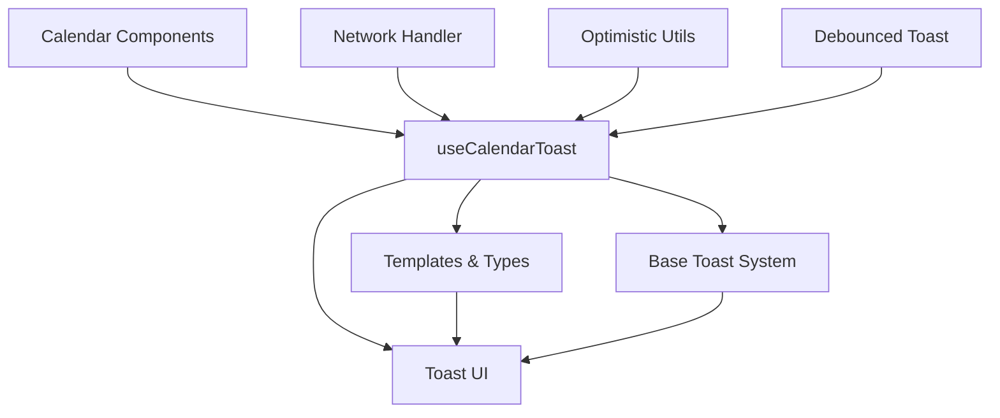

# Calendar Toast システム

Calendar機能専用のToast通知システム - 既存Toastシステムの拡張レイヤー

## 📁 ファイル構成

```
src/features/calendar/lib/toast/
├── README.md                   # このファイル - システム全体の理解用
├── index.ts                    # 統合エクスポート - 外部向けAPI
├── types.ts                    # Calendar特化型定義
├── templates.ts                # 日本語メッセージテンプレート（9種類）
├── use-calendar-toast.ts       # メインフック - 基本機能
├── network-handler.ts          # ネットワークエラー自動分類・処理
├── optimistic-utils.ts         # 楽観的更新・ロールバック機能
└── debounced-toast.ts          # 連続操作制御・デバウンス
```

## 🏗️ システム構成

### 基本アーキテクチャ



### データフロー

1. **Calendar Component** がユーザー操作を受信
2. **useCalendarToast** でCalendar特化の処理を実行
3. **Templates** でメッセージを生成
4. **Base Toast System** で実際の表示
5. **Network Handler** でエラー時の自動対応

## 📋 ファイル詳細

### `index.ts` - 統合エクスポート

```typescript
// 全てのモジュールの re-export
export * from './types'
export * from './use-calendar-toast'
// ... 他のモジュール

// デフォルトエクスポート
export { useCalendarToast as default } from './use-calendar-toast'
```

**役割**: 外部からの単一アクセスポイント

### `types.ts` - 型定義

```typescript
export type CalendarAction = 'created' | 'updated' | 'deleted' | ...
export interface CalendarToastOptions { ... }
export interface ToastTemplate { ... }
```

**役割**:

- Calendar操作の9種類を定義
- Toast表示オプションの型安全性確保
- テンプレート構造の定義

### `templates.ts` - メッセージテンプレート

```typescript
export const toastTemplates: ToastTemplates = {
  created: { title: '予定を作成しました', ... },
  deleted: { title: '予定を削除しました', ... },
  // 9種類の操作テンプレート
}
```

**役割**:

- 日本語メッセージの一元管理
- `date-fns`による日時フォーマット
- 動的メッセージ生成（イベント名、日時含む）

**テンプレート一覧**:

- `created`, `updated`, `deleted`, `moved`, `duplicated`
- `bulk-deleted`, `sync-started`, `sync-completed`, `sync-failed`

### `use-calendar-toast.ts` - メインフック

```typescript
export const useCalendarToast = () => {
  // 汎用Toast表示
  const showCalendarToast = useCallback(...)

  // Calendar特化メソッド
  const eventCreated = useCallback(...)
  const eventDeleted = useCallback(...)
  // ...
}
```

**役割**:

- Calendar操作の便利メソッド提供
- アクションボタン（アンドゥ、表示、再試行）
- Promise統合（loading/success/error自動管理）
- 既存Toast機能の露出

**主要メソッド**:

- `eventCreated`, `eventUpdated`, `eventDeleted`, `eventMoved`
- `bulkDeleted`, `syncStart`, `syncComplete`, `syncFailed`
- `promise` - 非同期処理統合

### `network-handler.ts` - エラーハンドリング

```typescript
export const handleNetworkError = (error: Error | unknown, retryFn?: () => void)
export const useNetworkErrorHandler = () => { ... }
```

**役割**:

- ネットワークエラーの自動分類
- HTTP状態コード別の適切な対応
- 再試行機能の提供
- 権限エラー時の自動リダイレクト

**エラー分類**:

- `offline`, `timeout`, `unauthorized`, `forbidden`
- `not_found`, `conflict`, `server_error`, `unknown`

### `optimistic-utils.ts` - 楽観的更新

```typescript
export const withOptimisticUpdate = async <T>(...) => { ... }
export const useOptimisticUpdate = () => { ... }
```

**役割**:

- UI即座更新 → API呼び出し → 失敗時ロールバック
- イベント操作特化ヘルパー（移動、削除、作成）
- バッチ操作対応（並行処理制限）
- 進捗表示と部分失敗通知

### `debounced-toast.ts` - 連続操作制御

```typescript
export const useDebouncedToast = () => { ... }
export const TOAST_GROUPS = { ... }
```

**役割**:

- 連続操作時の重複通知防止
- グループ化Toast（同種操作まとめ表示）
- ドラッグ操作専用デバウンス
- 大量操作時の通知制限

## 🎯 使用パターン

### 基本的な通知

```typescript
const toast = useCalendarToast()

// シンプルな成功通知
toast.eventCreated(event)

// アンドゥ付き削除
toast.eventDeleted(event, () => restoreEvent(event.id))
```

### Promise統合

```typescript
const result = await toast.promise(api.createEvent(data), {
  loading: '作成中...',
  success: (event) => `「${event.title}」を作成しました`,
  error: '作成に失敗しました',
})
```

### エラーハンドリング

```typescript
import { useNetworkErrorHandler } from '@/features/calendar/lib/toast'

const { handleError } = useNetworkErrorHandler()

try {
  await api.updateEvent(event)
  toast.eventUpdated(event)
} catch (error) {
  handleError(error, () => api.updateEvent(event)) // 再試行付き
}
```

### 楽観的更新

```typescript
import { useOptimisticUpdate } from '@/features/calendar/lib/toast'

const { moveEvent } = useOptimisticUpdate()

// UI即座更新 → API → 失敗時自動ロールバック
await moveEvent(eventId, { startDate: newDate }, { startDate: oldDate }, api.updateEvent, updateEventInUI)
```

## 🔧 統合状況

### 統合済みコンポーネント

1. **CreateEventModal** (`/src/features/events/components/create/CreateEventModal.tsx`)
   - ✅ 作成・更新時: Promise統合Toast
   - ✅ 削除時: アンドゥ付きToast（復元機能付き）

2. **useDragAndDrop** (`/src/features/calendar/components/views/shared/hooks/useDragAndDrop.ts`)
   - ✅ ドラッグ移動: 成功通知Toast（シンプル）
   - ✅ リサイズ: 更新通知Toast（シンプル）
   - ✅ エラー時: 適切なエラーメッセージ表示

3. **useEventContextActions** (`/src/features/calendar/hooks/useEventContextActions.ts`)
   - ✅ 削除: アンドゥ付きToast（復元機能付き）
   - ✅ 複製: 成功通知Toast（表示アクション付き）

4. **その他のコンポーネント統合**
   - ✅ useCreateEvent.ts - Calendar Toast使用
   - ✅ useAutoSaveSettings.ts - 基本toast使用（設定機能）
   - ✅ DayView.tsx - 不要なimport削除済み

## 🧪 テスト

### テスト方針

- 手動テスト中心（UI操作との統合が重要）
- ユニットテストは将来的に追加予定
- 主要操作の動作確認を優先

### 動作確認項目

- ✅ **基本Toast操作**（作成、削除、移動、リサイズ）
- ✅ **アンドゥ機能の動作**（削除のみ、移動・リサイズはシンプル通知）
- ✅ **Promise統合**（loading/success/error自動管理）
- ✅ **同期・非同期対応**（onEventUpdateの戻り値を自動判定）
- ✅ **エラーハンドリング**（ネットワークエラー分類・再試行）
- ✅ **shadcn-ui toast競合解決**（中央表示削除、右下のみ）
- ✅ **型安全性確保**（CalendarEvent形式準拠、as any削除）

## 🎨 カスタマイズ

### メッセージのカスタマイズ

```typescript
// templates.ts
export const toastTemplates = {
  created: {
    title: 'カスタムメッセージ', // 変更
    description: (opts) => `カスタム説明: ${opts.event?.title}`,
    // ...
  },
}
```

### スタイルのカスタマイズ

既存Toastシステムを使用しているため：

- `@/config/theme/colors` でカラー調整
- Toast UI は `@/lib/toast` で管理

### 新しい操作の追加

1. `types.ts` で `CalendarAction` に追加
2. `templates.ts` でテンプレート定義
3. `use-calendar-toast.ts` で便利メソッド追加

## 📊 パフォーマンス考慮

### 最適化

- **useCallback**: 全メソッドでコンポーネント再レンダリング防止
- **デバウンス**: 連続操作での重複通知防止
- **グループ化**: 大量操作時の通知制限
- **遅延インポート**: 必要時のみモジュール読み込み

### メモリ管理

- タイマーの適切なクリーンアップ
- 一時的な状態管理でメモリリークを防止

## 🔍 デバッグ

### 開発時の確認

```typescript
// Console出力でToast状態確認
console.log('Toast displayed:', toastId)

// Template適用確認
console.log('Template used:', template.title)
```

### よくある問題と解決済み事項

1. ~~**Toast表示されない**~~ → ✅ 解決: ToastProvider重複削除
2. ~~**中央Toast表示**~~ → ✅ 解決: shadcn-ui toast削除、右下のみ表示
3. ~~**型エラー（as any使用）**~~ → ✅ 解決: CalendarEvent形式準拠
4. ~~**移動成功でも失敗Toast表示**~~ → ✅ 解決: 同期・非同期処理対応
5. **アンドゥ動作しない**: 非同期処理のawait確認（削除機能のみ）
6. **重複通知**: デバウンス設定の確認（連続操作時）

## 🚀 今後の拡張予定

### 検討中の機能

- **通知履歴**: Toast履歴の保存・表示
- **通知設定**: ユーザー個別の通知ON/OFF
- **音声通知**: 重要な操作での音声フィードバック
- **プッシュ通知**: バックグラウンド同期の通知

### アーキテクチャ改善

- **TypeScript厳密化**: より型安全な実装
- **A11y対応**: スクリーンリーダー対応強化
- **国際化**: 多言語対応の仕組み

---

## 🎯 実装完了サマリー

### ✅ 完了した主要機能

1. **完全統合**: Calendar Toast システム全体完成
2. **shadcn-ui toast競合解決**: 中央表示削除、右下のみ
3. **型安全性**: CalendarEvent準拠、as any削除
4. **同期・非同期対応**: Promise自動判定
5. **アンドゥ機能**: 削除のみ（移動・リサイズはシンプル通知）
6. **エラーハンドリング**: 適切なエラー分類・表示

### 🎨 Toast通知一覧

- **作成**: 「予定を作成しました」
- **更新**: 「予定を更新しました」（リサイズ時）
- **移動**: 「予定を移動しました」
- **削除**: 「予定を削除しました」+ アンドゥボタン
- **複製**: 「予定を作成しました」+ 表示ボタン
- **Promise**: loading → success/error 自動管理

---

**最終更新**: 2025年8月29日
**バージョン**: 2.0 - 完全統合版
**管理者**: Claude Code System
