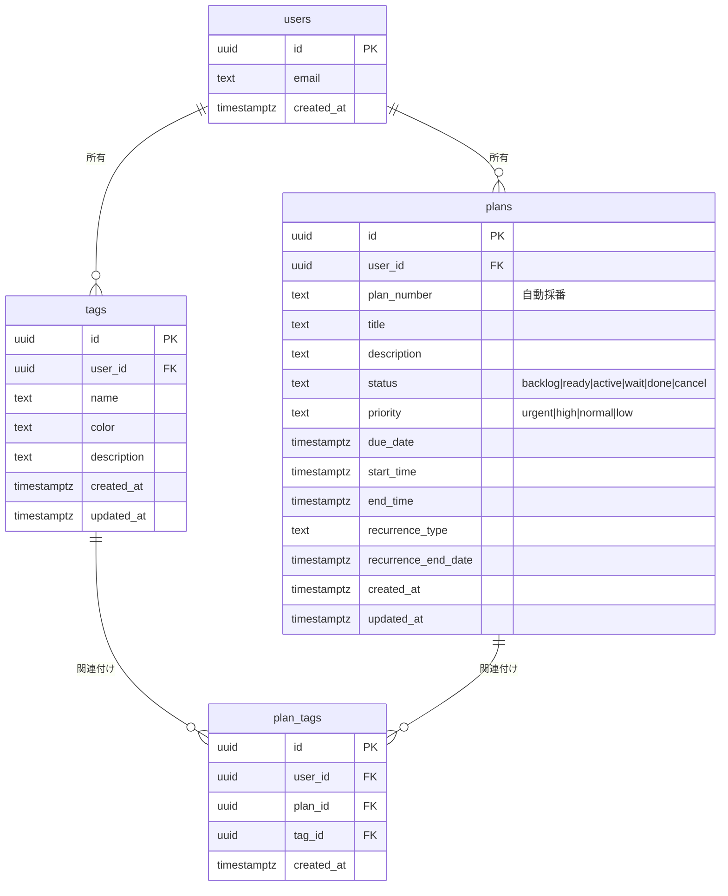

# Plan管理システム - データベース設計

## 📊 ER図（Entity Relationship Diagram）



## 🎯 テーブル設計の意図

### 1. Tags（タグ）

**目的**: プランを分類・整理するためのラベル

**特徴**:

- シンプルな1階層設計（過去の複雑な階層構造を排除）
- ユーザーごとに独立したタグ管理
- カラー指定でビジュアル識別が可能

**制約**:

- `UNIQUE(user_id, name)`: 同一ユーザー内で重複禁止

---

### 2. Plans（プラン）

**目的**: 作業単位を管理（タスク、予定、イベント等）

**自動機能**:

- **plan_number自動採番**: `TKT-20241027-001` 形式
  - フォーマット: `TKT-YYYYMMDD-NNN`
  - ユーザーごと・日付ごとに連番

**ステータス遷移**:

```
backlog → ready → active → done
           ↓       ↓
         wait    cancel
```

**優先度**:

- `urgent`: 緊急
- `high`: 高
- `normal`: 通常（デフォルト）
- `low`: 低

---

### 3. 中間テーブル（plan_tags）

**目的**: 多対多のタグ関連付け

**制約**:

- `UNIQUE(plan_id, tag_id)`: 重複タグ付け防止

---

## 🔐 Row Level Security（RLS）

### セキュリティポリシー

全テーブルに以下のRLSポリシーを適用：

```sql
-- 読み取り
CREATE POLICY "Users can view own data" ON {table}
  FOR SELECT USING (auth.uid() = user_id);

-- 作成
CREATE POLICY "Users can insert own data" ON {table}
  FOR INSERT WITH CHECK (auth.uid() = user_id);

-- 更新
CREATE POLICY "Users can update own data" ON {table}
  FOR UPDATE USING (auth.uid() = user_id);

-- 削除
CREATE POLICY "Users can delete own data" ON {table}
  FOR DELETE USING (auth.uid() = user_id);
```

**原則**:

- すべてのデータは `user_id` でユーザー分離
- `auth.uid()` による行レベルアクセス制御
- 他ユーザーのデータは一切アクセス不可

---

## ⚡ パフォーマンス最適化

### インデックス戦略

```sql
-- 主要検索パターン
CREATE INDEX idx_plans_user_id ON plans(user_id);        -- ユーザー単位検索
CREATE INDEX idx_plans_status ON plans(status);          -- ステータスフィルター
CREATE INDEX idx_plans_due_date ON plans(due_date);      -- 期限フィルター

-- タグ検索
CREATE INDEX idx_plan_tags_plan_id ON plan_tags(plan_id);
CREATE INDEX idx_plan_tags_tag_id ON plan_tags(tag_id);
```

**想定クエリ**:

- 「自分のプラン一覧（ステータス別）」
- 「期限が近いプラン一覧」
- 「特定タグの付いたプラン一覧」

---

## 🛠️ トリガー一覧

| トリガー名                     | 対象テーブル | 実行タイミング | 機能             |
| ------------------------------ | ------------ | -------------- | ---------------- |
| `trigger_generate_plan_number` | plans        | INSERT前       | plan番号自動採番 |
| `trigger_update_*_updated_at`  | 全テーブル   | UPDATE前       | updated_at更新   |

---

## 📝 マイグレーション手順

### 適用

```bash
# ローカル環境でマイグレーション適用
supabase db reset

# または特定マイグレーションのみ
supabase migration up
```

### ロールバック

```bash
# マイグレーション削除
rm supabase/migrations/20241027000000_create_plans_sessions_tags.sql

# データベースリセット
supabase db reset
```

---

## 🧪 テストデータ投入例

### Supabase Studio SQL Editorで実行

```sql
-- 1. タグ作成
INSERT INTO tags (user_id, name, color, description)
VALUES
  (auth.uid(), '準備作業', '#3B82F6', 'イベント準備関連'),
  (auth.uid(), '本番', '#10B981', 'イベント本番作業'),
  (auth.uid(), '片付け', '#F59E0B', 'イベント後片付け');

-- 2. プラン作成（plan_number自動採番確認）
INSERT INTO plans (user_id, title, description, status, priority, due_date)
VALUES
  (auth.uid(), 'コミケ準備', 'コミケ101の準備タスク', 'backlog', 'high', '2025-12-30');

-- 3. plan_number自動採番確認
SELECT id, plan_number, title, status, priority
FROM plans;

-- 4. タグ関連付け
INSERT INTO plan_tags (user_id, plan_id, tag_id)
VALUES (
  auth.uid(),
  (SELECT id FROM plans WHERE title = 'コミケ準備' LIMIT 1),
  (SELECT id FROM tags WHERE name = '準備作業' LIMIT 1)
);
```

---

## 🔄 データフロー

### Plan作成時の自動処理

```
1. User が Plan作成
   ↓
2. trigger_generate_plan_number
   → plan_number = "TKT-20241027-001"
   ↓
3. RLSポリシー適用
   → user_id = auth.uid() の検証
```

---

## 📚 関連ドキュメント

- [マイグレーションファイル](/supabase/migrations/20241027000000_create_plans_sessions_tags.sql)
- [型定義](/src/features/plans/types/)
- [Phase 2: tRPC API実装](https://github.com/t3-nico/boxlog-app/issues/620)

---

**作成日**: 2024-10-27
**Phase**: 1 - Database Foundation
**バージョン**: 1.0.0
