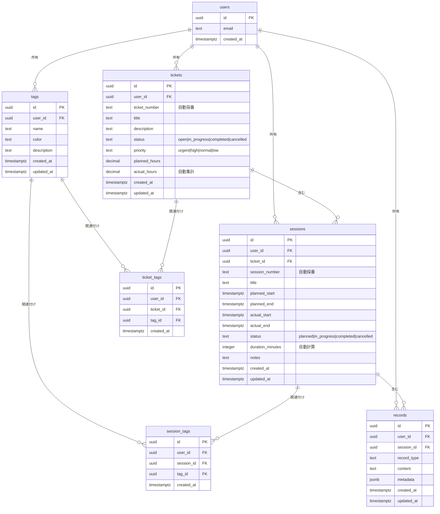

# Ticket & Session管理システム - データベース設計

## 📊 ER図（Entity Relationship Diagram）



## 🎯 テーブル設計の意図

### 1. Tags（タグ）

**目的**: チケットとセッションを分類・整理するためのラベル

**特徴**:
- シンプルな1階層設計（過去の複雑な階層構造を排除）
- ユーザーごとに独立したタグ管理
- カラー指定でビジュアル識別が可能

**制約**:
- `UNIQUE(user_id, name)`: 同一ユーザー内で重複禁止

---

### 2. Tickets（チケット）

**目的**: 作業単位を管理（イベント出展の準備タスク等）

**自動機能**:
- **ticket_number自動採番**: `TKT-20241027-001` 形式
  - フォーマット: `TKT-YYYYMMDD-NNN`
  - ユーザーごと・日付ごとに連番
- **actual_hours自動集計**: 配下のSessionsのduration_minutesを合計

**ステータス遷移**:
```
open → in_progress → completed
  ↓
cancelled
```

**優先度**:
- `urgent`: 緊急
- `high`: 高
- `normal`: 通常（デフォルト）
- `low`: 低

---

### 3. Sessions（セッション）

**目的**: Ticketに紐づく作業セッション（ブース準備の各作業時間等）

**自動機能**:
- **session_number自動採番**: `SES-20241027-001` 形式
- **duration_minutes自動計算**: `actual_end - actual_start` を分単位で計算

**時間管理**:
- `planned_start/end`: 予定時刻
- `actual_start/end`: 実績時刻
- `duration_minutes`: 実績時間（分）

**トリガー連携**:
- Session追加・更新・削除時に親TicketのActual_hoursを自動更新

---

### 4. Records（記録）

**目的**: 将来的な拡張用（メモ、チェックリスト、添付ファイル等）

**メタデータ**:
- `metadata (JSONB)`: 柔軟な構造化データ保存

---

### 5. 中間テーブル（ticket_tags / session_tags）

**目的**: 多対多のタグ関連付け

**制約**:
- `UNIQUE(ticket_id, tag_id)`: 重複タグ付け防止
- `UNIQUE(session_id, tag_id)`: 重複タグ付け防止

---

## 🔐 Row Level Security（RLS）

### セキュリティポリシー

全テーブルに以下のRLSポリシーを適用：

```sql
-- 読み取り
CREATE POLICY "Users can view own data" ON {table}
  FOR SELECT USING (auth.uid() = user_id);

-- 作成
CREATE POLICY "Users can insert own data" ON {table}
  FOR INSERT WITH CHECK (auth.uid() = user_id);

-- 更新
CREATE POLICY "Users can update own data" ON {table}
  FOR UPDATE USING (auth.uid() = user_id);

-- 削除
CREATE POLICY "Users can delete own data" ON {table}
  FOR DELETE USING (auth.uid() = user_id);
```

**原則**:
- すべてのデータは `user_id` でユーザー分離
- `auth.uid()` による行レベルアクセス制御
- 他ユーザーのデータは一切アクセス不可

---

## ⚡ パフォーマンス最適化

### インデックス戦略

```sql
-- 主要検索パターン
CREATE INDEX idx_tickets_user_id ON tickets(user_id);        -- ユーザー単位検索
CREATE INDEX idx_tickets_status ON tickets(status);          -- ステータスフィルター
CREATE INDEX idx_sessions_ticket_id ON sessions(ticket_id); -- チケット配下検索

-- タグ検索
CREATE INDEX idx_ticket_tags_ticket_id ON ticket_tags(ticket_id);
CREATE INDEX idx_ticket_tags_tag_id ON ticket_tags(tag_id);
```

**想定クエリ**:
- 「自分のチケット一覧（ステータス別）」
- 「特定チケットの全セッション」
- 「特定タグの付いたチケット一覧」

---

## 🛠️ トリガー一覧

| トリガー名 | 対象テーブル | 実行タイミング | 機能 |
|-----------|------------|--------------|------|
| `trigger_generate_ticket_number` | tickets | INSERT前 | Ticket番号自動採番 |
| `trigger_generate_session_number` | sessions | INSERT前 | Session番号自動採番 |
| `trigger_calculate_session_duration` | sessions | INSERT/UPDATE前 | 実績時間計算 |
| `trigger_update_ticket_hours_on_session_change` | sessions | INSERT/UPDATE/DELETE後 | Ticket実績時間更新 |
| `trigger_update_*_updated_at` | 全テーブル | UPDATE前 | updated_at更新 |

---

## 📝 マイグレーション手順

### 適用

```bash
# ローカル環境でマイグレーション適用
supabase db reset

# または特定マイグレーションのみ
supabase migration up
```

### ロールバック

```bash
# マイグレーション削除
rm supabase/migrations/20241027000000_create_tickets_sessions_tags.sql

# データベースリセット
supabase db reset
```

---

## 🧪 テストデータ投入例

### Supabase Studio SQL Editorで実行

```sql
-- 1. タグ作成
INSERT INTO tags (user_id, name, color, description)
VALUES
  (auth.uid(), '準備作業', '#3B82F6', 'イベント準備関連'),
  (auth.uid(), '本番', '#10B981', 'イベント本番作業'),
  (auth.uid(), '片付け', '#F59E0B', 'イベント後片付け');

-- 2. チケット作成（ticket_number自動採番確認）
INSERT INTO tickets (user_id, title, description, status, priority, planned_hours)
VALUES
  (auth.uid(), 'コミケ準備', 'コミケ101の準備タスク', 'open', 'high', 20);

-- 3. セッション作成（session_number自動採番、duration_minutes自動計算確認）
INSERT INTO sessions (user_id, ticket_id, title, actual_start, actual_end, status)
VALUES
  (
    auth.uid(),
    (SELECT id FROM tickets WHERE title = 'コミケ準備' LIMIT 1),
    'グッズ梱包作業',
    NOW() - INTERVAL '2 hours',
    NOW(),
    'completed'
  );

-- 4. Ticketのactual_hours自動更新確認
SELECT id, ticket_number, title, planned_hours, actual_hours
FROM tickets;

-- 5. タグ関連付け
INSERT INTO ticket_tags (user_id, ticket_id, tag_id)
VALUES (
  auth.uid(),
  (SELECT id FROM tickets WHERE title = 'コミケ準備' LIMIT 1),
  (SELECT id FROM tags WHERE name = '準備作業' LIMIT 1)
);
```

---

## 🔄 データフロー

### Session作成時の自動処理

```
1. User が Session作成
   ↓
2. trigger_generate_session_number
   → session_number = "SES-20241027-001"
   ↓
3. trigger_calculate_session_duration
   → duration_minutes = (actual_end - actual_start) / 60
   ↓
4. trigger_update_ticket_hours_on_session_change
   → 親TicketのActual_hoursを再計算
```

---

## 📚 関連ドキュメント

- [マイグレーションファイル](/supabase/migrations/20241027000000_create_tickets_sessions_tags.sql)
- [型定義](/src/features/tickets/types/)
- [Phase 2: tRPC API実装](https://github.com/t3-nico/boxlog-app/issues/620)

---

**作成日**: 2024-10-27
**Phase**: 1 - Database Foundation
**バージョン**: 1.0.0
