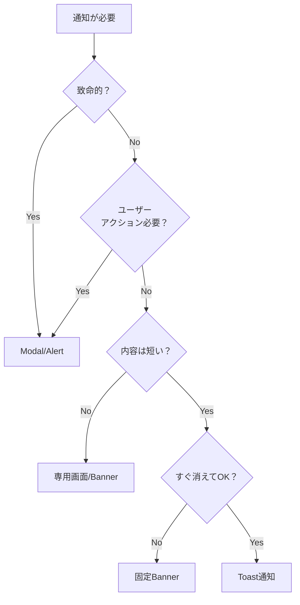

# Toast通知システム 使用ガイドライン

## いつToastを使うべきか

### ✅ Toast推奨ケース

#### 1. **非同期処理の完了通知**

```typescript
// GOOD: バックグラウンド処理の結果
toast.success('自動保存しました')
toast.success('クリップボードにコピーしました')
toast.error('ネットワークエラー: 再試行してください')
```

#### 2. **確認が不要な成功通知**

```typescript
// GOOD: ユーザーの操作が成功したことを伝える
toast.success('設定を更新しました')
toast.success('予定を作成しました')
toast.success('ファイルをアップロードしました')
```

#### 3. **非致命的なエラー**

```typescript
// GOOD: 操作は継続できるが、問題があることを伝える
toast.warning('一部のデータが読み込めませんでした')
toast.info('オフラインモードで実行中')
```

#### 4. **進行状況の表示**

```typescript
// GOOD: 時間のかかる処理
const id = toast.loading('処理中...')
// 処理完了後
toast.dismiss(id)
toast.success('完了しました')
```

### ❌ Toast非推奨ケース

#### 1. **ユーザーの確認が必要な場合**

```typescript
// BAD: Toastで削除確認
toast.error('本当に削除しますか？')

// GOOD: Modalを使用
showConfirmDialog({
  title: '削除の確認',
  message: '本当に削除しますか？',
})
```

#### 2. **致命的エラー・操作不能な状態**

```typescript
// BAD: 重要なエラーをToastで
toast.error('データベース接続に失敗')

// GOOD: エラー画面・エラーバナーを表示
showErrorBanner('システムエラーが発生しました')
```

#### 3. **長文の情報・複雑な内容**

```typescript
// BAD: 読み切れない長文
toast.info('利用規約が更新されました。新しい規約では...')

// GOOD: モーダルまたは専用ページ
showModal('利用規約の更新')
```

#### 4. **フォームバリデーションエラー**

```typescript
// BAD: 入力エラーをToastで
toast.error('メールアドレスが無効です')

// GOOD: インラインエラーメッセージ
<input className="error" />
<span className="error-message">メールアドレスが無効です</span>
```

## 判断フローチャート



## パターン別ガイド

### 🎯 CRUD操作

| 操作       | Toast使用 | 理由                             |
| ---------- | --------- | -------------------------------- |
| Create成功 | ✅        | 作成確認は重要だが、継続作業可能 |
| Read失敗   | ❌        | 画面内にエラー表示すべき         |
| Update成功 | ✅        | 更新確認、Undo可能なら尚良い     |
| Delete確認 | ❌        | 必ずModalで確認を取る            |
| Delete成功 | ✅        | Undo付きToastが理想              |

### ⏱️ 非同期処理

| 処理                  | Toast使用 | 実装例                                    |
| --------------------- | --------- | ----------------------------------------- |
| API呼び出し開始       | △         | 3秒以上かかる場合のみ                     |
| API成功               | ✅        | `toast.success('保存しました')`           |
| API失敗（再試行可）   | ✅        | `toast.error('失敗、再試行してください')` |
| API失敗（再試行不可） | ❌        | エラー画面表示                            |

### 📋 クリップボード・ファイル操作

| 操作             | Toast使用 | 理由                     |
| ---------------- | --------- | ------------------------ |
| コピー成功       | ✅        | 視覚的フィードバック必要 |
| ペースト成功     | △         | 結果が見える場合は不要   |
| ダウンロード開始 | ✅        | ブラウザ通知と併用OK     |
| アップロード進行 | ✅        | プログレス表示も検討     |

## コード例

### 良い例 ✅

```typescript
// 1. シンプルな成功通知
async function saveSettings(data) {
  try {
    await api.save(data)
    toast.success('設定を保存しました')
  } catch (error) {
    toast.error('保存に失敗しました')
  }
}

// 2. Undo付き削除
function deleteItem(item) {
  const backup = { ...item }
  api.delete(item.id)

  toast.info('削除しました', {
    action: {
      label: '元に戻す',
      onClick: () => api.restore(backup),
    },
  })
}

// 3. Promise統合
async function uploadFile(file) {
  await toast.promise(api.upload(file), {
    loading: 'アップロード中...',
    success: 'アップロード完了',
    error: 'アップロードに失敗しました',
  })
}
```

### 悪い例 ❌

```typescript
// 1. 確認が必要な操作
function deleteAccount() {
  toast.warning('アカウントを削除しますか？') // ❌
  // → Modalを使うべき
}

// 2. 複数のエラーを連続表示
validation.errors.forEach((error) => {
  toast.error(error.message) // ❌ Toastの洪水
})
// → まとめて1つのエラー表示にする

// 3. 重要な情報
toast.info('パスワード: ABC123') // ❌ すぐ消える
// → Modalかコピー可能な固定表示にする
```

## Toast設計チェックリスト

- [ ] **5秒ルール**: 5秒で読み切れる内容か？
- [ ] **継続性**: Toastが消えても作業を継続できるか？
- [ ] **重要度**: 見逃しても致命的でないか？
- [ ] **頻度**: 連続して表示される可能性は低いか？
- [ ] **代替手段**: 他に状態を確認する方法があるか？

## アンチパターン

### 🚫 避けるべきパターン

#### 1. **Toast の洪水**

- 同時に3個以上表示しない
- 連続した操作では最後だけ通知

#### 2. **モーダルの代替として使用**

- 確認が必要 → Modal
- 選択が必要 → Modal
- 詳細情報 → Modal/Page

#### 3. **唯一の通知手段**

- 重要な通知はToast + 他の方法を併用
- ログやhistoryにも残す

## まとめ

### Toast通知の本質：

**「ユーザーの作業を妨げずに、安心感を提供する」**

### 迷ったら以下の質問：

1. **これを見逃したらユーザーは困るか？** → Yes なら Toast以外
2. **ユーザーの返答が必要か？** → Yes なら Modal
3. **3秒で理解できるか？** → No なら別の方法

### 黄金律：

**「Nice to know」は Toast、「Need to know」は Modal**

---

## 使用方法

### 基本的な使用方法

```typescript
import { useToast } from '@/lib/toast'
import { toast } from '@/lib/toast' // 直接呼び出し用

// フック使用
const toastHook = useToast()
toastHook.success('成功しました')

// 直接呼び出し
toast.success('成功しました')
toast.error('エラーが発生しました')
toast.warning('警告メッセージ')
toast.info('情報メッセージ')
toast.loading('読み込み中...')
```

### カレンダー用カスタムフック

```typescript
import { useCalendarToast } from '@/features/calendar/hooks/use-calendar-toast'

const { eventCreated, eventDeleted, eventConflict } = useCalendarToast()

eventCreated(event) // 予定作成成功
eventDeleted('会議', undo) // 予定削除（Undo付き）
eventConflict() // 時間重複警告
```

### 高度な使用例

```typescript
// アクションボタン付き
toast.info('新しい通知があります', {
  action: {
    label: '確認',
    onClick: () => navigate('/notifications'),
  },
  duration: 0, // 無限表示
})

// Promise対応
await toast.promise(saveData(), {
  loading: '保存中...',
  success: '保存しました',
  error: (err) => `エラー: ${err.message}`,
})
```
